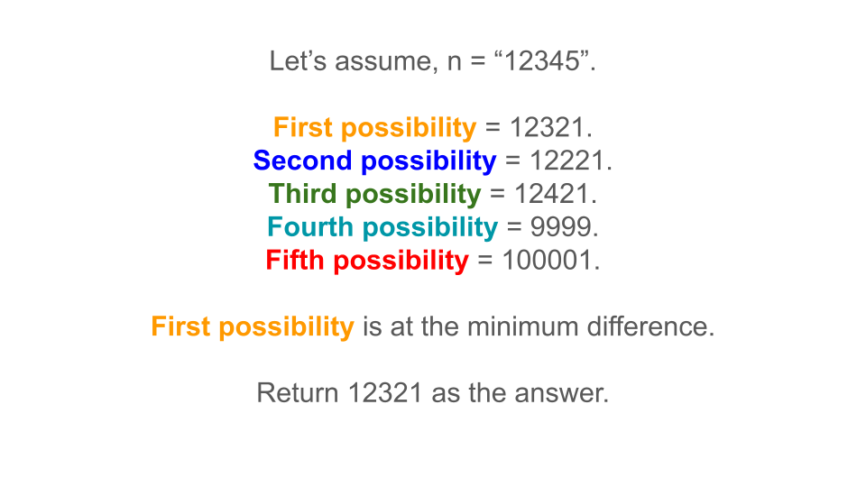

## ToC
- [August Week 4](#august-week-4)
  - [24.08.19 - 650. 2 Keys Keyboard](#240819---650-2-keys-keyboard)
    - [나](#나)
    - [gpt](#gpt)
  - [24.08.20 - 1140. Stone Game II](#240820---1140-stone-game-ii)
    - [나](#나-1)
    - [gpt](#gpt-1)
  - [24.08.21 - 664. Strange Printer](#240821---664-strange-printer)
    - [나](#나-2)
    - [Solution](#solution)
      - [Overview](#overview)
      - [Approach 1: Top-Down Dynamic Programming (Memoization)](#approach-1-top-down-dynamic-programming-memoization)
      - [Approach 2: Bottom-Up Dynamic Programming (Tabulation)](#approach-2-bottom-up-dynamic-programming-tabulation)
  - [24.08.22 - 476. Number Complement](#240822---476-number-complement)
    - [나](#나-3)
    - [gpt](#gpt-2)
  - [24.08.23 - 592. Fraction Addition and Subtraction](#240823---592-fraction-addition-and-subtraction)
    - [나](#나-4)
    - [gpt](#gpt-3)
  - [24.08.24 - 564. Find the Closest Palindrome](#240824---564-find-the-closest-palindrome)
    - [나](#나-5)
    - [Solution](#solution-1)
      - [Approach 1: Find Previous and Next Palindromes](#approach-1-find-previous-and-next-palindromes)
      - [Approach 2: Binary Search](#approach-2-binary-search)
  - [24.08.25 - 145. Binary Tree Postorder Traversal](#240825---145-binary-tree-postorder-traversal)
    - [나](#나-6)
    - [gpt](#gpt-4)

# August Week 4
## 24.08.19 - 650. 2 Keys Keyboard
[문제 링크](https://leetcode.com/problems/2-keys-keyboard/description/)

### 나
```cpp
// TLE
class Solution {
    struct Data {
        int copyLen{}, nowLen{};
        Data() = default;
        Data(int copyLen, int nowLen) : copyLen{copyLen}, nowLen{nowLen} {}
    };
public:
    int minSteps(int n) {
        int answer{-1};
        queue<Data> q;
        q.emplace(0, 1);
        for(int t{};!q.empty();++t) {
            for(int s{}, e{static_cast<int>(q.size())}; s<e; ++s) {
                auto [copyLen, nowLen] = q.front(); q.pop();
                
                if(nowLen == n) {
                    answer = t;
                    break;
                }

                // copy
                if(copyLen != nowLen) q.emplace(nowLen, nowLen);

                // paste
                if(copyLen != 0) q.emplace(copyLen, nowLen + copyLen);
            }
            if(answer != -1) break;
        }

        return answer;
    }
};
```
다른 아이디어가 없다..

### gpt
The problem you're dealing with is a classic dynamic programming (DP) problem. The goal is to find the minimum number of operations needed to get exactly `n` 'A's on the screen starting with one 'A' using only two operations: "Copy All" and "Paste".

<h3> Problem Breakdown: </h3>

1. **Initial Setup**: You start with one 'A' on the screen.
2. **Operations**:
   - **Copy All**: Copies the entire content of the screen to a buffer.
   - **Paste**: Pastes the content of the buffer to the screen.

<h3> Approach: </h3>

The essence of the problem is to decompose `n` into its prime factors. 

If `n` can be decomposed into smaller numbers, each "Copy All" followed by a series of "Paste" operations would effectively multiply the number of 'A's on the screen.

<h4> Steps: </h4>

1. **Prime Factorization Insight**:
   - If you factorize `n`, for every factor `f` of `n`, it means you can achieve `f` 'A's on the screen by first achieving `n/f` 'A's and then applying a "Copy All" followed by `f-1` "Paste" operations.
   - The minimum operations needed to get `n` 'A's is the sum of its prime factors.

2. **Dynamic Programming Approach**:
   - You can create a DP array where `dp[i]` represents the minimum operations needed to get `i` 'A's on the screen.
   - Start with `dp[1] = 0` because you're already starting with one 'A'.
   - For each `i` from 2 to `n`, try all possible factors `j`, and update `dp[i]` as `dp[j] + i/j` if `i % j == 0`.

Here's the code implementation:

```cpp
// 5ms, 8.22MB
class Solution {
public:
    int minSteps(int n) {
        vector<int> dp(n + 1, 0);
        
        for (int i = 2; i <= n; ++i) {
            dp[i] = i; // Maximum number of operations needed is i (all Paste operations)
            for (int j = i / 2; j > 1; --j) {
                if (i % j == 0) {
                    dp[i] = dp[j] + i / j;
                    break;
                }
            }
        }
        
        return dp[n];
    }
};
```

<h3> Explanation: </h3>

- **dp[i] = i**: The worst case is if `i` is a prime number, in which you would need `i` operations (one copy and `i-1` pastes).
- **For each `i`, we check factors `j`**: If `j` is a factor of `i`, then the operations needed are those to get `j` 'A's plus the number of pastes required to go from `j` to `i`.

<h3> Complexity: </h3>

- **Time Complexity**: $O(n \sqrt n)$ because for each `i`, you're potentially checking up to $\sqrt i$ factors.
- **Space Complexity**: $O(n)$ due to the DP array.

This approach is efficient and leverages the idea of reducing the problem by breaking down the operations into smaller subproblems.

> 오호..

## 24.08.20 - 1140. Stone Game II
[문제 링크](https://leetcode.com/problems/stone-game-ii/description/)

### 나
해설을 보자.

- [Dynamic Programming (Memoization)](https://leetcode.com/problems/stone-game-ii/editorial/#approach-1-dynamic-programming-memoization)

```cpp
// 4ms, 12.3MB
class Solution {
public:
    int stoneGameII(vector<int>& piles) {
        vector<vector<int>> memo(piles.size(), vector<int>(piles.size()));
        vector<int> suffixSum = piles;
        for (int i = suffixSum.size() - 2; i >= 0; --i)
            suffixSum[i] += suffixSum[i + 1];
        return maxStones(suffixSum, 1, 0, memo);
    }

    int maxStones(vector<int>& suffixSum, int maxTillNow, int currIndex, vector<vector<int>>& memo) {
        if (currIndex + 2 * maxTillNow >= suffixSum.size())
            return suffixSum[currIndex]; // all remaining stones can be picked.
        if (memo[currIndex][maxTillNow] > 0) 
            return memo[currIndex][maxTillNow]; // already calculated

        int res = INT_MAX;
        for (int i = 1; i <= 2 * maxTillNow; ++i) { // 선택할 수 있는 돌의 개수들
            res = min(res, maxStones(suffixSum, max(i, maxTillNow), currIndex + i, memo));
        }
        
        // 뒤에서 고를 수 있는 최소의 개수를 빼면 최대 개수
        memo[currIndex][maxTillNow] = suffixSum[currIndex] - res; 
        return memo[currIndex][maxTillNow];
    }
};
```

- [Dynamic Programming (Tabulation)](https://leetcode.com/problems/stone-game-ii/editorial/#approach-2-dynamic-programming-tabulation)

```cpp
// 58ms, 12.4MB
// Solution Code
class Solution {
public:
    int stoneGameII(vector<int>& piles) {
        int length = piles.size();
        vector<vector<int>> dp(length + 1, vector<int>(length + 1, 0));
        // dp[i][j]
        // i: the starting index of the piles
        // j: the maximum number of piles Alice can pick on her turn

        // Store suffix sum for all possible suffix
        vector<int> suffixSum(length + 1, 0);
        for (int i = length - 1; i >= 0; --i) {
            suffixSum[i] = suffixSum[i + 1] + piles[i];
        }

        // Initialize the dp array.
        for (int i = 0; i <= length; ++i) {
            dp[i][length] = suffixSum[i];
        }

        // Start from the last index to store the future state first.
        for (int index = length - 1; index >= 0; index--) { // 현재 index
            for (int maxTillNow = length - 1; maxTillNow >= 1; maxTillNow--) { // 가능한 maxTillNow
                for (int X = 1; X <= 2 * maxTillNow && index + X <= length; X++) { // 선택할 수 있는 돌의 개수들
                    dp[index][maxTillNow] = max(
                        dp[index][maxTillNow],
                        suffixSum[index] - dp[index + X][max(maxTillNow, X)]);
                }
            }
        }

        // Recursion에 비해 불필요한 연산이 많아서 오래걸리는 듯.

        return dp[0][1];
    }
};
```

### gpt
생략

## 24.08.21 - 664. Strange Printer
[문제 링크](https://leetcode.com/problems/strange-printer/description/?envType=daily-question&envId=2024-08-21)

### 나
이게 뭔가.. 답지 참고

### Solution
[링크](https://leetcode.com/problems/strange-printer/editorial)

#### Overview

We have a printer designed to produce a string of lowercase English characters, and we want to return the least number of turns it would take to print a given string. Normally, you would think the number of turns would be the number of characters in the string, but this printer has some bonus features that will let us reduce the number of turns. Instead of counting each keystroke as a turn, we count each time we change the character we are printing as a turn, and we can go back over what we've already typed.

The second bullet point from the problem description is basically saying that we can go back and write over characters we have already printed in previous steps. You could think about it like using an old-school typewriter: it always moves left to right, you have unlimited white-out, and for some reason you want to switch keys as few times as possible.

For example, consider the string `s = "aba"`. We can print it in two ways:

- **Method 1**:
  1. Turn 1: Print `a`.
  2. Turn 2: Print `b` after `a`.
  3. Turn 3: Print `a` after `b`.

- **Method 2**:
  1. Turn 1: Print `aaa`.
  2. Turn 2: Print `b` in the middle.

In this case, we return `2` as the least number of steps required.

Our clue to use dynamic programming is the requirement to find the least number of turns to achieve a goal. This suggests both optimal substructure and overlapping subproblems, where finding the minimum turns for different parts of the string often requires repeated calculations.

---

#### Approach 1: Top-Down Dynamic Programming (Memoization)

**Intuition**

Instead of analyzing the string from left to right, we want to consider the entire string and identify segments we can print in one turn. If the character at the end of one segment matches the start of the next, you can potentially print them in one turn and then override the middle character(s) in a later turn. This recursive function will break down the string into smaller substrings and determine the minimum number of turns required for each substring.

We will consider different ways of breaking the string and choose the most efficient option. For example:

```cpp
s = "cabad"
Two possible ways to split this string are:
1. "c" + "aba" + "d"
2. "cab" + "ad"
```

To optimize runtime, we first remove consecutive duplicate characters in the input string. This reduction doesn't change the minimum number of turns needed but can significantly decrease the problem size.

The recursive function, `minimumTurns`, calculates the minimum number of turns needed to print the substring from index `start` to `end`. The recursive relation is as follows:

- **Base Case**: If `start > end`, the substring is empty and requires 0 turns.
- **Initial Case**: Start with the worst-case scenario: `1 + minimumTurns(start + 1, end)`.
- **Optimization Case**: We try to optimize by checking for matching characters and reducing the number of turns.

Using memoization, we store the results of sub-problems in a cache, preventing redundant computations.

**Algorithm**

- Call `removeDuplicates` to remove consecutive duplicate characters.
- Initialize a 2-D array `memo` to store the minimum number of turns.
- Call the recursive function `minimumTurns` to compute the result.

**Implementation**

```cpp
// solution code - 12ms, 10.60MB
class Solution {
public:
    int strangePrinter(string s) {
        // Preprocess the string to remove consecutive duplicate characters
        s = removeDuplicates(s);
        int n = s.length();
        // Initialize memoization array
        vector<vector<int>> memo(n, vector<int>(n, -1));
        // Start the recursive process
        return minimumTurns(0, n - 1, s, memo);
    }

private:
    int minimumTurns(int start, int end, string& s, vector<vector<int>>& memo) {
        // Base case: empty string requires 0 turns
        if (start > end) {
            return 0;
        }

        // If result is memoized, return it
        if (memo[start][end] != -1) {
            return memo[start][end];
        }

        // Initialize with worst case: print each character separately
        int minTurns = 1 + minimumTurns(start + 1, end, s, memo);

        // Try to optimize by finding matching characters
        for (int k = start + 1; k <= end; k++) {
            if (s[k] == s[start]) {
                // If match found, try splitting the problem
                int turnsWithMatch = minimumTurns(start, k - 1, s, memo) +
                                     minimumTurns(k + 1, end, s, memo);
                minTurns = min(minTurns, turnsWithMatch);
            }
        }

        // Memoize and return the result
        return memo[start][end] = minTurns;
    }

    string removeDuplicates(string& s) {
        string uniqueChars;
        int i = 0;
        while (i < s.length()) {
            char currentChar = s[i];
            uniqueChars += currentChar;
            // Skip all consecutive occurrences of the current character
            while (i < s.length() && s[i] == currentChar) {
                i++;
            }
        }
        return uniqueChars;
    }
};
```

**Complexity Analysis**

Let $n$ be the length of the input string `s`.

- **Time complexity**: $O(n^3)$.
  - The recursive function considers all substrings of the input string. For each substring, it iterates through it to find matching characters, leading to a time complexity of $O(n^3)$.
- **Space complexity**: $O(n^2)$.
  - The memoization array `memo` has dimensions $n \times n$.

---

#### Approach 2: Bottom-Up Dynamic Programming (Tabulation)

**Intuition**

In our previous approach, we used a top-down recursive solution with memoization. To optimize further, we’ll switch to a bottom-up dynamic programming approach to eliminate recursion.

We use a 2-D array `minTurns` of size $n \times n$, where `minTurns[i][j]` represents the minimum number of turns needed to print the substring from index `i` to `j`. First, we set up the base case: substrings of length 1 require 1 turn to print. Then we build the solution for substrings of all lengths, using previously computed values.

**Algorithm**

- Call `removeDuplicates` to remove consecutive duplicate characters.
- Initialize a 2-D array `minTurns` of size $n \times n$.
- Use nested loops to iterate over increasing lengths of substrings.
- Compute the minimum turns needed for each substring and store the result in `minTurns`.

**Implementation**

```cpp
// solution code - 31ms, 10.47MB
class Solution {
public:
    int strangePrinter(string s) {
        // Preprocess the string to remove consecutive duplicate characters
        s = removeDuplicates(s);
        int n = s.length();

        // dp[i][j] represents the minimum number of turns to print s[i] to s[j]
        vector<vector<int>> minTurns(n, vector<int>(n, 0));

        // Initialize base case
        for (int i = 0; i < n; i++) {
            // It takes 1 turn to print a single character
            minTurns[i][i] = 1;
        }

        // Fill the dp table
        for (int length = 2; length <= n; length++) {
            for (int start = 0; start + length - 1 < n; start++) {
                int end = start + length - 1;

                // Initialize with worst case: print each character separately
                minTurns[start][end] = length;

                // Try all possible splits and find the minimum
                for (int split = 0; split < length - 1; split++) {
                    int totalTurns = minTurns[start][start + split] +
                                     minTurns[start + split + 1][end];

                    // If the characters at the split and end match, we can save
                    // one turn
                    if (s[start + split] == s[end]) {
                        totalTurns--;
                    }

                    minTurns[start][end] =
                        min(minTurns[start][end], totalTurns);
                }
            }
        }

        // Return the minimum turns needed to print the entire string
        return minTurns[0][n - 1];
    }

private:
    string removeDuplicates(string& s) {
        string uniqueChars;
        int i = 0;
        while (i < s.length()) {
            char currentChar = s[i];
            uniqueChars += currentChar;
            // Skip all consecutive occurrences of the current character
            while (i < s.length() && s[i] == currentChar) {
                i++;
            }
        }
        return uniqueChars;
    }
};
```

**Complexity Analysis**

Let $n$ be the length of the input string `s`.

- **Time complexity**: $O(n^3)$.
  - The main loop iterates over all substrings and computes the minimum number of turns using dynamic programming, which leads to a time complexity of $O(n^3)$.
- **Space complexity**: $O(n^2)$.
  - The 2-D array `minTurns` has dimensions $n \times n$.


## 24.08.22 - 476. Number Complement
[문제 링크](https://leetcode.com/problems/number-complement/description/?envType=daily-question&envId=2024-08-22)

### 나
```cpp
// 3ms, 7.64MB
class Solution {
public:
    int findComplement(int num) {
        string tmp;
        while(num) {
            if(num & 1) tmp.push_back('1');
            else tmp.push_back('0'); 
            num >>= 1;
        }

        int answer{}, d = 1 << (static_cast<int>(tmp.size()) - 1);
        for(auto it = rbegin(tmp);it!=rend(tmp);++it) {
            if(*it == '0') answer += d;
            d >>= 1;
        }
        return answer;
    }
};
```

### gpt
Certainly! Let's break down the problem and solve it step by step.

<h3> Problem Statement </h3>

Given a positive integer `num`, you need to find the complement of its binary representation. The complement of a binary number is obtained by flipping all its bits (changing `0` to `1` and `1` to `0`).

<h3> Example </h3>

- **Input:** `num = 5`
- **Output:** `2`
- **Explanation:**
  - The binary representation of `5` is `101`.
  - Flipping the bits gives `010`, which is `2` in decimal.

<h3> Approach </h3>

1. **Find the Binary Length:** 
   Determine the number of bits in the binary representation of the given number. For instance, `5` has a binary length of `3` (i.e., `101`).

2. **Create a Mask:**
   Create a mask that has the same number of bits, all set to `1`. For example, for `num = 5`, the mask would be `111` (which is `7` in decimal).

3. **Compute the Complement:**
   The complement can be obtained by XOR-ing the number with the mask:
   - `5 XOR 7` gives `2`.

<h3> Implementation in C++ </h3>

```cpp
// 0ms, 7.51MB
class Solution {
public:
    int findComplement(int num) {
        // Calculate the number of bits required to represent num
        int mask = 0;
        int temp = num;
        while (temp > 0) {
            mask = (mask << 1) | 1;
            temp >>= 1;
        }
        
        // The complement is the XOR of num with the mask
        return num ^ mask;
    }
};
```

<h3> Explanation: </h3>

1. **Mask Calculation:** 
   - The mask is created by shifting `1` left for each bit in `num` and then OR-ing it with the current mask value.
   - For `num = 5` (which is `101`), the mask will be `111` (or `7` in decimal).

2. **XOR Operation:**
   - XOR-ing `num` with `mask` flips the bits, giving the complement.

<h3> Complexity Analysis: </h3>

- **Time Complexity:** $O(1)$, since the number of bits in a positive integer is fixed (e.g., 32 bits).
- **Space Complexity:** $O(1)$, as we use a constant amount of extra space.

This approach is efficient and leverages bitwise operations, which are typically fast.

## 24.08.23 - 592. Fraction Addition and Subtraction
[문제 링크](https://leetcode.com/problems/fraction-addition-and-subtraction/description/)

### 나
```cpp
// 4ms, 9.2MB
class Solution {
public:
    string fractionAddition(string expression) {
        if (expression.front() != '-') {
            expression = '+' + expression;
        }

        vector<int> placeToCut;
        for (int s{ 1 }, e{ static_cast<int>(expression.length()) }; s < e; ++s) {
            char c = expression[s];
            if (c == '-' || c == '+')  placeToCut.push_back(s);
        }
        placeToCut.push_back(static_cast<int>(expression.length()));

        int index{};
        vector<string> fractions;
        for (int pos : placeToCut) {
            fractions.push_back(expression.substr(index, pos - index));
            index = pos;
        }

        string answer = fractions.front();
        for (int s{ 1 }, e{ static_cast<int>(fractions.size()) }; s < e; ++s) {
            string& second = fractions[s];
            auto [fn, fd] = StrToNum(answer);
            auto [sn, sd] = StrToNum(second);

            int gcd = GetGCD(fd, sd);
            int denominator = fd * sd / gcd;

            fn = fn * denominator / fd;
            sn = sn * denominator / sd;

            if (answer.front() == '-') fn *= -1;
            if (second.front() == '-') sn *= -1;

            int nominator = fn + sn;
            if (nominator == 0) {
                answer = "+0/1";
            }
            else {
                if (nominator > 0) answer = "+";
                else {
                    answer = "-";
                    nominator *= -1;
                }

                int rGCD = GetGCD(denominator, nominator);
                answer += to_string(nominator / rGCD);
                answer.push_back('/');
                answer += to_string(denominator / rGCD);
            }
        }
        if (answer.front() == '-') return answer;
        return answer.substr(1); // 부호 제거
    }
private:
    int GetGCD(int a, int b) {
        if (b == 0) return a;
        return GetGCD(b, a % b);
    }

    pair<int, int> StrToNum(string& str) {
        int pos = str.find('/');
        int numerator = stoi(str.substr(1, pos)); // 가장 앞에 부호
        int denominator = stoi(str.substr(pos + 1));
        return make_pair(numerator, denominator);
    }
};
```

### gpt
Sure! Let's break down the problem and solve it step by step.

<h3> Problem Statement </h3>

You are given a string expression representing a fraction addition and subtraction operation. The fractions are always of the form `±a/b`, where `a` and `b` are integers. The goal is to return the result of the operation as a reduced fraction.

<h3> Example </h3>

- **Input:** `"1/3-1/2"`
- **Output:** `"-1/6"`
  
- **Explanation:**
  - Convert `"1/3"` and `"-1/2"` to a common denominator: `2/6` and `-3/6`.
  - The result of `2/6 - 3/6` is `-1/6`.

<h3> Approach </h3>

1. **Parse the String:** 
   - We need to parse the string to extract the fractions.
   - Identify and handle both positive and negative fractions.

2. **Compute the Least Common Denominator (LCD):**
   - To add or subtract fractions, they must have a common denominator.
   - The LCD of two denominators is found using the formula:  
     \[
     \text{LCD}(a, b) = \frac{|a \times b|}{\text{gcd}(a, b)}
     \]
   - This allows us to add or subtract fractions with different denominators.

3. **Simplify the Result:**
   - After the arithmetic operations, simplify the resulting fraction by dividing the numerator and denominator by their greatest common divisor (GCD).

<h3> Implementation in C++ </h3>

```cpp
class Solution {
public:
    std::string fractionAddition(std::string expression) {
        int numerator = 0, denominator = 1; // Start with a neutral fraction of 0/1
        
        for (size_t i = 0; i < expression.size();) {
            // Extract the sign
            int sign = 1;
            if (expression[i] == '-' || expression[i] == '+') {
                sign = (expression[i] == '-') ? -1 : 1;
                ++i;
            }
            
            // Extract the numerator
            int num = 0;
            while (std::isdigit(expression[i])) {
                num = num * 10 + (expression[i++] - '0');
            }
            num *= sign; // Apply the sign to the numerator
            
            // Skip the '/'
            ++i;
            
            // Extract the denominator
            int denom = 0;
            while (std::isdigit(expression[i])) {
                denom = denom * 10 + (expression[i++] - '0');
            }
            
            // Perform the fraction addition
            numerator = numerator * denom + num * denominator;
            denominator *= denom;
            
            // Simplify the fraction
            int gcd = std::gcd(numerator, denominator);
            numerator /= gcd;
            denominator /= gcd;
        }
        
        return std::to_string(numerator) + "/" + std::to_string(denominator);
    }
};
```

<h3> Explanation: </h3>

1. **Parsing:** 
   - The string is parsed to extract individual fractions. Each fraction is composed of a numerator and a denominator separated by a '/'.

2. **Sign Handling:** 
   - The sign before each fraction is taken into account. If the sign is `'-'`, the numerator becomes negative.

3. **Fraction Addition/Subtraction:** 
   - For each fraction, the current numerator and denominator are updated to the common denominator using the formula for adding fractions:
     $$
     \frac{a}{b} \pm \frac{c}{d} = \frac{a \times d \pm c \times b}{b \times d}
     $$
   - The resulting fraction is simplified using the GCD of the numerator and denominator.

4. **Output:**
   - The final fraction is returned as a string in the form `"numerator/denominator"`.

<h3> Complexity Analysis: </h3>

- **Time Complexity:** $O(n)$, where `n` is the length of the expression, since each character in the string is processed once.
- **Space Complexity:** $O(1)$, since the space used is constant.

This approach ensures that the fractions are correctly added or subtracted and returned in their simplest form.

## 24.08.24 - 564. Find the Closest Palindrome
[문제 링크](https://leetcode.com/problems/find-the-closest-palindrome/description/?envType=daily-question&envId=2024-08-24)

### 나
해설 참고

### Solution
[링크](https://leetcode.com/problems/find-the-closest-palindrome/editorial)

#### Approach 1: Find Previous and Next Palindromes

**Intuition**

The problem asks us to find the closest palindrome to a given integer `n` represented as a string. The string length is at most 18, meaning `n` can be as large as 999,999,999,999,999,999. The goal is to return the nearest palindrome to `n` that is not equal to `n` itself, minimizing the absolute difference.

To solve this, we can think of a palindrome as a number where the first half is mirrored to create the second half. For example, the palindrome for `12321` is formed by reversing the first half (`12`) and appending it to itself (`12` -> `12321`). This observation is key to finding the closest palindrome.

If we consider changing the second half of `n` to match the reverse of the first half, we might obtain a palindrome close to `n`. However, there are cases where this method might not give us the optimal answer, particularly for odd-length strings or when small adjustments to the first half could yield a closer palindrome.

For instance, consider `n = 139`. If we mirror the first half (`13`), we get `131`, but a closer palindrome is `141`. Therefore, it's important to also check palindromes formed by slightly adjusting the first half of `n`:

1. Same Half: Create a palindrome by mirroring the first half.
2. Decremented Half: Create a palindrome by decrementing the first half by 1 and mirroring it.
3. Incremented Half: Create a palindrome by incrementing the first half by 1 and mirroring it.

> [!NOTE]
> Adding +1 or subtracting -1 to/from the first half ensures that we stay as close as possible to the original number while creating new potential palindromes. If we were to add or subtract a larger value, such as +2 or -2, the resulting palindrome would be farther away from the original number, potentially missing a closer palindrome, and it's given that we need to find the closest palindrome.

In addition to these cases, we must handle edge cases where `n` is close to numbers like `1000`, `10000`, etc., or very small numbers like `11` or `9`. These can produce palindromes like `99`, `999`, or `101`, `1001`, which might be closer to `n`.

To summarize, we need to check the following five candidates:

- Palindrome formed from the first half of `n`.
- Palindrome formed from the first half decremented by 1.
- Palindrome formed from the first half incremented by 1.
- Nearest palindrome of the form `99`, `999`, etc.
- Nearest palindrome of the form `101`, `1001`, etc.

After generating these candidates, we compare them to `n` and choose the one with the smallest absolute difference.

**Algorithm**

**Main Function - `nearestPalindromic(n)`**
1. Calculate the length of `n` and determine the midpoint.
2. Extract the first half of the number.
3. Generate possible palindromic candidates and append them to `possibilities` list:
    - Mirror the first half and append it to the string.
    - Mirror the first half incremented by 1 and append it to the string.
    - Mirror the first half decremented by 1 and append it to the string.
    - Add the form 999....
    - Add the form 100...001.
4. Find the nearest palindromic number by comparing absolute differences.
5. Return the closest palindrome.

**Helper Function - `halfToPalindrome(left, even)`**
1. Initialize `res` with `left`.
2. If the length is odd, divide `left` by 10.
3. Mirror the digits of `left` to form a palindrome.
4. Return the palindrome `res`.



**Implementation**
```cpp
// 0ms, 8.2MB
class Solution {
public:
    string nearestPalindromic(string n) {
        int len = n.size();
        int i = len % 2 == 0 ? len / 2 - 1 : len / 2;
        long firstHalf = stol(n.substr(0, i + 1));
        /*
        Generate possible palindromic candidates:
        1. Create a palindrome by mirroring the first half.
        2. Create a palindrome by mirroring the first half incremented by 1.
        3. Create a palindrome by mirroring the first half decremented by 1.
        4. Handle edge cases by considering palindromes of the form 999...
           and 100...001 (smallest and largest n-digit palindromes).
        */
        vector<long> possibilities;
        possibilities.push_back(halfToPalindrome(firstHalf, len % 2 == 0));
        possibilities.push_back(halfToPalindrome(firstHalf + 1, len % 2 == 0));
        possibilities.push_back(halfToPalindrome(firstHalf - 1, len % 2 == 0));
        possibilities.push_back((long)pow(10, len - 1) - 1);
        possibilities.push_back((long)pow(10, len) + 1);

        long diff = LONG_MAX, res = 0, nl = stol(n);
        for (auto cand : possibilities) {
            if (cand == nl) continue;
            if (abs(cand - nl) < diff) {
                diff = abs(cand - nl);
                res = cand;
            } else if (abs(cand - nl) == diff) {
                res = min(res, cand);
            }
        }

        return to_string(res);
    }

private:
    long halfToPalindrome(long left, bool even) {
        long res = left;
        if (!even) left = left / 10;
        while (left > 0) {
            res = res * 10 + left % 10;
            left /= 10;
        }
        return res;
    }
};
```

**Complexity Analysis**

Let `n` be the number of digits in the input number.

- **Time complexity:** $O(n)$
  - We perform operations on exactly 5 strings. The palindrome construction for each string takes $O(n)$ time. Therefore, total time complexity is given by $O(n)$.

- **Space complexity:** $O(n)$
  - We store the 5 possible candidates in the `possibilities` array. Apart from this, the built-in functions used to make the `firstHalf` can potentially lead to $O(n)$ space complexity, as they copy the characters into a new String. Therefore, the total space complexity is $O(n)$.

---

#### Approach 2: Binary Search

**Intuition**

Another way to solve the problem is by using binary search. The task is to find the smallest palindrome greater than `n` and the largest palindrome smaller than `n`, then return the one with the smallest absolute difference. Since this is a minimization/maximization, we can try to use binary search to solve this problem. But, our search space should be sorted to apply binary search. Observe that when you construct the palindromes using the first half for two integers, then the greater integer would always have its constructed palindrome greater. Therefore, our search space is sorted in a non-decreasing order.

Given that palindromes are symmetric numbers, we can search within a specific range by leveraging binary search. The key is to first determine potential palindromes by constructing them based on the first half of `n`.

**Finding the Next Palindrome:**

1. Start with the left boundary as `n + 1` and the right boundary as an infinitely large value.
2. Perform binary search within this range. For each midpoint value, construct the palindrome by mirroring its first half.
3. If the constructed palindrome is greater than `n`, shift the search to the left (smaller values). Otherwise, move to the right.

**Finding the Previous Palindrome:**

1. Start with the left boundary as `0` and the right boundary as `n - 1`.
2. Perform binary search, constructing palindromes as above.
3. If the constructed palindrome is smaller than `n`, shift the search to the right (larger values). Otherwise, move to the left.

Binary search efficiently narrows down the range of possible palindromes, finding the closest one that is greater and the closest one that is smaller. Once we have these two candidates, we simply compare their differences with `n` to determine the closest palindrome.

**Algorithm**

**`convert(num)`**
1. Convert the number `num` to a string `s`.
2. Identify the midpoint indices `l (left)` and `r (right)`.
3. Mirror the left half of the string `s` onto the right half to create a palindrome.
4. Return the palindrome as a long integer.

**`nextPalindrome(num)`**
1. Initialize `left` to `0` and `right` to `num`.
2. Use binary search to find the next palindrome greater than `num`:
    - Calculate `mid` as the midpoint between `left` and `right`.
    - Convert `mid` to a palindrome using `convert(mid)`.
    - If the palindrome is less than `num`, update `ans` to the palindrome and set `left` to `mid + 1`.
    - Otherwise, set `right` to `mid - 1`.
3. Return the result `ans`.

**`previousPalindrome(num)`**
1. Initialize `left` to `num` and `right` to a large value `(1e18)`.
2. Use binary search to find the previous palindrome smaller than `num`:
    - Calculate `mid` as the midpoint between `left` and `right`.
    - Convert `mid` to a palindrome using `convert(mid)`.
    - If the palindrome is greater than `num`, update `ans` to the palindrome and set `right` to `mid - 1`.
    - Otherwise, set `left` to `mid + 1`.
3. Return the result `ans`.

**Main Function - `nearestPalindromic(n)`**
1. Convert the input string `n` to a long integer `num`.
2. Call `nextPalindrome(num)` to find the next palindrome greater than `num`.
3. Call `previousPalindrome(num)` to find the previous palindrome smaller than `num`.
4. Compare the differences between `num` and the two palindromes found:
    - If the difference with the next palindrome is less than or equal to the difference with the previous palindrome, return the next palindrome. Otherwise, return the previous palindrome as a string.

**Implementation**
```cpp
// 4ms, 11.4MB
class Solution {
public:
    // Convert to palindrome keeping first half constant.
    long long convert(long long& num) {
        string s = to_string(num);
        int n = s.length();
        int l = (n - 1) / 2, r = n / 2;
        while (l >= 0) s[r++] = s[l--];
        return stoll(s);
    }
    // Find the previous palindrome, just smaller than n.
    long long previousPalindrome(long long num) {
        long long left = 0, right = num;
        long long ans = INT_MIN;
        while (left <= right) {
            long long mid = (right - left) / 2 + left;
            long long palin = convert(mid);
            if (palin < num) {
                ans = palin;
                left = mid + 1;
            } else {
                right = mid - 1;
            }
        }
        return ans;
    }
    // Find the next palindrome, just greater than n.
    long long nextPalindrome(long long num) {
        long long left = num, right = 1e18;
        long long ans = INT_MIN;
        while (left <= right) {
            long long mid = (right - left) / 2 + left;
            long long palin = convert(mid);
            if (palin > num) {
                ans = palin;
                right = mid - 1;
            } else {
                left = mid + 1;
            }
        }
        return ans;
    }
    string nearestPalindromic(string n) {
        int len = n.size();
        long long num = stoll(n);
        long long a = previousPalindrome(num);
        long long b = nextPalindrome(num);
        if (abs(a - num) <= abs(b - num)) return to_string(a);
        return to_string(b);
    }
};
```

**Complexity Analysis**

Let `m` be the input number and `n` be the number of digits in it.

- **Time complexity:** $O(n ⋅ log(m))$
  - We perform two binary search operations on a search space of size `m`, and in each operation iterate through all the digits. Therefore, the total time complexity is given by `O(n ⋅ log(m))`.

- **Space complexity:** $O(n)$
  - The space complexity is primarily determined by the storage needed for the string representation of the number and the intermediate list or character array used for manipulation. Since these data structures are proportional to the number of digits in $O(n)$, the total space complexity is $O(n)$.

---
- For C++: `to_string(num)` - Converts the number to a string, which requires space proportional to the number of digits in $O(n)$.
- For Java: `Long.toString(num)` - Converts the number to a string, requiring $O(n)$ space.
- For Python: `''.join(s_list)` - Creates a new string from the list, requiring $O(n)$ space.


## 24.08.25 - 145. Binary Tree Postorder Traversal
[문제 링크](https://leetcode.com/problems/binary-tree-postorder-traversal/description/?envType=daily-question&envId=2024-08-25)

### 나
```cpp
// 4ms, 10.3MB
/**
 * Definition for a binary tree node.
 * struct TreeNode {
 *     int val;
 *     TreeNode *left;
 *     TreeNode *right;
 *     TreeNode() : val(0), left(nullptr), right(nullptr) {}
 *     TreeNode(int x) : val(x), left(nullptr), right(nullptr) {}
 *     TreeNode(int x, TreeNode *left, TreeNode *right) : val(x), left(left), right(right) {}
 * };
 */
class Solution {
public:
    vector<int> postorderTraversal(TreeNode* root) {
        if(root != nullptr) makePostOrder(root);
        return answer;
    }
private:
    vector<int> answer;
    void makePostOrder(TreeNode* node) {
        // postorder: left - right - root
        if(node->left) makePostOrder(node->left);
        if(node->right) makePostOrder(node->right);
        answer.push_back(node->val);
    }
};
```

### gpt
The problem you've shared is a LeetCode problem that involves performing a postorder traversal on a binary tree. Let's break down the solution.

<h3> Problem Summary </h3>

You need to perform a **postorder traversal** on a binary tree. In postorder traversal, you visit nodes in the following order:
1. Traverse the left subtree.
2. Traverse the right subtree.
3. Visit the root node.

Given the root of a binary tree, you need to return the postorder traversal of its nodes' values.

<h3> Solution </h3>

There are several ways to implement the postorder traversal of a binary tree: recursively, iteratively using two stacks, or iteratively using one stack and a visited node indicator.

<h4> Recursive Approach </h4>

The recursive approach is straightforward because it directly follows the postorder definition.

```cpp
// 0ms, 10.27MB
/**
 * Definition for a binary tree node.
 * struct TreeNode {
 *     int val;
 *     TreeNode *left;
 *     TreeNode *right;
 *     TreeNode() : val(0), left(nullptr), right(nullptr) {}
 *     TreeNode(int x) : val(x), left(nullptr), right(nullptr) {}
 *     TreeNode(int x, TreeNode *left, TreeNode *right) : val(x), left(left), right(right) {}
 * };
 */

class Solution {
public:
    void postorder(TreeNode* node, vector<int>& result) {
        if (node == nullptr) return;
        postorder(node->left, result);   // Traverse left subtree
        postorder(node->right, result);  // Traverse right subtree
        result.push_back(node->val);     // Visit root node
    }

    vector<int> postorderTraversal(TreeNode* root) {
        vector<int> result;
        postorder(root, result);
        return result;
    }
};
```

<h4> Iterative Approach (Using One Stack) </h4>

An iterative approach using one stack and a visited node indicator can be a bit more complex but is more memory efficient.

```cpp
// 4ms, 10.15MB
/**
 * Definition for a binary tree node.
 * struct TreeNode {
 *     int val;
 *     TreeNode *left;
 *     TreeNode *right;
 *     TreeNode() : val(0), left(nullptr), right(nullptr) {}
 *     TreeNode(int x) : val(x), left(nullptr), right(nullptr) {}
 *     TreeNode(int x, TreeNode *left, TreeNode *right) : val(x), left(left), right(right) {}
 * };
 */

class Solution {
public:
    vector<int> postorderTraversal(TreeNode* root) {
        vector<int> result;
        if (!root) return result;

        stack<TreeNode*> stack;
        TreeNode* lastVisited = nullptr;
        TreeNode* current = root;

        while (!stack.empty() || current != nullptr) {
            if (current != nullptr) {
                stack.push(current);
                current = current->left;
            } else {
                TreeNode* node = stack.top();
                if (node->right != nullptr && lastVisited != node->right) {
                    current = node->right;
                } else {
                    result.push_back(node->val);
                    lastVisited = node;
                    stack.pop();
                }
            }
        }

        return result;
    }
};
```

<h3> Explanation </h3>

1. **Recursive Approach**:
   - The `postorder` function is called recursively on the left and right children, and then the current node's value is added to the result list.
   - This is the simplest and most intuitive approach, but it can lead to stack overflow for very deep trees.

2. **Iterative Approach**:
   - This approach uses a stack to simulate the call stack used in the recursive approach.
   - It keeps track of the last visited node to ensure that nodes are added to the result list only after their children have been fully processed.

<h3> Time Complexity </h3>

Both approaches have a time complexity of $O(n)$, where `n` is the number of nodes in the tree, since each node is visited exactly once.

<h3> Space Complexity </h3>

- **Recursive Approach**: $O(h)$, where `h` is the height of the tree, due to the recursive call stack.
- **Iterative Approach**: $O(h)$, where `h` is the height of the tree, due to the stack used for the traversal.

<h3> Final Note </h3>

Choose the recursive approach for its simplicity unless you are working with very deep trees, in which case the iterative approach might be safer to avoid stack overflow.

You can run either of the above solutions in your LeetCode environment, and they should work correctly for the problem provided.

