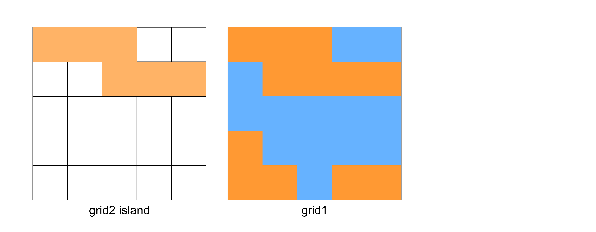
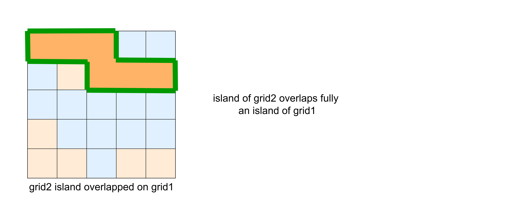
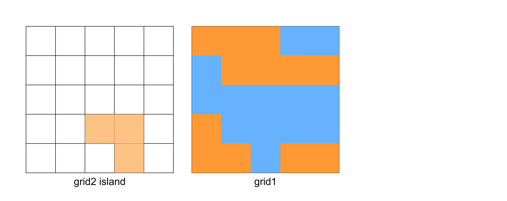
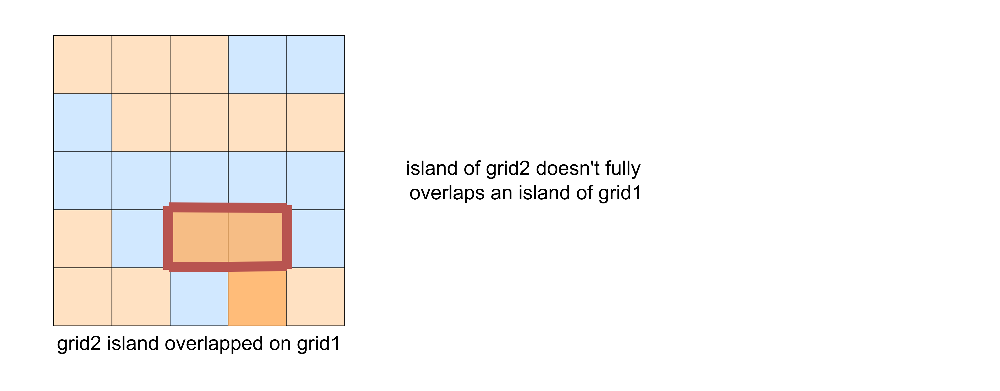
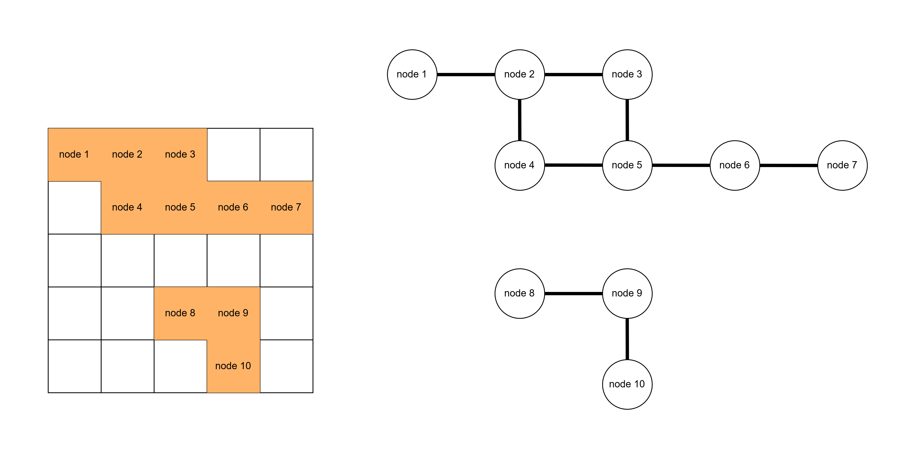

## ToC
- [August Week 5](#august-week-5)
  - [24.08.26 - 590. N-ary Tree Postorder Traversal](#240826---590-n-ary-tree-postorder-traversal)
    - [나](#나)
    - [gpt](#gpt)
  - [24.08.27 - 1514. Path with Maximum Probability](#240827---1514-path-with-maximum-probability)
    - [나](#나-1)
    - [Solution](#solution)
      - [Approach 1: Bellman-Ford Algorithm](#approach-1-bellman-ford-algorithm)
      - [Approach 2: Shortest Path Faster Algorithm (SPFA)](#approach-2-shortest-path-faster-algorithm-spfa)
      - [Approach 3: Dijkstra's Algorithm](#approach-3-dijkstras-algorithm)
  - [24.08.28 - 1905. Count Sub Islands](#240828---1905-count-sub-islands)
    - [나](#나-2)
    - [Solution](#solution-1)
      - [Approach 1: Breadth-First Search (BFS)](#approach-1-breadth-first-search-bfs)
      - [Approach 2: Depth-First Search](#approach-2-depth-first-search)
      - [Approach 3: Union-Find](#approach-3-union-find)
    - [gpt](#gpt-1)
  - [24.08.29 - 947. Most Stones Removed with Same Row or Column](#240829---947-most-stones-removed-with-same-row-or-column)
    - [나](#나-3)
    - [추후 해설 참고](#추후-해설-참고)
      - [Approach 1: Depth First Search](#approach-1-depth-first-search)
      - [Approach 2: Disjoint Set Union](#approach-2-disjoint-set-union)
      - [Approach 3: Disjoint Set Union (Optimized)](#approach-3-disjoint-set-union-optimized)
    - [gpt](#gpt-2)
  - [24.08.30 - 2699. Modify Graph Edge Weights](#240830---2699-modify-graph-edge-weights)
    - [나](#나-4)
    - [해설](#해설)
      - [Approach 1: Traditional Dijkstra's algorithm](#approach-1-traditional-dijkstras-algorithm)
      - [Approach 2: Dijkstra's Algorithm with Min-Heap](#approach-2-dijkstras-algorithm-with-min-heap)
  - [24.08.31 - 1514. Path with Maximum Probability](#240831---1514-path-with-maximum-probability)

# August Week 5
## 24.08.26 - 590. N-ary Tree Postorder Traversal
[문제 링크](https://leetcode.com/problems/n-ary-tree-postorder-traversal/description/?envType=daily-question&envId=2024-08-26)

### 나
```cpp
// 14ms, 15.2MB
/*
// Definition for a Node.
class Node {
public:
    int val;
    vector<Node*> children;

    Node() {}

    Node(int _val) {
        val = _val;
    }

    Node(int _val, vector<Node*> _children) {
        val = _val;
        children = _children;
    }
};
*/

class Solution {
public:
    vector<int> postorder(Node* root) {
        if(root) MakePostOrder(root); // left - right - root
        return answer;
    }
private:
    vector<int> answer;
    void MakePostOrder(Node* now) {
        for(Node* next : now->children) {
            MakePostOrder(next);
        }
        answer.push_back(now->val);
    }
};
```

### gpt
The problem you've shared involves performing a postorder traversal on an N-ary tree. In an N-ary tree, each node can have any number of children. The goal is to return the postorder traversal of the tree's nodes' values.

<h3> Problem Summary </h3>

In postorder traversal, for each node, you:
1. Traverse all its children in order.
2. Visit the node itself after all its children have been visited.

Given the root of an N-ary tree, you need to return the postorder traversal of its nodes' values.

<h3> Solution </h3>

<h4> Recursive Approach </h4>

The recursive approach is straightforward and mirrors the definition of postorder traversal.

```cpp
// 9ms, 15.3MB
/*
// Definition for a Node.
class Node {
public:
    int val;
    vector<Node*> children;

    Node() {}

    Node(int _val) {
        val = _val;
    }

    Node(int _val, vector<Node*> _children) {
        val = _val;
        children = _children;
    }
};
*/

class Solution {
public:
    void postorder(Node* node, vector<int>& result) {
        if (node == nullptr) return;
        
        // Traverse all children
        for (Node* child : node->children) {
            postorder(child, result);
        }
        
        // Visit the node itself
        result.push_back(node->val);
    }
    
    vector<int> postorder(Node* root) {
        vector<int> result;
        postorder(root, result);
        return result;
    }
};
```

<h4> Iterative Approach (Using One Stack) </h4>

An iterative solution can be implemented using a stack. This approach can be a bit trickier since you need to manage the order in which nodes are processed.

```cpp
// 15ms, 15.3MB
/*
// Definition for a Node.
class Node {
public:
    int val;
    vector<Node*> children;

    Node() {}

    Node(int _val) {
        val = _val;
    }

    Node(int _val, vector<Node*> _children) {
        val = _val;
        children = _children;
    }
};
*/

class Solution {
public:
    vector<int> postorder(Node* root) {
        vector<int> result;
        if (root == nullptr) return result;
        
        stack<Node*> stack;
        stack.push(root);
        
        while (!stack.empty()) {
            Node* node = stack.top();
            stack.pop();
            result.push_back(node->val);
            
            // Push all children to the stack
            for (Node* child : node->children) {
                stack.push(child);
            }
        }
        
        // Since we traversed in reverse postorder, reverse the result to get the correct order
        reverse(result.begin(), result.end());
        return result;
    }
};
```

<h3> Explanation </h3>

1. **Recursive Approach**:
   - The `postorder` function recursively traverses all the children of the current node before adding the node's value to the result list.
   - This approach is simple and directly follows the definition of postorder traversal for an N-ary tree.

2. **Iterative Approach**:
   - A stack is used to simulate the postorder traversal.
   - Nodes are processed in a reverse order (node before children) and then reversed at the end to get the correct postorder sequence.
   - This approach is useful when dealing with deep trees where recursion might cause a stack overflow.

<h3> Time Complexity </h3>

Both approaches have a time complexity of $O(n)$, where `n` is the number of nodes in the tree, since each node is visited exactly once.

<h3> Space Complexity </h3>

- **Recursive Approach**: $O(h)$, where `h` is the height of the tree, due to the recursive call stack.
- **Iterative Approach**: $O(h)$, where `h` is the height of the tree, due to the stack used for traversal.

<h3> Final Note </h3>

The recursive approach is generally simpler and easier to understand, while the iterative approach might be necessary for very large trees where recursion could lead to a stack overflow. Both solutions should work correctly for the problem provided on LeetCode.

## 24.08.27 - 1514. Path with Maximum Probability
[문제 링크](https://leetcode.com/problems/path-with-maximum-probability/description/?envType=daily-question&envId=2024-08-27)

### 나
```cpp
// 271ms, 74.09MB
using pid = pair<int, double>;
class Solution {
public:
    double maxProbability(int n, vector<vector<int>>& edges, vector<double>& succProb, int start_node, int end_node) {
        // undirected weighted graph
        vector<vector<GraphData>> graph(n);

        for(int s{}, e{static_cast<int>(edges.size())}; s<e; ++s) {
            int from = edges[s][0], to = edges[s][1];
            double prob = succProb[s];
            graph[from].emplace_back(to, prob);
            graph[to].emplace_back(from, prob);
        }

        // dijkstra
        priority_queue<pid> pq; // {node, probability}
        vector<double> dist(n, 0);
        pq.emplace(start_node, 1); 
        dist[start_node] = 1;

        while(!pq.empty()) {
            auto [now, nowProb] = pq.top(); pq.pop();
            if(dist[now] != nowProb) continue;
            for(auto [to, prob] : graph[now]) {
                double nextProb = nowProb * prob;
                if(nextProb > dist[to]) {
                    dist[to] = nextProb;
                    pq.emplace(to, nextProb);
                }
            }
        }

        return dist[end_node];
    }
private:
    struct GraphData {
        int to{};
        double prob{};
        GraphData() = default;
        GraphData(int to, double prob) : to{to}, prob{prob} {}
    };
};
```

### Solution
[링크](https://leetcode.com/problems/path-with-maximum-probability/editorial)

#### Approach 1: Bellman-Ford Algorithm

**Intuition**

> If you are not familiar with the Bellman-Ford algorithm, please refer to our [Bellman-Ford Algorithm Explore Card](https://leetcode.com/explore/learn/card/graph/622/single-source-shortest-path-algorithm/3864/). For the sake of brevity, we will focus only on the usage of Bellman-Ford and not the implementation details.

The algorithm works by relaxing edges in the graph, meaning that it tries to improve the shortest path estimate for each node in the graph until the solution is found.

Bellman-Ford is typically used to find the shortest path in a weighted graph. In this problem, instead of the shortest distance, we are looking for the **maximum probability**. The length of a path is the sum of the weights of its edges. Here, the probability of a path equals the product of the probabilities of its edges.

Initially, we set the probability to reach the starting node `start` as `1` and all other probabilities as `0`. Then we iteratively relax the edges of the graph by updating the probability to each node if a higher probability is found.

Considering that a path in the graph without a cycle contains at most `n - 1` edges, the process is repeated `n - 1` times, which is enough to relax every edge of every possible path.

- In the first round, we update the maximum probability of reaching each node `u` from the starting node along the path that contains only one edge `(u, v)`.
- In the second round, we update the maximum probability of reaching each node `u` from the starting node along the path that contains two edges (including `(u, v)`).
- and so on.

After `n - 1` rounds, we have updated `max_prob[end]` to be the maximum probability of reaching `end` from the starting node along every possible path.

**Algorithm**

1. Initialize an array `maxProb` as the maximum probability to reach each node from the starting node, set `maxProb[start]` as `1`.
2. Relax all edges: for each edge `(u, v)`, if a higher probability of reaching `u` through this edge is found, update the `max_prob[u] = max_prob[v] * path_prob`; similarly, if a higher probability to reach `v` through this edge is found, update `max_prob[v]`.
3. If we are unable to update any node with a higher probability, we can stop the iteration by proceeding to step 4. Otherwise, repeat step 2 until all edges are relaxed `n - 1` times.
4. Return `max_prob[end]`.

**Complexity Analysis**

Let `n` be the number of nodes and `m` be the number of edges.

- **Time complexity:** $O(n ⋅ m)$
  - The algorithm relaxes all edges in the graph `n - 1` times, and each round contains an iteration over all `m` edges.
  
- **Space complexity:** $O(n)$
  - We only need an array of size `n` to update the maximum probability to reach each node from the starting node.

---
#### Approach 2: Shortest Path Faster Algorithm (SPFA)

**Intuition**

The Shortest Path Faster Algorithm (SPFA) is an improvement of the Bellman–Ford algorithm which computes single-source shortest paths in a weighted directed graph.

We start at node `start` and traverse all its neighbors, calculating the probability of moving from `start` to each neighbor. We then add these neighbors to a queue, and continue the process for all nodes in the queue until we empty the queue.

The key is maintaining a running maximum probability for each node, and using this maximum to calculate the probabilities for its neighbors. If the probability of traveling from the starting node to a neighbor node through a specific edge is greater than the current maximum probability for that neighbor, we update the maximum probability of this neighbor node, and add this neighbor node to the queue.

Another key point to note is how we calculate the probability of traveling from `start` to a neighbor node. We are given a set of edge weights that represent the probabilities of moving from one node to another. To calculate the probability of traveling from the starting node to a neighbor node through a specific edge, we simply multiply the edge weight (i.e., the probability of traveling through that edge) by the maximum probability of reaching the current node from the starting node. This gives us the probability of reaching the neighbor node through the current edge.

> You might wonder, will repeatedly adding the same node back to the queue cause an infinite loop and result in a timeout?

The answer is NO because we only update the probability of reaching a neighbor node, say `nxt_node` and add it back to the queue if the current path **increases** the probability of reaching `nxt_node` from the starting node. Moreover, the weight (probability) of each path is less than or equal to 1. Therefore, even if the graph contains a cycle, the product of the probabilities of all edges in the cycle is still less than or equal to 1. Since loops do not increase the probability of reaching a node, paths that contain loops will be excluded from consideration and not added to the queue.

**Algorithm**

1. Initialize an empty queue `queue` to store nodes that need to be visited.
2. Initialize an array `max_prob` to store the maximum probability of reaching each node from the starting node. Set the probability of the starting node `max_prob[start]` as 1, and the probability of all other nodes as 0.
3. Add the starting node `start` to the `queue`.
4. While `queue` is not empty, we remove the first node `cur_node` from the queue.
5. For each neighbor of `nxt_node`, calculate the probability of traveling from the starting node to the `nxt_node` through the current edge (`cur_node --- nxt_node`), and update the maximum probability for this neighbor `max_prob[nxt_node]` if necessary.
6. If the probability to this neighbor node is increased, add `nxt_node` to `queue`.
7. Repeat steps 4-6 until `queue` is empty.
8. Return `max_prob[end]`, the maximum probability of reaching the end node `end` from the starting node.

**Complexity Analysis**

Let `n` be the number of nodes and `m` be the number of edges.

- **Time complexity:** $O(n ⋅ m)$
  - The worst-case running of SPFA is $O(|V| ⋅ |E|)$. However, this is only the worst-case scenario, and the average runtime of SPFA is better than in Bellman-Ford.

- **Space complexity:** $O(n + m)$
  - We build a hash map `graph` based on all edges, which takes $O(m)$ space.
  - The algorithm stores the probability array `max_prob` of size `n` and a queue of vertices `queue`. In the worst-case scenario, there are $O(m)$ nodes in `queue` at the same time.

---

#### Approach 3: Dijkstra's Algorithm

**Intuition**

> If you are not familiar with Dijkstra's algorithm, please refer to our [Dijkstra's Algorithm Explore Card](https://leetcode.com/explore/learn/card/graph/622/single-source-shortest-path-algorithm/3862/). For the sake of brevity, we will focus on the usage of the algorithm and not implementation details.

Dijkstra's algorithm takes into account the weights of the edges and always guarantees to find the highest probability from the source node to any other node in the graph. This is where Dijkstra's algorithm becomes more suitable than BFS, as it takes into account the weights (probabilities) of the edges and can find the path with the highest probability of reaching the end node.

We start from the starting node `start`, and consider its neighbors one by one, updating the probability to each neighboring node `nxt_node` if the probability of reaching `nxt_node` through the current node `cur_node` is higher than the previous stored probability of reaching `nxt_node` (by other paths). In order to always select the node with the highest reaching probability, we use a priority queue `pq` to store the nodes to visit, where the node with the highest probability of being reached from the starting node has the highest priority.

**Algorithm**

1. Initialize a priority queue `pq` to store nodes that need to be visited, and an array `max_prob` to store the maximum probability to reach each node from the starting node. Set the probability of the starting node as `1`, and the probability of all other nodes as `0`.
2. Add the starting node `start` and its probability to the priority queue.
3. While `pq` is not empty, remove `cur_node`, the node with the highest priority from it.
4. For each neighbor `nxt_node` of the current node `cur_node`, calculate the probability of traveling from the starting node to the `nxt_node` through the current edge `cur_node --- nxt_node`, and update the maximum probability of `nxt_node` if necessary. If the neighbor node `nxt_node` has not been visited, we add it and its probability to the `pq`.
5. Repeat steps 3-4 until the priority queue is empty or the ending node `end` has been reached.
6. Return `max_prob[end]`.

**Complexity Analysis**

Let `n` be the number of nodes and `m` be the number of edges.

- **Time Complexity:** $O((n + m) ⋅ log(n))$
  - We build an adjacency

 list `graph` based on all edges, which takes $O(m)$ time.
  - In the worst case, each node could be pushed into the priority queue exactly once, resulting in $O(n ⋅ log(n))$ operations.
  - Each edge is considered exactly once when its corresponding node is dequeued from the priority queue. This takes $O(m ⋅ log(n))$ time in total.

- **Space Complexity:** $O(n + m)$
  - We build an adjacency list `graph` based on all edges, which takes $O(m)$ space.
  - The algorithm stores the `maxProb` array, which uses $O(n)$ space.
  - We use a priority queue to keep track of nodes to be visited, and there are at most `n` nodes in the queue.


## 24.08.28 - 1905. Count Sub Islands
[문제 링크](https://leetcode.com/problems/count-sub-islands/description/?envType=daily-question&envId=2024-08-28)

### 나
못 풀었다..
```cpp
// Memory Limit Exceeded
using pii = pair<int,int>;
class Solution {
public:
    int countSubIslands(vector<vector<int>>& grid1, vector<vector<int>>& grid2) {
        // 0: water, 1: land
        // island: a group of 1's connected 4-directionally (horizontal and vertical)
        // outside of the grid: water cells
        // An island in grid2 is considered a sub-island if there is an island in grid1 that contains all the cells that make up this island in grid2.

        int n = grid1.size(), m = grid1[0].size();
        vector island1(n, vector(m,0));
        int cnt{1};
        for(int i{};i<n;++i){
            for(int j{};j<m;++j) {
                if(grid1[i][j] && !island1[i][j]) {
                    queue<pii> q;
                    q.emplace(i,j);
                    island1[i][j] = cnt;
                    while(!q.empty()) {
                        auto [x, y] = q.front(); q.pop();

                        for(int d{};d<4;++d) {
                            int nx = x + "0211"[d] - '1', ny = y + "1102"[d] - '1';
                            if(nx < 0 || nx >= n || ny < 0 || ny >= m) continue;
                            if(!grid1[nx][ny] || island1[nx][ny]) continue;
                            q.emplace(nx, ny);
                            island1[nx][ny] = cnt;
                        }
                    }
                }
                ++cnt;
            }
        }

        int answer{};
        vector island2(n, vector(m,0));
        for(int i{};i<n;++i){
            for(int j{};j<m;++j) {
                if(grid2[i][j] && island1[i][j] && !island2[i][j]) { 
                    auto ret = [&]() {
                        vector visited(n, vector(m,0));
                        queue<pii> q;
                        q.emplace(i,j);
                        int now = island1[i][j];
                        island2[i][j] = 1;
                        visited[i][j] = 1;
                        while(!q.empty()) {
                            auto [x, y] = q.front(); q.pop();

                            for(int d{};d<4;++d) {
                                int nx = x + "0211"[d] - '1', ny = y + "1102"[d] - '1';
                                if(nx < 0 || nx >= n || ny < 0 || ny >= m) continue;
                                if(!grid2[nx][ny] || visited[nx][ny]) continue;
                                if(now != island1[nx][ny]) {
                                    return false; // 다른 섬과 연결
                                }
                                q.emplace(nx, ny);
                                visited[nx][ny] = 1;
                                island2[nx][ny] = 1;
                            }
                        }
                        return true;
                    } ();
                    if(ret) ++answer;
                }
            }
        }

        return answer;
    }
};
```
너무 한 번에 하려고 했던 것 같다. (2번 각각 돌리고 나중에 한 번 더 확인하면 될 듯,)

### Solution

<h3> Overview </h3>

We are given two binary matrices, `grid1` and `grid2`, both of size `m x n`, where 1 represents land and 0 represents water. An island is a group of connected 1s, connected horizontally or vertically. The task is to find how many islands in `grid2` are also sub-islands of `grid1`. An island in `grid2` is considered a sub-island if every land cell of the island is part of an island in `grid1`.



If we overlap this image with `grid1`, we can see all the land cells of the island of `grid2` lie on one island in `grid1`.



Let's consider another island of the `grid2`. Now, is this a sub-island?



If we overlap this image with `grid1`, we can see two land cells are lying on the water cell, thus this island can't be considered a sub-island.



The above images hint that, to check whether an island of `grid2` is a sub-island in `grid1`, we can start traversing each land cell of the current island of `grid2`, and for each land cell, there should be a land cell in `grid1` at the same position (at the same `(x, y)` index in grids).

Each grid cell is connected to its adjacent neighbors 4-directionally (horizontal or vertical). This grid problem can be visualized as a graph traversal problem, where each cell is a node and the 4-directions are edges connecting those nodes.



We will iterate on each cell of the `grid2`. If the current cell is a land cell, we traverse the whole island of `grid2` containing the current land cell. While traversing over the entire island, we keep track of whether for each land cell of the island of `grid2`, the `grid1` also has a land cell at the respective position using a boolean variable. After iteration on the current island is completed, this boolean variable will denote if the island is a sub-island or not.

The following slideshow will give you an idea about this approach: (생략)

There are different techniques to traverse a graph. In this article, we will cover some of them briefly. We assume you already have a good knowledge of them. If you are new to the graph traversal algorithms, we recommend you read the following Leetcode articles before proceeding:

- [Breadth-First Search](https://leetcode.com/explore/learn/card/graph/620/breadth-first-search-in-graph/3883/)
- [Depth-First Search](https://leetcode.com/explore/learn/card/graph/619/depth-first-search-in-graph/3882/)
- [Union Find](https://leetcode.com/discuss/general-discussion/1072418/Disjoint-Set-Union-(DSU)Union-Find-A-Complete-Guide)

---

#### Approach 1: Breadth-First Search (BFS)

<h3> Intuition </h3>

Breadth-first search is used to traverse graphs level by level, and in this problem, each cell in the grid represents a node, with 4-directional connections as edges. The goal is to check if an island in `grid2` is a sub-island of `grid1`. We start BFS from each unvisited land cell in `grid2` and verify if all corresponding cells in `grid1` are also land cells. If we encounter a land cell in `grid2` where the corresponding cell in `grid1` is water, the island in `grid2` is not a sub-island.

We iterate through each cell in `grid2`, initiating BFS from each unvisited land cell to explore the island. During the traversal, we use a boolean flag `isSubIsland` to track if all corresponding cells in `grid1` are land. If the flag remains `true` after the traversal, we increment our sub-island count.

<h3> Algorithm </h3>

1. Create an array of `directions` storing the up, down, left, and right direction movements, which is the change in the `(x, y)` position value of the cell while moving.
2. Create a helper method `isCellLand(x, y, grid)` that returns a boolean value indicating whether the cell at position `(x, y)` in `grid` is a land cell.
3. Create a helper method `isSubIsland(x, y, grid1, grid2, visited)` that returns a boolean value indicating whether the island of `grid2` containing the cell at position `(x, y)` is a sub-island in `grid1`. This method will utilize the BFS algorithm to traverse all cells of the island of `grid2`:
   - Initialize a variable `isSubIsland` to `true`, indicating whether the island of `grid2` is a sub-island or not.
   - Initialize a queue, push the starting cell `(x, y)` in the queue and mark it as visited.
   - While the queue is not empty:
     - Pop the current cell from the queue.
     - If the cell in `grid1` at the same position as the current cell of `grid2` is not a land cell, then this island can't be a sub-island, so we mark the `isSubIsland` flag as `false`.
     - Next, we move in all 4 directions one by one using the `directions` array. If the cell at the next position `(nextX, nextY)` lies inside `grid2`, was not visited earlier, and is also a land cell, then we will traverse this cell by pushing it in the queue and marking it as visited.
   - When we traverse all cells of the current island, we return `isSubIsland`.
4. Initialize a boolean `visited` matrix of the same size as `grid2` to mark visited land cells.
5. Initialize a variable `subIslandsCount` to `0` to count the total number of islands in `grid2` that are also sub-islands.
6. Iterate over all cells of `grid2` using a nested for loop. If the current cell is not visited, is a land cell in `grid2`, and is a sub-island, increment the `subIslandsCount` by `1`.
7. At the end, return `subIslandsCount`.

<h3> Implementation </h3>

```cpp
// 312ms, 223.36MB
class Solution {
    // Directions in which we can traverse inside the grids.
    int directions[4][2] = {{0, 1}, {1, 0}, {0, -1}, {-1, 0}};

    // Helper method to check if the cell at the position (x, y) in the 'grid'
    // is a land cell.
    bool isCellLand(int x, int y, vector<vector<int>>& grid) {
        return grid[x][y] == 1;
    }

public:
    // Traverse all cells of island starting at position (x, y) in 'grid2',
    // and check this island is a sub-island in 'grid1'.
    bool isSubIsland(int x, int y, vector<vector<int>>& grid1,
                     vector<vector<int>>& grid2,
                     vector<vector<bool>>& visited) {
        int totalRows = grid2.size();
        int totalCols = grid2[0].size();

        int isSubIsland = true;

        queue<pair<int, int>> pendingCells;
        // Push the starting cell in the queue and mark it as visited.
        pendingCells.push({x, y});
        visited[x][y] = true;

        // Traverse on all cells using the breadth-first search method.
        while (!pendingCells.empty()) {
            int currX = pendingCells.front().first;
            int currY = pendingCells.front().second;
            pendingCells.pop();

            // If the current position cell is not a land cell in 'grid1',
            // then the current island can't be a sub-island.
            if (!isCellLand(currX, currY, grid1)) {
                isSubIsland = false;
            }

            for (auto& direction : directions) {
                int nextX = currX + direction[0];
                int nextY = currY + direction[1];
                // If the next cell is inside 'grid2', is never visited and
                // is a land cell, then we traverse to the next cell.
                if (nextX >= 0 && nextY >= 0 && nextX < totalRows &&
                    nextY < totalCols && !visited[nextX][nextY] &&
                    isCellLand(nextX, nextY, grid2)) {
                    // Push the next cell in the queue and mark it as visited.
                    pendingCells.push({nextX, nextY});
                    visited[nextX][nextY] = true;
                }
            }
        }

        return isSubIsland;
    }

    int countSubIslands(vector<vector<int>>& grid1,
                        vector<vector<int>>& grid2) {
        int totalRows = grid2.size();
        int totalCols = grid2[0].size();

        vector<vector<bool>> visited(totalRows, vector<bool>(totalCols, false));
        int subIslandCounts = 0;

        // Iterate on each cell in 'grid2'
        for (int x = 0; x < totalRows; ++x) {
            for (int y = 0; y < totalCols; ++y) {
                // If cell at the position (x, y) in the 'grid2' is not visited,
                // is a land cell in 'grid2', and the island
                // starting from this cell is a sub-island in 'grid1', then we
                // increment the count of sub-islands.
                if (!visited[x][y] && isCellLand(x, y, grid2) &&
                    isSubIsland(x, y, grid1, grid2, visited)) {
                    subIslandCounts += 1;
                }
            }
        }
        // Return total count of sub-islands.
        return subIslandCounts;
    }
};
```

<h3> Complexity Analysis </h3>

Let $m$ and $n$ represent the number of rows and columns, respectively.

- **Time complexity**: $O(m \cdot n)$
  - We iterate on each grid cell and perform BFS to traverse all land cells of all the islands. Each land cell is only traversed once. In the worst case, we may traverse all cells of the grid.
  - Thus, in the worst case time complexity will be $O(m \cdot n)$
  
- **Space complexity**: $O(m \cdot n)$
  - We create an additional grid `visited` of size $m \cdot n$ and push the land cells into the queue.
  - Thus, in the worst case space complexity will be $O(m \cdot n)$


#### Approach 2: Depth-First Search

<h3> Intuition </h3>

Depth-first search (DFS) explores as far as possible along each branch before backtracking, making it effective for checking if an island in `grid2` is a sub-island of `grid1`.

We start by iterating through each cell in `grid2`. Upon encountering an unvisited land cell, we initiate a DFS to mark all connected land cells as visited. During the traversal, we compare each cell in `grid2` with the corresponding cell in `grid1`. If any land cell in `grid2` maps to a water cell in `grid1`, the island is disqualified. If the island passes the check, it is counted as a sub-island.

DFS is ideal for this task because it efficiently handles deep, recursive exploration, avoiding the need for additional data structures like a queue.

<h3> Algorithm </h3>

1. Create an array `directions` for the four movement directions: up, down, left, and right, representing changes in `(x, y)` coordinates.
2. Define a helper method `isCellLand(x, y, grid)` to check if the cell at `(x, y)` in `grid` is a land cell.
3. Define a helper method `isSubIsland(x, y, grid1, grid2, visited)` to determine if the island in `grid2` containing cell `(x, y)` is a sub-island of `grid1`. This method uses DFS to:
   - Initialize `isSubIsland` as `true`.
   - Check if the corresponding cell in `grid1` is land; if not, set `isSubIsland` to `false`.
   - Move in all four directions. For each valid, unvisited land cell in `grid2`, recursively check if it’s part of a sub-island and update `isSubIsland` accordingly.
   - Return `isSubIsland` after traversing the island.
4. Initialize a boolean `visited` matrix of the same size as `grid2` to keep track of visited cells.
5. Initialize `subIslandsCount` to `0` to count sub-islands.
6. Iterate through all cells of `grid2`. For each unvisited land cell, use `isSubIsland` to check if it's a sub-island of `grid1`. Increment `subIslandsCount` if it is.
7. Return `subIslandsCount`.

<h3> Implementation </h3>

```cpp
// 408ms, 112.42MB
class Solution {
    // Directions in which we can traverse inside the grids.
    int directions[4][2] = {{0, 1}, {1, 0}, {0, -1}, {-1, 0}};

    // Helper method to check if the cell at the position (x, y) in the 'grid'
    // is a land cell.
    bool isCellLand(int x, int y, vector<vector<int>>& grid) {
        return grid[x][y] == 1;
    }

    // Traverse all cells of island starting at position (x, y) in 'grid2',
    // and check this island is a sub-island in 'grid1'.
    bool isSubIsland(int x, int y, vector<vector<int>>& grid1,
                     vector<vector<int>>& grid2,
                     vector<vector<bool>>& visited) {
        int totalRows = grid2.size();
        int totalCols = grid2[0].size();
        // Traverse on all cells using the depth-first search method.
        bool isSubIsLand = true;

        // If the current cell is not a land cell in 'grid1', then the current
        // island can't be a sub-island.
        if (!isCellLand(x, y, grid1)) {
            isSubIsLand = false;
        }

        // Traverse on all adjacent cells.
        for (auto& direction : directions) {
            int nextX = x + direction[0];
            int nextY = y + direction[1];
            // If the next cell is inside the 'grid2', is never visited and is a
            // land cell, then we traverse to the next cell.
            if (nextX >= 0 && nextY >= 0 && nextX < totalRows &&
                nextY < totalCols && !visited[nextX][nextY] &&
                isCellLand(nextX, nextY, grid2)) {
                // Push the next cell in the recursive stack and mark it as
                // visited.
                visited[nextX][nextY] = true;
                bool nextCellIsPartOfSubIsland =
                    isSubIsland(nextX, nextY, grid1, grid2, visited);
                isSubIsLand = isSubIsLand && nextCellIsPartOfSubIsland;
            }
        }
        return isSubIsLand;
    }

public:
    int countSubIslands(vector<vector<int>>& grid1,
                        vector<vector<int>>& grid2) {
        int totalRows = grid2.size();
        int totalCols = grid2[0].size();

        vector<vector<bool>> visited(totalRows, vector<bool>(totalCols, false));
        int subIslandCounts = 0;

        // Iterate on each cell in 'grid2'
        for (int x = 0; x < totalRows; ++x) {
            for (int y = 0; y < totalCols; ++y) {
                // If cell at the position (x, y) in the 'grid2' is not visited,
                // is a land cell in 'grid2',
                // and the island starting from this cell is a sub-island in
                // 'grid1', then we increment the count of sub-islands.
                if (!visited[x][y] && isCellLand(x, y, grid2)) {
                    visited[x][y] = true;
                    if (isSubIsland(x, y, grid1, grid2, visited)) {
                        subIslandCounts += 1;
                    }
                }
            }
        }
        // Return total count of sub-islands.
        return subIslandCounts;
    }
};
```

<h3> Complexity Analysis </h3>

Let $m$ and $n$ represent the number of rows and columns, respectively.

- **Time complexity**: $O(m \cdot n)$
  - We iterate on each grid cell and perform DFS to traverse all land cells of all the islands. Each land cell is only traversed once. In the worst case, we may traverse all cells of the grid.
  - Thus, in the worst case time complexity will be $O(m \cdot n)$
  
- **Space complexity**: $O(m \cdot n)$
  - We create an additional grid `visited` of size $m \cdot n$ and push the land cells in the recursive stack.
  - Thus, in the worst case space complexity will be $O(m \cdot n)$

#### Approach 3: Union-Find

<h3> Intuition </h3>

Union-Find, or Disjoint Set Union (DSU), is a data structure that efficiently manages disjoint subsets, supporting quick union and find operations. It’s well-suited for problems where you need to determine if elements are in the same subset or to merge subsets. The key idea is to treat each island as a separate set and unite these sets based on connectivity.

In this problem, each land cell in both `grid1` and `grid2` is treated as a node. We group nodes (land cells) into islands by using union operations. Then, we verify if the islands in `grid2` are entirely contained within the corresponding islands in `grid1`.

<h3> Algorithm </h3>

1. Create an array of `directions` to store the up, down, left, and right movements.
2. Define a `UnionFind` class that supports `find` and `union` operations.
   - `find(u)`: Returns the root of element `u`, applying path compression for optimization.
   - `union(u, v)`: Unites the sets containing `u` and `v`.
3. Use a helper method `convertToIndex(x, y, totalCols)` to convert 2D grid coordinates to a 1D index for the Union-Find structure.
4. Initialize a `UnionFind` object `uf` for both grids.
5. Iterate through `grid2`, performing union operations on adjacent land cells to group them into islands.
6. Use a boolean array `isSubIsland` to keep track of whether each island in `grid2` is a valid sub-island.
7. Iterate through `grid2` again. For each land cell in `grid2`, if its corresponding cell in `grid1` is water, mark the island as not a sub-island.
8. Count and return the number of sub-islands.

<h3> Implementation </h3>

```cpp
// 240ms, 96.08MB
class Solution {
    // Directions in which we can traverse inside the grids.
    int directions[4][2] = {{0, 1}, {1, 0}, {0, -1}, {-1, 0}};

    // Helper method to check if the cell at the position (x, y) in the 'grid'
    // is a land cell.
    bool isCellLand(int x, int y, vector<vector<int>>& grid) {
        return grid[x][y] == 1;
    }

    // Union-Find class.
    class UnionFind {
    public:
        vector<int> parent;
        vector<int> rank;

        // Itialize union-find object with 'n' elements.
        UnionFind(int n) {
            parent.resize(n);
            rank.resize(n, 0);
            for (int i = 0; i < n; ++i) {
                parent[i] = i;
            }
        }

        // Find the root of element 'u', using the path-compression technique.
        int find(int u) {
            if (parent[u] != u) {
                parent[u] = find(parent[u]);
            }
            return parent[u];
        }

        // Union two components of elements 'u' and 'v' respectively on the
        // basis of their ranks.
        void unionSets(int u, int v) {
            int rootU = find(u);
            int rootV = find(v);
            if (rootU != rootV) {
                if (rank[rootU] > rank[rootV]) {
                    parent[rootV] = rootU;
                } else if (rank[rootU] < rank[rootV]) {
                    parent[rootU] = rootV;
                } else {
                    parent[rootV] = rootU;
                    rank[rootU]++;
                }
            }
        }
    };

    // Helper method to convert (x, y) position to 1-dimensional index.
    int convertToIndex(int x, int y, int totalCols) {
        return x * totalCols + y;
    }

public:
    int countSubIslands(vector<vector<int>>& grid1,
                        vector<vector<int>>& grid2) {
        int totalRows = grid2.size();
        int totalCols = grid2[0].size();
        UnionFind uf(totalRows * totalCols);

        // Traverse on each land cell of 'grid2'.
        for (int x = 0; x < totalRows; ++x) {
            for (int y = 0; y < totalCols; ++y) {
                if (isCellLand(x, y, grid2)) {
                    // Union adjacent land cells with the current land cell.
                    for (auto& direction : directions) {
                        int nextX = x + direction[0], nextY = y + direction[1];
                        if (nextX >= 0 && nextY >= 0 && nextX < totalRows &&
                            nextY < totalCols &&
                            isCellLand(nextX, nextY, grid2)) {
                            uf.unionSets(
                                convertToIndex(x, y, totalCols),
                                convertToIndex(nextX, nextY, totalCols));
                        }
                    }
                }
            }
        }

        // Traverse on 'grid2' land cells and mark that cell's root not a
        // sub-island if land cell not present at the respective position in
        // 'grid1'.
        vector<bool> isSubIsland(totalRows * totalCols, true);
        for (int x = 0; x < totalRows; ++x) {
            for (int y = 0; y < totalCols; ++y) {
                if (isCellLand(x, y, grid2) && !isCellLand(x, y, grid1)) {
                    int root = uf.find(convertToIndex(x, y, totalCols));
                    isSubIsland[root] = false;
                }
            }
        }

        // Count all the sub-islands.
        int subIslandCounts = 0;
        for (int x = 0; x < totalRows; ++x) {
            for (int y = 0; y < totalCols; ++y) {
                if (isCellLand(x, y, grid2)) {
                    int root = uf.find(convertToIndex(x, y, totalCols));
                    if (isSubIsland[root]) {
                        subIslandCounts++;
                        // One cell can be the root of multiple land cells, so
                        // to avoid counting the same island multiple times and
                        // mark it as false.
                        isSubIsland[root] = false;
                    }
                }
            }
        }

        return subIslandCounts;
    }
};
```

<h3> Complexity Analysis </h3>

Let $m$ and $n$ represent the number of rows and columns, respectively.

- **Time complexity**: $O(m \cdot n)$
  - Each land cell is processed once during the union operations.
  - Thus, in the worst case time complexity will be $O(m \cdot n)$.
  
- **Space complexity**: $O(m \cdot n)$
  - The `UnionFind` data structure and the `isSubIsland` array both have size $m \cdot n$.
  - Thus, in the worst case space complexity will be $O(m \cdot n)$.


### gpt

Certainly! The problem you're referring to is the "Count Sub Islands" problem on LeetCode. The challenge involves two grids, `grid1` and `grid2`, where we need to count the number of islands in `grid2` that are also "sub-islands" in `grid1`. A sub-island is an island in `grid2` that is completely surrounded by land (1s) in `grid1`.

<h3> Problem Breakdown </h3>

- **Grid1** and **Grid2** are binary matrices where `1` represents land and `0` represents water.
- An island is a group of connected 1s (connected horizontally or vertically).
- A sub-island in `grid2` means that all the land cells (1s) in this island are present in `grid1` as well.

<h3> Approach </h3>

1. **Mark Invalid Sub-Islands in Grid2:**
   - First, we'll mark the islands in `grid2` that cannot be sub-islands by comparing them with `grid1`. If a land cell in `grid2` does not correspond to a land cell in `grid1`, we'll mark the entire island in `grid2` as invalid.

2. **Count Remaining Valid Sub-Islands:**
   - After marking, we'll count the remaining valid islands in `grid2`.

<h3> Implementation </h3>

We'll implement this using Depth-First Search (DFS) to traverse and mark islands. Below is the Python code for solving the problem:

```cpp
// 199ms, 95.73MB
class Solution {
public:
    // DFS function to explore the island
    bool dfs(vector<vector<int>>& grid1, vector<vector<int>>& grid2, int x, int y) {
        // Check if we are out of bounds or on water in grid2
        if (x < 0 || x >= grid1.size() || y < 0 || y >= grid1[0].size() || grid2[x][y] == 0) {
            return true;
        }
        
        // If this part of the island in grid2 is not part of grid1, it's not a sub-island
        if (grid1[x][y] == 0) {
            return false;
        }

        // Mark the current cell in grid2 as visited by setting it to 0
        grid2[x][y] = 0;
        
        // Explore all four directions
        bool top = dfs(grid1, grid2, x - 1, y);
        bool bottom = dfs(grid1, grid2, x + 1, y);
        bool left = dfs(grid1, grid2, x, y - 1);
        bool right = dfs(grid1, grid2, x, y + 1);
        
        // The current island in grid2 is only a sub-island if all its parts are valid
        return top && bottom && left && right;
    }

    int countSubIslands(vector<vector<int>>& grid1, vector<vector<int>>& grid2) {
        int subIslands = 0;
        
        // Iterate over every cell in grid2
        for (int i = 0; i < grid2.size(); ++i) {
            for (int j = 0; j < grid2[0].size(); ++j) {
                // If we find an unvisited land cell in grid2, perform DFS
                if (grid2[i][j] == 1) {
                    // If DFS confirms it's a sub-island, increment the count
                    if (dfs(grid1, grid2, i, j)) {
                        ++subIslands;
                    }
                }
            }
        }
        
        return subIslands;
    }
};
```

<h3> Explanation </h3>

1. **DFS Implementation:**
   - The `dfs` function explores an island starting from a cell `(x, y)` and checks if all its parts are valid by comparing with `grid1`.
   - If any part of the island in `grid2` is not part of `grid1`, the island cannot be a sub-island.

2. **Counting Sub-Islands:**
   - For each unvisited land cell in `grid2`, we initiate a DFS. If the DFS confirms that the island is a sub-island (returns `True`), we increment our sub-island count.

3. **Time Complexity:**
   - The time complexity is $O(m * n)$, where `m` and `n` are the dimensions of the grid. Each cell is visited at most once.

## 24.08.29 - 947. Most Stones Removed with Same Row or Column
[문제 링크](https://leetcode.com/problems/most-stones-removed-with-same-row-or-column/description/?envType=daily-question&envId=2024-08-29)

### 나
아이디어 생각을 못 함..
```cpp
// 58ms, 18.01MB
// 와 이게 unionfind?.. 와
// 겹치는 개수 구하고 (가장 적게 겹치는 애 지우고, 갱신 반복 아이디어) - 막막함.
class Solution {
    struct UnionFind {
        vector<int> par;

        UnionFind(int n) : par(n, -1) {}

        int Find(int a) {
            if(par[a] < 0) return a;
            return Find(par[a]);
        }

        bool Union(int a, int b) {
            a = Find(a), b = Find(b);
            if(a==b) return false;
            if(par[a] > par[b]) swap(a, b);
            par[a] += par[b];
            par[b] = a;
            return true;
        }
    };
public:
    int removeStones(vector<vector<int>>& stones) {
        int n = stones.size();
        
        UnionFind uf{n};
        for(int i{};i<n;++i) {
            for(int j{i + 1};j<n;++j) {
                if(stones[i][0] == stones[j][0] || stones[i][1] == stones[j][1]) {
                    uf.Union(i, j);
                }
            }
        }

        // Union 개수 카운팅
        int answer{};
        for(int i{};i<n;++i) {
            if(uf.par[i] < 0) ++answer;
        }
        return n - answer;
    }
};
```

### 추후 해설 참고

#### Approach 1: Depth First Search
[링크](https://leetcode.com/problems/most-stones-removed-with-same-row-or-column/editorial/?envType=daily-question&envId=2024-08-29#approach-1-depth-first-search)

#### Approach 2: Disjoint Set Union
[링크](https://leetcode.com/problems/most-stones-removed-with-same-row-or-column/editorial/?envType=daily-question&envId=2024-08-29#approach-2-disjoint-set-union)

#### Approach 3: Disjoint Set Union (Optimized)
[링크](https://leetcode.com/problems/most-stones-removed-with-same-row-or-column/editorial/?envType=daily-question&envId=2024-08-29#approach-3-disjoint-set-union-optimized)


### gpt
Certainly! The problem "Most Stones Removed with Same Row or Column" on LeetCode is an interesting problem that can be approached using graph theory, specifically using the Union-Find (also known as Disjoint Set Union) algorithm. 

<h3> Problem Breakdown </h3>

- **Objective:** You are given a 2D grid with stones placed at certain integer coordinates. A stone can be removed if there is another stone in the same row or column. The goal is to remove as many stones as possible such that at least one stone remains.
- **Challenge:** Determine the maximum number of stones that can be removed.

<h3> Approach </h3>

1. **Model as a Graph:**
   - Consider each stone as a node in a graph. If two stones share the same row or column, connect them with an edge.
   - The problem now reduces to finding connected components in this graph. In each connected component, all but one stone can be removed (because we need to leave one stone to maintain the "connectedness" of the component).

2. **Union-Find Algorithm:**
   - Use Union-Find to group stones that are in the same row or column.
   - Each connected component will then allow us to remove all stones except one.

<h3> C++ Implementation </h3>

```cpp
class Solution {
public:
    // Find function with path compression
    int find(int x, unordered_map<int, int>& parent) {
        if (parent[x] != x) {
            parent[x] = find(parent[x], parent); // Path compression
        }
        return parent[x];
    }

    // Union function to merge two components
    void unionSets(int x, int y, unordered_map<int, int>& parent, unordered_map<int, int>& rank) {
        int rootX = find(x, parent);
        int rootY = find(y, parent);
        
        if (rootX != rootY) {
            if (rank[rootX] > rank[rootY]) {
                parent[rootY] = rootX;
            } else if (rank[rootX] < rank[rootY]) {
                parent[rootX] = rootY;
            } else {
                parent[rootY] = rootX;
                rank[rootX]++;
            }
        }
    }

    int removeStones(vector<vector<int>>& stones) {
        unordered_map<int, int> parent;
        unordered_map<int, int> rank;

        // Initialize the parent of each stone (using row and column as distinct identifiers)
        for (const auto& stone : stones) {
            int x = stone[0]; // Row
            int y = stone[1] + 10000; // Column offset by 10000 to avoid collision with rows
            if (parent.find(x) == parent.end()) parent[x] = x;
            if (parent.find(y) == parent.end()) parent[y] = y;
            unionSets(x, y, parent, rank);
        }

        // Find number of unique connected components
        unordered_set<int> uniqueComponents;
        for (const auto& stone : stones) {
            int x = stone[0];
            uniqueComponents.insert(find(x, parent));
        }

        // The number of stones that can be removed is total stones minus the number of unique components
        return stones.size() - uniqueComponents.size();
    }
};
```

<h3> Explanation </h3>

1. **Union-Find Data Structure:**
   - **`parent`:** This map keeps track of the parent node for each stone (or rather, each row and column identifier).
   - **`rank`:** This map helps optimize the union operation by always attaching the smaller tree under the root of the bigger tree.

2. **Union Operation:**
   - Each stone's row and column are treated as nodes. We union the row and the column for each stone, effectively saying that the stone at `(x, y)` is connected to both its row and column.

3. **Counting Connected Components:**
   - After processing all stones, we count the number of unique root nodes using the `find` function. Each unique root represents a connected component, meaning one stone should be left in this component.

4. **Result Calculation:**
   - The maximum number of stones we can remove is the total number of stones minus the number of connected components. This is because in each connected component, all but one stone can be removed.

But It make wrong answer.
- counterexample: `[[0,0],[2,2],[10000,2]]`
- and answer is 1

Thank you for pointing out the issue. The counterexample you provided highlights a flaw in the initial approach where rows and columns are treated as separate entities with the same union-find structure. 

The problem is that in the initial solution, rows and columns that do not share a direct connection are being incorrectly considered part of the same connected component because of how the union-find was set up.

To fix this, we need to treat each stone as a unique entity in the union-find structure and only merge stones that are directly connected by either the same row or the same column.

<h3> Corrected Approach </h3>

We'll create a union-find structure that directly associates stones with each other by treating each stone as a unique node. We will only union stones that are in the same row or column.

<h3> Corrected C++ Implementation </h3>

```cpp
// 32ms, 23.60MB
class Solution {
public:
    // Find function with path compression
    int find(int x, unordered_map<int, int>& parent) {
        if (parent[x] != x) {
            parent[x] = find(parent[x], parent); // Path compression
        }
        return parent[x];
    }

    // Union function to merge two components
    void unionSets(int x, int y, unordered_map<int, int>& parent, unordered_map<int, int>& rank) {
        int rootX = find(x, parent);
        int rootY = find(y, parent);
        
        if (rootX != rootY) {
            if (rank[rootX] > rank[rootY]) {
                parent[rootY] = rootX;
            } else if (rank[rootX] < rank[rootY]) {
                parent[rootX] = rootY;
            } else {
                parent[rootY] = rootX;
                rank[rootX]++;
            }
        }
    }

    int removeStones(vector<vector<int>>& stones) {
        unordered_map<int, int> parent;
        unordered_map<int, int> rank;

        // Initialize the parent for each stone
        for (const auto& stone : stones) {
            int x = stone[0] + 10000; // Offset to distinguish rows from columns
            int y = stone[1];         // Keep columns distinct
            
            if (parent.find(x) == parent.end()) parent[x] = x;
            if (parent.find(y) == parent.end()) parent[y] = y;
            
            // Union the row and column of the current stone
            unionSets(x, y, parent, rank);
        }

        // Find the number of unique components
        unordered_set<int> uniqueComponents;
        for (const auto& stone : stones) {
            int x = stone[0] + 10000;
            uniqueComponents.insert(find(x, parent));
        }

        // The number of stones that can be removed is total stones minus the number of unique components
        return stones.size() - uniqueComponents.size();
    }
};
```

<h3> Explanation of the Corrected Approach </h3>

1. **Union-Find Data Structure:**
   - We represent each stone's row and column uniquely by offsetting the row indices by a large number (e.g., `10000`) to avoid any overlap between row and column indices. This allows us to distinguish them in the union-find structure.

2. **Union Operations:**
   - For each stone, we union its row and column by treating them as nodes in the union-find structure. Stones that share the same row or column are connected via their corresponding row or column nodes.

3. **Counting Components:**
   - After processing all stones, we count the number of unique components by finding the root of each stone's row node. Each component represents a group of stones that are interconnected, allowing us to remove all but one stone.

4. **Result Calculation:**
   - The number of removable stones is the total number of stones minus the number of connected components. In each component, all but one stone can be removed.

<h3> Counterexample Explanation </h3>

For the input `[[0,0],[2,2],[10000,2]]`:

- The row `0` and column `0` will be connected as one component.
- The row `2` and column `2` will be connected as a separate component.
- The row `10000` and column `2` will be another separate component.

In this scenario, there are three unique components, so we can only remove `1` stone, which is correct for this particular counterexample.

## 24.08.30 - 2699. Modify Graph Edge Weights
[문제 링크](https://leetcode.com/problems/modify-graph-edge-weights/description/?envType=daily-question&envId=2024-08-30)

### 나
해설 참고 하자..

### 해설

#### Approach 1: Traditional Dijkstra's algorithm
[링크](https://leetcode.com/problems/modify-graph-edge-weights/editorial/?envType=daily-question&envId=2024-08-30#approach-1-traditional-dijkstras-algorithm)

#### Approach 2: Dijkstra's Algorithm with Min-Heap
[링크](https://leetcode.com/problems/modify-graph-edge-weights/editorial/?envType=daily-question&envId=2024-08-30#approach-2-dijkstras-algorithm-with-min-heap)


## 24.08.31 - 1514. Path with Maximum Probability
08.27 문제와 동일.

- [08.27](#240827---1514-path-with-maximum-probability)
