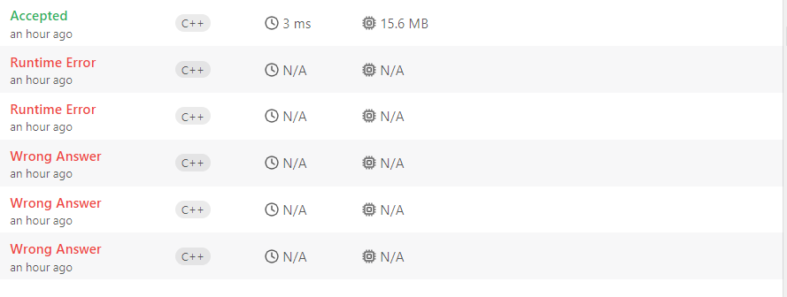
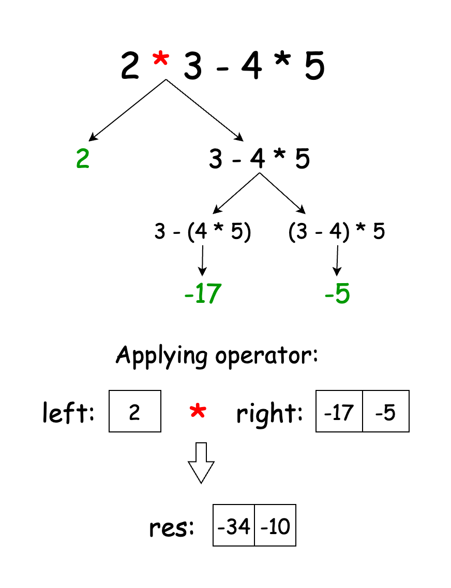
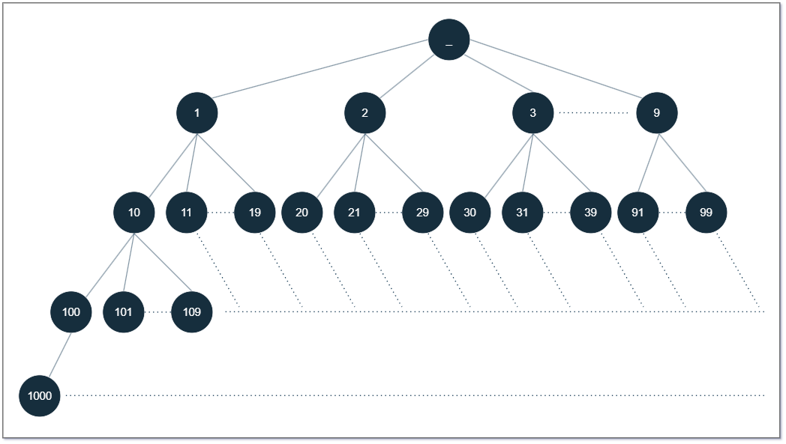

## ToC
- [September Week 3](#september-week-3)
  - [24.09.16 - 539. Minimum Time Difference](#240916---539-minimum-time-difference)
    - [나](#나)
    - [Solution](#solution)
      - [Approach 1: Sort](#approach-1-sort)
      - [Approach 2: Bucket Sort](#approach-2-bucket-sort)
  - [24.09.17 - 884. Uncommon Words from Two Sentences](#240917---884-uncommon-words-from-two-sentences)
    - [나](#나-1)
    - [gpt](#gpt)
  - [24.09.18 - 179. Largest Number](#240918---179-largest-number)
    - [나](#나-2)
    - [Solution](#solution-1)
      - [Proof of Correctness](#proof-of-correctness)
      - [Approach 1: Using Built-in Function](#approach-1-using-built-in-function)
      - [Approach 5: TimSort](#approach-5-timsort)
    - [TimSort \& IntroSort](#timsort--introsort)
      - [TimSort](#timsort)
      - [IntroSort](#introsort)
      - [Comparing Two.](#comparing-two)
  - [24.09.19 - 241. Different Ways to Add Parentheses](#240919---241-different-ways-to-add-parentheses)
    - [나](#나-3)
    - [Solution](#solution-2)
      - [Approach 1: Recursion](#approach-1-recursion)
      - [Approach 2: Memoization](#approach-2-memoization)
      - [Approach 3: Tabulation](#approach-3-tabulation)
  - [24.09.20 - 214. Shortest Palindrome](#240920---214-shortest-palindrome)
    - [나](#나-4)
    - [Solution](#solution-3)
      - [Approach 1: Brute Force](#approach-1-brute-force)
      - [Approach 2: Two Pointer](#approach-2-two-pointer)
      - [Approach 3: KMP (Knuth-Morris-Pratt) Algorithm](#approach-3-kmp-knuth-morris-pratt-algorithm)
      - [Approach 4: Rolling Hash Based Algorithm](#approach-4-rolling-hash-based-algorithm)
      - [Approach 5: Manacher's Algorithm](#approach-5-manachers-algorithm)
  - [24.09.21 - 386. Lexicographical Numbers](#240921---386-lexicographical-numbers)
    - [나](#나-5)
    - [Solution](#solution-4)
      - [Approach 1: DFS Approach](#approach-1-dfs-approach)
      - [Approach 2: Iterative Approach](#approach-2-iterative-approach)
  - [24.09.22 - 440. K-th Smallest in Lexicographical Order](#240922---440-k-th-smallest-in-lexicographical-order)
    - [나](#나-6)
    - [Solution 추후 갱신](#solution-추후-갱신)

# September Week 3
## 24.09.16 - 539. Minimum Time Difference
[문제 링크](https://leetcode.com/problems/minimum-time-difference/description/?envType=daily-question&envId=2024-09-16)

### 나
```cpp
// 1038ms, 19MB
class Solution {
public:
    int findMinDifference(vector<string>& timePoints) {
        vector<int> times;
        int answer = 1 << 30;
        for(string& timePoint : timePoints) {
            int curr = getTime(timePoint);
            int curr2 = 1440 + curr; // 24 hours later
            for(int time : times) {
                answer = min({answer, abs(curr - time), abs(time - curr)});
                answer = min({answer, abs(curr2 - time), abs(time - curr2)});
            }
            times.push_back(curr);
            times.push_back(curr2);
        }
        return answer;
    }
private:
    int getTime(string& timePoint) {
        return stoi(timePoint.substr(0,2)) * 60 + stoi(timePoint.substr(3));
    }
};
```

비효율적임

### Solution

<h3> Overview </h3>

We are given an array of times, where each time is given in `"HH:MM"` string format. We must return the minimum difference in minutes between any pair of times in the array.

#### Approach 1: Sort

<h3> Intuition </h3>

Since the times are given in `"HH:MM"` string format instead of the number of minutes, we can start by parsing the string format of each time and converting it into the total number of minutes passed since `"00:00"`.


If this converted array is sorted in ascending order, then the minimum difference must be the difference in an adjacent pair of times. This is because adjacent elements in a sorted array have smaller differences than nonadjacent elements. Thus, we can sort our array and calculate the difference between each adjacent pair of elements, keeping track of the smallest difference.

An edge case we have to consider is if the smallest difference is between the last and first element, in which case the time loops back to `"00:00"`. For example, if the last and first time is `"22:00"` and `"02:00"`, then the time difference is 4 hours or 240 minutes.

Thus, checking the difference between each adjacent pair in the sorted array as well as the difference between the first and last element will give us the minimum time difference.

<h3> Algorithm </h3>

1. Initialize an array `minutes` to store the given time points in units of minutes.
2. For each time `time` in the given `timePoints` array:
   - Parse the first two characters in `time` to get the hour `h`.
   - Parse the last two characters to get the minutes `m`.
   - Calculate the total number of minutes `h * 60 + m` and store the value in `minutes`.
3. Sort `minutes` in ascending order.
4. Initialize our answer variable `ans = Integer.MAX_VALUE`.
5. Iterate through each adjacent pair of elements `(i, i+1)` in `minutes` to find the minimum time difference:
   - `ans = min(ans, minutes[i+1] - minutes[i])`.
6. Return the minimum of `ans` and `24 * 60 - minutes[minutes.length - 1] + minutes[0]`, the amount of time between the last and first elements.

<h3> Implementation </h3>

```cpp
// 14ms, 17.46MB
class Solution {
public:
    int findMinDifference(vector<string>& timePoints) {
        // Convert input to minutes
        vector<int> minutes(timePoints.size());
        for (int i = 0; i < timePoints.size(); i++) {
            string time = timePoints[i];
            int h = stoi(time.substr(0, 2));
            int m = stoi(time.substr(3));
            minutes[i] = h * 60 + m;
        }

        // Sort times in ascending order
        sort(minutes.begin(), minutes.end());

        // Find minimum difference across adjacent elements
        int ans = INT_MAX;
        for (int i = 0; i < minutes.size() - 1; i++) {
            ans = min(ans, minutes[i + 1] - minutes[i]);
        }

        // Consider difference between last and first element
        return min(ans, 24 * 60 - minutes[minutes.size() - 1] + minutes[0]);
    }
};
```

<h3> Complexity Analysis </h3>

Let $N$ be the size of the given array `timePoints`.

- **Time Complexity**: $O(N \cdot \log N)$  
  Converting the input into minutes and traversing the sorted array to calculate the minimum difference both take $O(N)$ time. However, sorting the array takes $O(N \cdot \log N)$ time. Thus, the total time complexity is $O(N \cdot \log N)$.
  
- **Space Complexity**: $O(N)$  
  Our array `minutes` to store the converted input takes $O(N)$ space.

#### Approach 2: Bucket Sort

<h3> Intuition </h3>

In Approach 1, our time complexity was dominated by the time needed for sorting, which was $O(N \cdot \log N)$. However, we notice that the values in our array `minutes` can only fall into the range $[0, 24 \cdot 60 - 1]$. Because we know the range of values for the array we'd like to sort, we can instead use bucket sort, which is a sorting algorithm that can be done in linear time.

Bucket sort is typically completed in three steps:

1. We initialize an array `buckets` whose size is equal to the total number of possible values.
2. We process the input array so that each element `buckets[i]` contains the frequency count of the value `i` in the input array.
3. We can finally produce the sorted array by iterating through each element/bucket `buckets[i]` in `buckets` and append the value `i` `buckets[i]` times to a new array.

For our purposes, we can use a modified bucket sort for `minutes` where `minutes[i]` will contain a boolean value for whether or not the input array has value `i`. After, we can iterate through `minutes` in a similar fashion as Approach 1, where we keep track of the difference between adjacent elements, as well as the difference between the last and first elements.

<h3> Algorithm </h3>

1. Initialize array `minutes` with a size of $24 \cdot 60$.
2. For each `time` in `timePoints`:
   - Parse `time` and convert to the total number of minutes `min`.
   - If `minutes[min] == true`, then that means `time` appears more than once in our array, which means the minimum time difference is just $0$, so return $0$.
   - Otherwise, set `minutes[min] == true`.
3. Initialize variable `prevIndex = Integer.MAX_VALUE` to keep track of the previous time to calculate the time difference for adjacent pairs.
4. Initialize variables `firstIndex = Integer.MAX_VALUE` and `lastIndex = Integer.MAX_VALUE` to keep track of the first and last elements in our array.
5. Initialize answer variable `ans = Integer.MAX_VALUE` to maintain the minimum time difference between adjacent pairs.
6. Iterate through values `i` between $[0, 24 \cdot 60 - 1]$:
   - If `minutes[i]` is true, then the time `i` is present in our array:
     - If `prevIndex` does not contain the default value `Integer.MAX_VALUE`, then we can find the difference between time `i` and the previous time `prevIndex`: `ans = min(ans, i - prevIndex)`.
     - Update `prevIndex` to `i`.
     - If `firstIndex` contains the default value, then `i` is the first element in our sorted array, so we can set `firstIndex = i`.
     - Update `lastIndex` to `i`.
7. Return the minimum between `ans` and $24 \cdot 60 - lastIndex + firstIndex$.

<h3> Implementation </h3>

```cpp
// 7ms, 17.40MB
class Solution {
public:
    int findMinDifference(vector<string>& timePoints) {
        // create buckets array for the times converted to minutes
        vector<bool> minutes(24 * 60, false);
        for (string time : timePoints) {
            int h = stoi(time.substr(0, 2));
            int m = stoi(time.substr(3));
            int min = h * 60 + m;
            if (minutes[min]) return 0;
            minutes[min] = true;
        }
        int prevIndex = INT_MAX;
        int firstIndex = INT_MAX;
        int lastIndex = INT_MAX;
        int ans = INT_MAX;

        // find differences between adjacent elements in sorted array
        for (int i = 0; i < 24 * 60; i++) {
            if (minutes[i]) {
                if (prevIndex != INT_MAX) {
                    ans = min(ans, i - prevIndex);
                }
                prevIndex = i;
                if (firstIndex == INT_MAX) {
                    firstIndex = i;
                }
                lastIndex = i;
            }
        }

        return min(ans, 24 * 60 - lastIndex + firstIndex);
    }
};
```

<h3> Complexity Analysis </h3>

Let $N$ be the size of the given array `timePoints`.

- **Time Complexity**: $O(N)$  
  In contrast to Approach 1, our sorting only takes $O(N)$ time.
  
- **Space Complexity**: $O(1)$  
  Our array `minutes` will always have a size of $24 \cdot 60$, so the space complexity is constant.


## 24.09.17 - 884. Uncommon Words from Two Sentences
[문제 링크](https://leetcode.com/problems/uncommon-words-from-two-sentences/description/?envType=daily-question&envId=2024-09-17)

### 나
```cpp
// 0ms, 8.9MB
class Solution {
public:
    vector<string> uncommonFromSentences(string s1, string s2) {
        istringstream iss(s1);
        string tmp;
        map<string, int> stringMap;
        while(getline(iss, tmp, ' ')) {
            if(stringMap.count(tmp)) {
                stringMap[tmp]++;
            }
            else stringMap[tmp] = 1;
        }

        
        istringstream iss2(s2);
        while(getline(iss2, tmp, ' ')) {
            if(stringMap.count(tmp)) {
                stringMap[tmp]++;
            }
            else stringMap[tmp] = 1;
        }

        vector<string> answer;
        for(auto& [key, value] : stringMap) {
            if(value == 1) answer.push_back(key);
        }

        return answer;
    }
};
```

### gpt
The problem asks to find "uncommon words" from two given sentences. An uncommon word is defined as one that appears exactly once in either sentence but not in both. 

Here's a C++ solution that solves this problem:

```cpp
// 5ms, 8.71MB
class Solution {
public:
    vector<string> uncommonFromSentences(string s1, string s2) {
        unordered_map<string, int> wordCount;
        stringstream ss(s1 + " " + s2);
        string word;
        
        // Count frequency of each word in both sentences
        while (ss >> word) {
            wordCount[word]++;
        }
        
        // Collect words that appear only once
        vector<string> result;
        for (auto& entry : wordCount) {
            if (entry.second == 1) {
                result.push_back(entry.first);
            }
        }
        
        return result;
    }
};
```

<h3> Explanation: </h3>

1. Combine both sentences into a single string with `s1 + " " + s2`.
2. Use a `stringstream` to extract each word and store it in a `unordered_map<string, int>` to track word frequencies.
3. Traverse the map and collect words with a frequency of exactly 1 into a result vector.

Time complexity: $O(N)$, where N is the total number of words in both sentences.

## 24.09.18 - 179. Largest Number
[문제 링크](https://leetcode.com/problems/largest-number/description/?envType=daily-question&envId=2024-09-18)

### 나


ㅎㅎ..

```cpp
// 3ms, 15.58MB
class Solution {
public:
    string largestNumber(vector<int>& nums) {
        sort(begin(nums), end(nums), [](const int a, const int b) {
            // 그냥 숫자로 비교하지 말고.. (사실 아이디어도 틀림)
            // 3, 303 => 300, 303으로 만들어서 더 작은 수가 앞에 오기? => 3303
            // 34, 3 => 34, 30으로 만들어서 더 작은 수가 앞에 오기? => 334 (X)
            string strA = to_string(a);
            string strB = to_string(b);

            return strA + strB > strB + strA;
        });

        string answer;
        for (int num : nums) {
            answer += to_string(num);
        }

        // "00" => "0", "000" => "0"
        // stoll => long long 범위 벗어남.
        // Handle the case where the largest number is zero
        if (answer[0] == '0') return "0";

        return answer;
    }
};
```
- 정렬 기준
  - 그냥 합쳤을 때 더 큰지 비교하기(수학적으로 접근 X)
- "000..."일 때 "0"으로 만들기.


### Solution

<h3> Overview </h3>

We need to arrange a list of non-negative integers such that their concatenation results in the largest possible number. Return this largest number as a string.

To solve this, we use a custom comparator—a function or object that defines how two elements are compared for sorting. It’s used when the default comparison operations (like `<` or `>`) do not fit the requirements of a particular task. In this case, we want to compare numbers based on the result of their concatenation in two different orders.

First, we convert each integer to a string. Then, we sort the array of strings.

Sorting the numbers in descending order might seem like a good idea, but it leads to issues when numbers share the same leading digit. For example, sorting `[9, 5, 34, 3, 30]` in descending order gives `"9534303"`, but the correct answer is `"9534330"`. The problem arises because `"3"` and `"30"` share the same leading digit.

To fix this, we compare the concatenated results of pairs of numbers. For example, given two numbers `a` and `b`, we compare `a + b` and `b + a` (where `+` denotes string concatenation). If `a + b` is larger, we place `a` before `b`. This ensures that the numbers are ordered correctly for the largest possible result.

The key is that this comparison ensures that the greedy approach of comparing pairs of numbers leads to the correct result. The difficult part is proving that this greedy logic always gives the correct answer.

#### Proof of Correctness

**Objective**: To ensure that our custom comparator for sorting numbers produces the largest possible concatenated number.

1. **Transitivity of the Comparator**:

   To verify the validity of the comparator, we need to prove that it is transitive. In other words, if number `A` should come before `B`, and `B` should come before `C`, then `A` must come before `C` in the final order.

   We define the function:

   $$
   f(X) = 10^{\text{lg}(X) + 1}
   $$

   where `lg(X)` denotes the logarithm base 10 of `X`. This function helps in determining the power of 10 needed to position `X` correctly when concatenating.

2. **Comparator Verification**:

   If concatenating `A` and `B` as `AB` is less than or equal to `BA`, we need to verify that:

   $$
   f(B) \cdot A + B \leq f(A) \cdot B + A
   $$

   Similarly, if `B` and `C` satisfy:

   $$
   f(C) \cdot B + C \leq f(B) \cdot C + B
   $$

3. **By Combining These Inequalities**:

   $$
   A \cdot f(C) + A \leq C \cdot f(A) + C
   $$

   This demonstrates that if `A` is before `B` and `B` is before `C`, then `A` must come before `C`, maintaining a consistent ordering.

4. **By Establishing the Consistency of the Comparator**:

   We confirm that sorting numbers with this comparator yields the largest concatenated number. For example, sorting `[3, 30, 34, 5, 9]` yields `[9, 5, 34, 3, 30]`, which concatenates to `"9534330"`, the largest possible number.

#### Approach 1: Using Built-in Function

<h3> Intuition </h3>

To begin with, we need to determine the best order for the numbers to form the largest possible number when concatenated. We first convert each integer in the list to a string. This conversion allows us to compare different concatenated results. For instance, if we have the numbers `56` and `9`, converting them to strings allows us to compare `"569"` and `"956"`.

Next, we use a custom sorting function to order these strings. This function compares two strings, `a` and `b`, by evaluating `a + b` against `b + a`. If `a + b` is greater, then `a` should come before `b` in the sorted list to maximize the final result.

Once sorted, we concatenate all the strings. If the first element in this sorted list is `"0"`, it indicates that all numbers were zeros, so the largest number possible is `"0"`. In this case, we return `"0"`. If not, we return the concatenated result.

<h3> Algorithm </h3>

- Initialize `numStrings` as an array of strings to hold string representations of numbers.
- Convert each integer in `nums` to a string and store it in `numStrings`.
- Sort `numStrings` based on concatenated values:
  - Use a lambda function to compare concatenated results (`a + b` and `b + a`).
  - Ensure that the concatenation which forms a larger number determines the order.
- Check if the largest number formed is `"0"`:
  - If the first element in `numStrings` is `"0"`, return `"0"` (handles cases where all numbers are zero).
- Concatenate all strings in `numStrings` to form the largest number.
- Return the concatenated result as the largest number.

<h3> Implementation </h3>

```cpp
// 11ms, 17.3MB
class Solution {
public:
    string largestNumber(vector<int> &nums) {
        vector<string> numStrings;
        // Convert each integer to a string
        for (int num : nums) {
            numStrings.push_back(to_string(num));
        }

        // Sort strings based on concatenated values
        sort(numStrings.begin(), numStrings.end(),
             [](string &a, string &b) { return a + b > b + a; });

        // Handle the case where the largest number is zero
        if (numStrings[0] == "0") return "0";

        // Concatenate sorted strings to form the largest number
        string largestNum;
        for (string &numStr : numStrings) {
            largestNum += numStr;
        }

        return largestNum;
    }
};
```

<h3> Complexity Analysis </h3>

Let $n$ be the size of the `nums` array.

- **Time Complexity**: $O(n \log n)$
  - The most time-consuming operation is the sorting step, which uses a custom comparator. The sorting algorithm has a time complexity of $O(n \log n)$. The conversion of numbers to strings and concatenation operations are linear with respect to the number of elements.
- **Space Complexity**: $O(n + S)$
  - Additional space is used for storing the string representations of the numbers and the final concatenated result, which scales linearly with the size of the input array.

---
QuickSort, Merge Sort, Heap Sort 생략

Here is the same content formatted in Markdown with mathematical expressions rendered using LaTeX syntax:

#### Approach 5: TimSort

TimSort is a sorting algorithm that combines insertion sort and merge sort.

We start by dividing the list into small segments called runs. Each run is a segment of the list that is sorted independently using insertion sort. Insertion sort is well-suited for this task because it efficiently handles small or already partially sorted segments. For instance, in our example list `[3, 30, 34, 5, 9]`, TimSort first breaks it into runs. Since the list is small, it might treat the entire list as a single run or split it into smaller manageable runs like `[3, 30]` and `[34, 5, 9]` (although usually runs are not this small, but for the sake of this example, let's assume this).

> Minrun is chosen from the range 32 to 64 inclusive, such that the size of the data, divided by minrun, is equal to or slightly less than a power of two.

Next, we merge these sorted runs into larger, sorted segments. During the merging phase, we use a custom comparison function to determine the order of numbers based on which concatenated result is larger.

After all runs are merged, we get a fully sorted list arranged to form the largest possible number. Finally, we check if the result starts with '0'. If it does, this indicates that all numbers are zeros, so we return `"0"`.

Consider the list `[3, 30, 34, 5, 9]`. TimSort starts by sorting small runs like `[3, 30]` and `[34, 5, 9]` using insertion sort. It then merges these runs, comparing concatenated results to determine the correct order. For instance, it would compare `"330"` with `"303"` and place `"3"` before `"30"` because `"330"` is larger. The final merge step sorts the list to `[9, 5, 34, 3, 30]`. Concatenating these gives us the largest number, `"9534330"`.

TimSort aims to optimize the merging process by ensuring that the number of runs is close to a power of two. Merging is most effective when the number of runs is equal to or just under a power of two, while it becomes less efficient when the number of runs exceeds a power of two. To achieve this, TimSort selects the value of `RUN` so that the total number of runs is close to a power of two.

`RUN` is chosen within the range of 32 to 64. It is set so that the total size of the data divided by `RUN` is either equal to or slightly less than a power of two. The method for determining `RUN` involves taking the six most significant bits of the array size, adding one if any of the remaining bits are set, and using this result for `RUN`. This approach accommodates all array sizes, including those smaller than 64. For arrays with 63 or fewer elements, `RUN` is set equal to the array size, effectively reducing TimSort to insertion sort for those smaller arrays.

> Fun fact: TimSort is highly regarded for its efficiency and stability. It is more advanced compared to older algorithms like bubble sort or insertion sort. Invented by Tim Peters in 2002, it was named after him. TimSort is used in Python's built-in sort.

<h3> Algorithm </h3>

- Sort the `nums` array using the custom `timSort` algorithm.

- `timSort` function:
  - For each small run of size `RUN` (32 elements), call `insertionSort` to sort the subarrays.
  - After sorting small runs, iteratively merge them using the `merge` function until the entire array is sorted.

- `insertionSort` function:
  - Iterate through the subarray from `left + 1` to `right`.
  - For each element, store it in a temporary variable `temp`.
  - Compare `temp` with its previous elements (from right to left) using the `compare` function:
    - If the comparison returns `true` (i.e., `temp` should precede the compared element), shift the previous element to the right.
  - Insert `temp` in its correct position once all comparisons are done.

- `merge` function:
  - Split the array into two subarrays: `leftArr` (from `left` to `mid`) and `rightArr` (from `mid + 1` to `right`).
  - Merge the two subarrays back into the original array:
    - Compare the elements from both subarrays using the `compare` function.
    - Insert the smaller element into the original array and proceed until both subarrays are fully merged.

- `compare` function:
  - Convert the two numbers `firstNum` and `secondNum` into strings.
  - Concatenate them in both possible orders and return `true` if the first concatenation results in a larger number.

- Once `nums` is sorted, concatenate all elements in `nums` to form the `largestNum` string.
- If the first character of `largestNum` is `'0'`, return `"0"` to handle the case where all numbers are zero.
- Otherwise, return `largestNum` as the final result.

<h3> Implementation </h3>

```cpp
// 14ms, 15.62MB
class Solution {
public:
    string largestNumber(vector<int>& nums) {
        // Sort the numbers using Tim Sort
        timSort(nums);
        // Concatenate sorted numbers to form the largest number
        string largestNum;
        for (int num : nums) {
            largestNum += to_string(num);
        }
        // Handle the case where the largest number is zero
        return largestNum[0] == '0' ? "0" : largestNum;
    }

private:
    const int RUN = 32;

    void insertionSort(vector<int>& nums, int left, int right) {
        for (int i = left + 1; i <= right; ++i) {
            int temp = nums[i];
            int j = i - 1;
            while (j >= left && compare(temp, nums[j])) {
                nums[j + 1] = nums[j];
                --j;
            }
            nums[j + 1] = temp;
        }
    }

    void merge(vector<int>& nums, int left, int mid, int right) {
        vector<int> leftArr(nums.begin() + left, nums.begin() + mid + 1);
        vector<int> rightArr(nums.begin() + mid + 1, nums.begin() + right + 1);

        int i = 0, j = 0, k = left;
        while (i < leftArr.size() && j < rightArr.size()) {
            if (compare(leftArr[i], rightArr[j])) {
                nums[k++] = leftArr[i++];
            } else {
                nums[k++] = rightArr[j++];
            }
        }
        while (i < leftArr.size()) nums[k++] = leftArr[i++];
        while (j < rightArr.size()) nums[k++] = rightArr[j++];
    }

    void timSort(vector<int>& nums) {
        int n = nums.size();
        // Sort small runs with insertion sort
        for (int i = 0; i < n; i += RUN) {
            insertionSort(nums, i, min(i + RUN - 1, n - 1));
        }
        // Merge sorted runs
        for (int size = RUN; size < n; size = 2 * size) {
            for (int left = 0; left < n; left += 2 * size) {
                int mid = left + size - 1;
                int right = min(left + 2 * size - 1, n - 1);
                if (mid < right) {
                    merge(nums, left, mid, right);
                }
            }
        }
    }

    bool compare(int firstNum, int secondNum) {
        return to_string(firstNum) + to_string(secondNum) >
               to_string(secondNum) + to_string(firstNum);
    }
};
```

<h3> Complexity Analysis </h3>

Let $n$ be the size of the `nums` array.

- **Time Complexity**: $O(n \log n)$
  - The main time-consuming operation here is the sorting step using TimSort. Its time complexity is $O(n \log n)$ in the average and worst cases.
  - Specifically:
    - The insertion sort runs in $O(n^2)$ time on small segments (runs), but since it operates on a limited size of `RUN`, the total cost for insertion sorting all runs is $O(n)$ in practice.
    - The merge step involves merging pairs of runs and is performed $\log n$ times, leading to the overall time complexity of $O(n \log n)$ for TimSort.
  - Concatenating the numbers to form the final string has a linear time complexity $O(n)$, but it doesn't affect the overall complexity since $O(n \log n)$ dominates.

- **Space Complexity**: $O(n)$
  - The space complexity is dominated by the space used for temporary storage during merging:
    - The `leftArr` and `rightArr` vectors in the merge function require $O(n)$ space in total.
    - The extra space used for the `largestNum` string is $O(n)$.
  - Other auxiliary space used in the algorithm, such as variables and function call stacks, is minimal compared to the space required for arrays.
  - Thus, the overall space complexity is $O(n)$.

---

<h3> Further Thoughts </h3>

You might be wondering why merging is most effective when the number of runs is equal to or just below a power of two, and why it becomes less efficient when the number of runs exceeds this number.

The main reason for this is that merging is most balanced when the number of runs is a power of two. If the data is randomly ordered, each run will typically be about the size of `minrun`. When the number of runs matches a power of two, merging operations can proceed in a perfectly balanced manner throughout the process. This balance minimizes the number of comparisons and data movements needed.

If the number of runs is slightly more than a power of two, the merging process becomes less balanced. This imbalance results in inefficient merges, as you end up with uneven merge sizes, leading to increased comparisons and data movement.

Conversely, if the number of runs is slightly fewer than a power of two, the merges remain relatively balanced, although not perfectly. This slight imbalance causes only a minor increase in inefficiency compared to the ideal scenario.

For example, if you have nine natural runs with lengths of 800, 100, 100, 100, 100, 100, 100, and 100 elements, the merges will still be well-balanced, even though the number of runs is slightly above a power of two.

Tim Peters talks about this in his [listsort.txt](https://github.com/python/cpython/blob/main/Objects/listsort.txt) file. He points out that using a `minrun` of 32 isn't always the best choice. For example, if you have 2,112 elements, splitting them into runs of 32 means it will take 7 steps to merge everything. The first 6 runs merge smoothly, but after reaching 2,048 elements, the final merge becomes less efficient. This leads to more comparisons and extra data movement.

Now, if the run size is 33, it will take 6 steps to merge everything: 33, 66 (33 * 2), 132 (66 * 2), 264 (132 * 2), 528 (264 * 2), 1,056 (528 * 2) and then 2,112 (1,056 * 2). But with a run size of 32, you'll need 7 steps: 32, 64, 128, 256, 512, 1,024, 2,048, and then 2,112.

You can view the full implementation of TimSort, including all the detailed aspects, in the file located at [https://svn.python.org/projects/python/trunk/Objects/listobject.c](https://svn.python.org/projects/python/trunk/Objects/listobject.c). This implementation was crafted by Tim Peters.

Here’s a snippet taken from `listobject.c` showing how to determine the minimum run size for a subarray in the TimSort algorithm based on the size of the initial array `n`:

```c
/* Compute a good value for the minimum run length; natural runs shorter
 * than this are boosted artificially via binary insertion.
 *
 * If n < 64, return n (it's too small to bother with fancy stuff).
 * Else if n is an exact power of 2, return 32.
 * Else return an int k, 32 <= k <= 64, such that n/k is close to, but
 * strictly less than, an exact power of 2.
 *
 * See listsort.txt for more info.
 */

static Py_ssize_t
merge_compute_minrun(Py_ssize_t n)
{
    Py_ssize_t r = 0;           /* becomes 1 if any 1 bits are shifted off */

    assert(n >= 0);

    while (n >= 64) {
        r |= n & 1;
        n >>= 1;
    }
    return n + r;
}
``` 

### TimSort & IntroSort
#### TimSort
**Timsort** is a hybrid sorting algorithm derived from **Merge Sort** and **Insertion Sort**. It was designed by Tim Peters in 2002 for the Python programming language and has since been used in Java and other languages as well.

Timsort is known for its **speed and efficiency** in real-world sorting tasks, as it takes advantage of existing order within data (like runs of consecutive sorted elements). It's a stable sorting algorithm, meaning that it preserves the relative order of equal elements.

Let’s break down the algorithm step-by-step:

<h3> Key Concepts in Timsort: </h3>

1. **Run**: A "run" is a consecutive subsequence of an array that is already sorted. Timsort identifies these runs in the array and merges them using Merge Sort. If a run is too short, it will be extended by sorting the nearby elements with Insertion Sort.
2. **Hybrid of Merge Sort and Insertion Sort**:
   - **Merge Sort**: This is an efficient, stable, divide-and-conquer algorithm. It has a time complexity of $O(n log n)$ but can be overkill for smaller data, which is where Insertion Sort comes in.
   - **Insertion Sort**: This is efficient for small datasets and partially sorted data, with a time complexity of $O(n^2)$, but for small arrays, it's very fast in practice.

<h3> How Timsort Works: </h3>

1. **Splitting the Array into Runs**:
   - First, Timsort divides the array into smaller "runs." 
   - It identifies **natural runs**, which are consecutive sorted sequences in the array.
   - If a run is found to be too small (typically smaller than 32 elements, but the threshold can vary), Timsort uses Insertion Sort to extend it and ensure the run is sorted.

2. **Merge the Runs**:
   - Once the array is split into runs, Timsort merges these runs using Merge Sort.
   - Timsort tries to merge runs in an optimal order to minimize the number of comparisons. It does this by following a specific set of rules to maintain balance in the merge tree.

<h3> Optimizations in Timsort: </h3>

- **Galloping Mode**: This is an optimization for merging. If one run is much longer than the other, Timsort switches to "galloping," a strategy where it tries to quickly skip over multiple elements at once, reducing the number of comparisons.
  
- **Minrun**: Timsort chooses a minimum run size (`minrun`) based on the size of the array (typically between 32 and 64 elements). This parameter ensures that runs aren’t too small, improving performance by balancing the cost of merging and sorting.

<h3> Time Complexity: </h3>

- **Best Case**: $O(n)$ – If the array is already sorted or contains many long runs, Timsort can run in linear time.
- **Average Case and Worst Case**: $O(n log n)$ – Similar to Merge Sort.

<h3> Space Complexity: </h3>

- $O(n)$ – Because of the additional temporary arrays used during merging.

<h3> Why is Timsort Efficient? </h3>

- **Adaptive**: It takes advantage of the fact that real-world data often has existing order or is nearly sorted, so it adapts and performs better than typical $O(n log n)$ algorithms in such cases.
- **Stable**: It preserves the relative order of equal elements, which is useful for applications like sorting database records.
- **Hybrid Nature**: By using Insertion Sort for small runs and Merge Sort for merging, Timsort combines the best aspects of both algorithms.

<h3> Timsort in Practice: </h3>

- **Python**: Timsort is the default sorting algorithm in Python’s `sort()` and `sorted()` functions.
- **Java**: Since Java 7, Timsort has been the default for sorting objects.

<h3> Summary of Steps: </h3>

1. Split the array into runs.
2. Use Insertion Sort on small or unsorted runs.
3. Merge the sorted runs using an optimized Merge Sort.

Timsort is particularly fast for real-world datasets with patterns or nearly sorted data. Would you like to dive deeper into any specific aspect, like run detection or how galloping works?

#### IntroSort
**Introsort** (short for **introspective sort**) is a hybrid sorting algorithm that combines the best features of **Quicksort**, **Heapsort**, and **Insertion Sort**. It was designed by David Musser in 1997 to avoid the worst-case performance pitfalls of Quicksort while still taking advantage of its efficiency in practice.

The key idea of Introsort is to monitor the recursion depth during Quicksort. If the depth exceeds a certain limit (indicating that Quicksort is taking too long or approaching its worst case), the algorithm switches to Heapsort to guarantee a better worst-case performance. This makes Introsort very efficient and **well-suited for practical sorting** needs.

<h3> Step-by-Step Explanation of Introsort: </h3>

1. **Start with Quicksort**:
   - Introsort begins by applying Quicksort. Quicksort is a **divide-and-conquer** algorithm that works by selecting a **pivot**, partitioning the array into two subarrays (one with elements less than the pivot and one with elements greater than the pivot), and then recursively sorting the subarrays.
   - Quicksort is usually fast in practice, with an average time complexity of **O(n log n)**. However, it has a **worst-case time complexity of O(n²)** if poor pivot choices lead to unbalanced partitions.

2. **Monitor Recursion Depth**:
   - As the algorithm performs recursive calls, it tracks the **recursion depth** (or the number of partitions). If this depth exceeds a predetermined limit, Introsort switches to Heapsort.
   - The recursion depth limit is typically set to **2 × log₂(n)**, where `n` is the size of the array. This limit is derived from the idea that well-behaved Quicksort should have a recursion depth proportional to **log n**.

3. **Switch to Heapsort** (if needed):
   - When the recursion depth limit is exceeded, it indicates that Quicksort is not performing efficiently (perhaps because of poor pivot choices leading to unbalanced partitions).
   - At this point, Introsort switches to **Heapsort**. Heapsort has a guaranteed worst-case time complexity of **O(n log n)**, ensuring that the algorithm remains efficient.
   - Heapsort works by first converting the array into a **binary heap** (a complete binary tree), then repeatedly extracting the largest element from the heap and placing it at the end of the array.

4. **Use Insertion Sort for Small Arrays**:
   - For small subarrays, typically smaller than a certain threshold (often around 16 elements), Introsort switches to **Insertion Sort**.
   - Insertion Sort is efficient for small datasets because of its low overhead and ability to exploit partially sorted data. It has a time complexity of **O(n²)** in the worst case but is fast for small inputs.

<h3> Why Introsort Is Efficient: </h3>

1. **Avoids Quicksort’s Worst-Case Behavior**: Quicksort has poor performance (O(n²)) when it makes bad pivot choices, resulting in highly unbalanced partitions. By switching to Heapsort when the recursion depth becomes too deep, Introsort guarantees an **O(n log n)** worst-case performance.
2. **Adaptive**: Introsort starts with the fast and efficient Quicksort but adapts to the situation if Quicksort starts to perform poorly.
3. **Hybrid Approach**: Like other hybrid algorithms, Introsort takes advantage of the strengths of different algorithms:
   - **Quicksort**: Efficient for most data due to its cache-friendly behavior and low overhead.
   - **Heapsort**: Guarantees good worst-case performance.
   - **Insertion Sort**: Handles small arrays efficiently.

<h3> Time Complexity: </h3>

- **Best Case**: $O(n log n)$ (when Quicksort works optimally).
- **Average Case**: $O(n log n)$.
- **Worst Case**: $O(n log n)$ (guaranteed by Heapsort when recursion depth is too deep).

<h3 > Space Complexity: </h3>

- $O(log n)$ for recursion stack, since Quicksort’s space complexity is $O(log n)$ in the best case, and Heapsort uses $O(1)$ auxiliary space.

<h3> Summary of Introsort Steps: </h3>

1. Start with Quicksort.
2. Track the recursion depth.
3. Switch to Heapsort if the recursion depth exceeds $2 × log₂(n)$.
4. Use Insertion Sort for small subarrays.

<h3> Practical Uses of Introsort: </h3>

Introsort is the default sorting algorithm in several popular programming libraries due to its robustness and adaptability:
- **C++ Standard Template Library (STL)**: The C++ STL uses Introsort for the `std::sort()` function.
- **Rust**: Uses a variant of Introsort for its standard sorting.

Introsort efficiently handles the pitfalls of Quicksort while maintaining its speed in most cases, making it a **well-balanced choice for general-purpose sorting**. Would you like a deeper dive into how Quicksort, Heapsort, or Insertion Sort work within Introsort?

#### Comparing Two.
Let's compare **Introsort** and **Timsort**, two highly efficient hybrid sorting algorithms used in modern computing. Both algorithms were designed to perform well in practical use cases, but they differ in their approaches and the types of data they excel at sorting.

<h3> 1. Algorithm Overview: </h3>

- **Introsort**: A hybrid of **Quicksort**, **Heapsort**, and **Insertion Sort**. It starts with Quicksort and switches to Heapsort if Quicksort’s recursion depth becomes too deep (to avoid Quicksort's worst-case performance). For small subarrays, it uses Insertion Sort.
  
- **Timsort**: A hybrid of **Merge Sort** and **Insertion Sort**. It leverages naturally occurring sorted sequences (runs) in the data and merges them using Merge Sort. If runs are small or unsorted, it uses Insertion Sort to extend them.

<h3> 2. Key Differences in Approach: </h3>

- **Handling of Input Data**:
  - **Introsort**: Starts by applying Quicksort, which performs well on average and in practice, but switches to Heapsort only if it detects that Quicksort is approaching its worst case ($O(n^2)$)—which happens when the recursion depth exceeds a threshold. This makes it highly adaptive to pathological input that causes poor pivot selection in Quicksort.
  
  - **Timsort**: Exploits existing order in the input data. It looks for already sorted sequences (runs) and merges them. If it finds small unsorted sequences, it uses Insertion Sort to create longer runs. This makes it well-suited for real-world data that often contains partial order or repeated patterns.

- **Adaptive Nature**:
  - **Introsort**: Adaptivity is based on **recursion depth**. It switches to Heapsort to avoid worst-case performance when Quicksort isn’t performing well. This guarantees that even in the worst case, the sorting time is $O(n log n)$.
  
  - **Timsort**: Adaptivity is based on the **structure of the input**. It looks for and utilizes already sorted runs in the data, which allows it to perform better than $O(n log n)$ when the input data has natural ordering (nearly sorted, or partially sorted data).

<h3> 3. Time Complexity: </h3>

- **Introsort**:
  - **Best Case**: $O(n log n)$ (when Quicksort runs optimally).
  - **Average Case**: $O(n log n)$ (typical Quicksort behavior).
  - **Worst Case**: $O(n log n)$ (Heapsort guarantees this if Quicksort performs poorly).

- **Timsort**:
  - **Best Case**: $O(n)$ (if the array is already sorted or contains long sorted runs).
  - **Average Case**: $O(n log n)$ (comparable to Merge Sort).
  - **Worst Case**: $O(n log n)$ (when the data is completely unsorted and no runs are found).

<h3> 4. Space Complexity: </h3>

- **Introsort**:
  - $O(n log n)$ in space due to recursion stack (for Quicksort), plus a small overhead for Insertion Sort. Heapsort uses $O(1)$ additional space.
  
- **Timsort**:
  - $O(n)$ space due to the temporary arrays used for merging during Merge Sort operations. Merge Sort inherently needs auxiliary space for merging runs.

<h3> 5. Handling Small Arrays: </h3>

- **Introsort**: Uses **Insertion Sort** when the array size falls below a certain threshold (typically around 16 elements). This is because Insertion Sort is very efficient for small datasets due to its low overhead and ability to take advantage of partially sorted data.
  
- **Timsort**: Also uses **Insertion Sort** for small runs that are below a certain size (usually around 32 elements). However, it focuses more on maintaining and extending natural runs in the data.

<h3> 6. Stability: </h3>

- **Introsort**: **Not stable**, meaning it does not preserve the relative order of equal elements. Quicksort and Heapsort both rearrange elements in ways that do not guarantee stability.

- **Timsort**: **Stable**, meaning that it preserves the relative order of equal elements. This makes Timsort especially useful in cases where stability is required, such as sorting database records where multiple fields may need to be sorted.

<h3> 7. Performance on Different Data Types: </h3>

- **Introsort**: Performs well across a wide range of inputs, including random and uniformly distributed data. It’s efficient even when sorting large datasets with a mix of unsorted, partially sorted, or random data.
  
- **Timsort**: Excels with **real-world data**, where there are often already sorted sequences (like dates, timestamps, or numerical sequences). It’s particularly fast for nearly sorted or reverse-sorted data, which can reduce the time complexity to $O(n)$.

<h3> 8. Use Cases: </h3>

- **Introsort**: Used in cases where the input data is highly unpredictable, and we need to ensure consistent performance. For example, **C++’s STL `std::sort()`** uses Introsort, making it suitable for general-purpose sorting where no assumptions about the input data can be made.

- **Timsort**: Ideal for real-world scenarios where data tends to have inherent order or structure, such as **Python’s `sort()`** and **Java’s `Arrays.sort()`** for object types. It’s a great choice when stability and good performance on nearly sorted data are needed.

<h3> 9. Summary of the Comparison: </h3>

| **Feature**            | **Introsort**                                | **Timsort**                                    |
|:---:|:---:|:---:|
| **Algorithm Type**      | Hybrid of Quicksort, Heapsort, Insertion Sort| Hybrid of Merge Sort and Insertion Sort        |
| **Best Case**           | $O(n log n)$                                   | $O(n)$ (if already sorted)                       |
| **Average Case**        | $O(n log n)$                                   | $O(n log n)$                                     |
| **Worst Case**          | $O(n log n)$ (Heapsort guarantees this)        | $O(n log n)$                                     |
| **Space Complexity**    | $O(log n)$                                     | $O(n)$ (due to merge operations)                 |
| **Stability**           | Not stable                                   | Stable                                         |
| **Small Arrays**        | Insertion Sort                               | Insertion Sort                                 |
| **Strengths**           | General-purpose sorting, guarantees worst-case performance | Real-world data, nearly sorted data, stability |
| **Common Uses**         | C++ STL (`std::sort()`)                      | Python, Java object sorting (`Arrays.sort()`)   |

<h3> Conclusion: </h3>

- **Introsort** is a general-purpose sorting algorithm, best suited for highly unpredictable data, with guaranteed worst-case performance due to its switch to Heapsort.
- **Timsort** shines when sorting **real-world data** that often contains ordered sequences. It’s stable and adaptive to partially sorted data, making it highly efficient in those cases.

## 24.09.19 - 241. Different Ways to Add Parentheses
[문제 링크](https://leetcode.com/problems/different-ways-to-add-parentheses/description/?envType=daily-question&envId=2024-09-19)

### 나
Solution 참고..

### Solution

<h3> Overview </h3>

We are given a string `expression` containing:

1. Numbers from 0 - 99.
2. Operators (+, -, *)

Our task is to determine all possible results obtainable by grouping the numbers and operators in various ways.

#### Approach 1: Recursion

<h3> Intuition </h3>

When we add parentheses to an expression, they group parts of the expression, telling us to evaluate those parts first. To decide where to place these parentheses, we look at each operator in the expression. Each operator offers a chance to split the expression into two smaller parts: everything before the operator and everything after it. These smaller parts are similar to our original problem, so we use recursion to solve them.

We start by defining our base cases, where we can return a result without further recursion:

1. If the expression is empty, return an empty list.
2. If the expression is a single digit, return a list with that number.
3. If the expression has two characters and the first is a digit, the second must also be a digit. We convert the expression to a number and return it in a list.

For longer expressions, we find operators to split the expression. We iterate through each character, and when we find an operator, we recursively evaluate the parts before and after it. We store the results of these evaluations in separate lists. Then, we combine the results from the left and right parts using the operator and store the final values in a list.

Here’s a visual example of how a recursion subtree might look:



By the end of the process, the `results` list will contain all possible results from grouping the numbers and operators in the expression.

<h3> Algorithm </h3>

- Initialize a list `results` to store the possible outcomes.
- If the input string is empty, return the empty `results` list.
- Check if `expression` is a single character:
  - If so, convert it to an integer and add it to `results`.
  - Return `results`.
- Check if `expression` has only two characters and starts with a digit:
  - If so, convert the entire string to an integer and add it to `results`.
  - Return `results`.
- Iterate through each character of `expression`:
  - Set the current character as `currentChar`.
  - If `currentChar` is a digit, continue to the next iteration.
  - Recursively call `diffWaysToCompute` for the left part of `expression` (from indices `0` to `i-1`) and set it to a list `leftResults`.
  - Recursively call `diffWaysToCompute` for the right part of `expression` (from indices `i+1` to the end) and set it to a list `rightResults`.
  - Iterate through `leftValue` in `leftResults`:
    - For each `leftValue`, iterate through each `rightValue` in the `rightResults`:
      - Initialize a variable `computedResult` to store the result of the current operation.
      - Perform the operation (addition, subtraction, or multiplication) based on the current character.
      - Add the `computedResult` to the `results` list.
- Return `results` as our answer.

<h3> Implementation </h3>

```cpp
// 7ms, 13.69MB
class Solution {
public:
    vector<int> diffWaysToCompute(string expression) {
        vector<int> results;

        // Base case: if the string is empty, return an empty list
        if (expression.length() == 0) return results;

        // Base case: if the string is a single character, treat it as a number
        // and return it
        if (expression.length() == 1) {
            results.push_back(stoi(expression));
            return results;
        }

        // If the string has only two characters and the first character is a
        // digit, parse it as a number
        if (expression.length() == 2 && isdigit(expression[0])) {
            results.push_back(stoi(expression));
            return results;
        }

        // Recursive case: iterate through each character
        for (int i = 0; i < expression.length(); i++) {
            char currentChar = expression[i];

            // Skip if the current character is a digit
            if (isdigit(currentChar)) continue;

            // Split the expression into left and right parts
            vector<int> leftResults =
                diffWaysToCompute(expression.substr(0, i));
            vector<int> rightResults =
                diffWaysToCompute(expression.substr(i + 1));

            // Combine results from left and right parts
            for (int leftValue : leftResults) {
                for (int rightValue : rightResults) {
                    int computedResult = 0;

                    // Perform the operation based on the current character
                    switch (currentChar) {
                        case '+':
                            computedResult = leftValue + rightValue;
                            break;
                        case '-':
                            computedResult = leftValue - rightValue;
                            break;
                        case '*':
                            computedResult = leftValue * rightValue;
                            break;
                    }

                    results.push_back(computedResult);
                }
            }
        }

        return results;
    }
};
```

<h3> Complexity Analysis </h3>

Let $n$ be the length of the input string `expression`.

- **Time complexity:** $O(n \cdot 2^n)$
  
  For each sub-expression, we iterate through the string to identify the operators, which takes $O(n)$ time. However, the key aspect is the recursive combination of results from the left and right sub-expressions. The number of results grows exponentially because each sub-expression produces multiple results, and combining these results takes $O(k \times l)$, where $k$ and $l$ are the numbers of results from the left and right sub-problems, respectively.

  There were some suggestions to model the number of results using Catalan numbers which we deemed as incorrect. Catalan numbers apply when counting distinct ways to fully parenthesize an expression or structure. In this problem, however, we're not just counting valid ways to split the expression but also calculating and combining all possible results. This introduces exponential growth in the number of possible results, not the polynomial growth typical of Catalan numbers. The number of combinations grows exponentially with the depth of recursive splitting, which means the overall complexity is driven by the exponential growth in results.

  Thus, the time complexity of the algorithm is $O(n \cdot 2^n)$, where the $O(2^n)$ factor reflects the exponential growth in the number of ways to combine results from sub-expressions.

- **Space complexity:** $O(2^n)$
  
  The algorithm stores the intermediate results at each step. Since the total number of results can be equal to the $O(2^n)$, the space complexity of the algorithm is $O(2^n)$.

#### Approach 2: Memoization

<h3> Intuition </h3>

When dealing with complex expressions, we often find ourselves repeating the same calculations. Take the expression `2 + 2 - 2 - 2 - 2`. You could group it in different ways:

1. `(2 + 2) - (2 - 2) - 2`
2. `(2 + 2) - 2 - (2 - 2)`

As you can see, the sub-expression (2 + 2) is evaluated more than once.

To avoid this, we can store the results of these sub-calculations. This way, if we hit the same sub-problem again, we can use the stored result instead of recalculating it, which speeds things up.

Another issue with the previous method was that it repeatedly created substrings of the expression. Since creating a substring takes $O(n)$ time, where $n$ is the length of the string, this can be quite slow. Instead, we’ll pass the entire `expression` to each recursive call and use `start` and `end` indices to specify the part we're interested in. This avoids the costly substring operations.

In our updated approach, each state in the recursion is defined by the `start` and `end` indices. We use a 2D array for memoization, where each cell `memo[i][j]` holds the list of possible results for the sub-expression from index `i` to index `j`.

> Note: There is an alternative way to apply memoization in this problem. Consider the expression "2-2-2". This can be grouped in two ways: `(2 - 2) - 2` and `2 - (2 - 2)`. As you can see, the expression "2 - 2" is being evaluated repeatedly, even though the instances do not share the same indices.
> 
> To memoize this, we need to store the substring itself as the state of the sub-problem. This can be achieved by using a map with the substring as the key and the list of results as the value. Whenever we encounter the same substring, we can return the result from the map.
> 
> While this approach leads us to identify and cache more sub-problems, it forces us to use substrings in our recursion. In an interview setting, you can highlight both approaches and discuss their advantages and disadvantages for extra credit.

<h3> Algorithm </h3>

Main method `diffWaysToCompute`:

- Initialize a 2D array `memo` to store computed results for sub-expressions.
- Call the `computeResults` method with the full expression range and return the result.

Helper method `computeResults(expression, memo, start, end)`:

- Check if the result for the range `[start, end]` is memoized. If so, return the memoized result.
- Initialize a list `results` to store computed values for the current sub-expression.
- Check if the current range is a single digit:
  - If so, convert `expression` to an integer and add it to `results`.
  - Return `results`.
- Check if the current range is a two-digit number:
  - If so, compute its value and add it to `results`.
  - Return `results`.
- Iterate through each character in the current range of the expression:
  - Skip the current iteration if the character is a digit.
  - Recursively call `computeResults` for the left part of the expression up to the current character (from `start` to `i-1`). Store the result in `leftResults`.
  - Recursively call `computeResults` for the right part of the expression after the current character (from `i+1` to `end`). Store the result in `rightResults`.
  - Iterate through each `leftValue` in the `leftResults`:
    - For each `leftValue`, iterate through each `rightValue` in `rightResults`:
      - Perform the operation (addition, subtraction, or multiplication) based on the current character.
      - Add the computed result to the `results` list.
  - Store the result in `memo` for the range `[start, end]`.
- Return the `results` list.

<h3> Implementation </h3>

```cpp
// 0ms, 8.90MB
class Solution {
public:
    vector<int> diffWaysToCompute(string expression) {
        // Initialize memoization vector to store results of subproblems
        vector<vector<vector<int>>> memo(
            expression.length(), vector<vector<int>>(expression.length()));
        // Solve for the entire expression
        return computeResults(expression, memo, 0, expression.length() - 1);
    }

private:
    vector<int> computeResults(string& expression,
                               vector<vector<vector<int>>>& memo, int start,
                               int end) {
        // If result is already memoized, return it
        if (!memo[start][end].empty()) {
            return memo[start][end];
        }

        vector<int> results;

        // Base case: single digit
        if (start == end) {
            results.push_back(expression[start] - '0');
            return results;
        }

        // Base case: two-digit number
        if (end - start == 1 && isdigit(expression[start])) {
            int tens = expression[start] - '0';
            int ones = expression[end] - '0';
            results.push_back(10 * tens + ones);
            return results;
        }

        // Recursive case: split the expression at each operator
        for (int i = start; i <= end; i++) {
            char currentChar = expression[i];
            if (isdigit(currentChar)) {
                continue;
            }

            vector<int> leftResults =
                computeResults(expression, memo, start, i - 1);
            vector<int> rightResults =
                computeResults(expression, memo, i + 1, end);

            // Combine results from left and right subexpressions
            for (int leftValue : leftResults) {
                for (int rightValue : rightResults) {
                    switch (currentChar) {
                        case '+':
                            results.push_back(leftValue + rightValue);
                            break;
                        case '-':
                            results.push_back(leftValue - rightValue);
                            break;
                        case '*':
                            results.push_back(leftValue * rightValue);
                            break;
                    }
                }
            }
        }

        // Memoize the result for this subproblem
        memo[start][end] = results;

        return results;
    }
};
```

<h3> Complexity Analysis </h3>

Let $n$ be the length of the input string `expression`.

- **Time complexity:** $O(n \cdot 2^n)$

  The algorithm uses memoization to store the results of sub-problems, ensuring that each sub-problem is evaluated exactly once. There are at most $O(n^2)$ possible sub-problems, as each sub-problem is defined by its start and end indices, both ranging from $0$ to $n-1$. 
  
  Despite the efficiency gains from memoization, the time complexity is still dominated by the recursive nature of the algorithm. The recursion tree expands exponentially, with a growth factor of $O(2^n)$. 
  
  Thus, the overall time complexity remains $O(n \cdot 2^n)$.

- **Space complexity:** $O(n^2 \cdot 2^n)$

  The space complexity is $O(n^2 \cdot 2^n)$, where $O(n^2)$ comes from the memoization table storing results for all sub-problems, and $O(2^n)$ accounts for the space required to store the exponentially growing number of results for each sub-problem. The recursion stack depth is at most $O(n)$, which is dominated by the exponential complexity and can therefore be omitted from the overall space complexity analysis.

#### Approach 3: Tabulation

<h3> Intuition </h3>

Recursive solutions can use up a lot of stack space, which might lead to stack overflow errors. To avoid this, we'll switch to an iterative approach and build our solution step by step.

We’ll use a 2-D array, called `dp`, to keep track of intermediate results. This table will have dimensions $n \times n$, where $n$ is the length of our input `expression`. Each cell `dp[i][j]` will store all possible results for the sub-expression starting at index `i` and ending at index `j`. For instance, `dp[0][2]` will hold all possible results for the first three characters of the expression.

First, we need to fill in our base cases. We loop through the `expression` to identify all single-digit and double-digit numbers.

1. For single-digit numbers, add the digit's value to `dp[i][i]`.
2. For double-digit numbers, add the number's value to `dp[i][i+1]`.

Next, we handle longer sub-expressions. We start with lengths of 3 and go up to the length of the `expression`. For each length, we consider all possible starting points in the expression. This double loop structure ensures we consider all possible substrings of `expression`. For each sub-expression, we try different ways to split it. We go through each character and, when we find an operator, split the expression at that point. We then combine the results from the left and right parts using the operator.

After we've filled our entire `dp` table, the cell `dp[0][n-1]` contains all possible results for the entire expression. We can return this list as our final answer.

<h3> Algorithm </h3>

Main method `diffWaysToCompute`:

- Initialize a variable `n` to store the length of the input string `expression`.
- Create a 2D array `dp` of lists to store the results of sub-problems.
- Initialize the base cases using the `initializeBaseCases` method.
- Iterate through all possible sub-expression lengths, starting from 3 up to `n`.
  - For each length, iterate through all possible `start` positions of the sub-expression.
  - Set `end` as `start + length - 1`.
  - Calculate the results for the sub-expression `[start, end]` using the `processSubexpression` method.
- Return `dp[0][n-1]`, which contains all possible results for the entire `expression`.

Helper method `initializeBaseCases(expression, dp)`:

- Initialize the `dp` array.
- Handle base cases by iterating through the `expression`:
  - For single digits, add the digit value to `dp[i][i]`.
  - For two-digit numbers, add the number value to `dp[i][i+1]`.

Helper method `processSubexpression(expression, dp, start, end)`:

- Try all possible `split` positions from `start` to `end`:
  - If the character is numeric, continue to the next iteration.
  - If not, retrieve the results of the left sub-expression from `dp[start][split-1]` and assign it to `leftResults`.
  - Retrieve the results of the right sub-expression from `dp[split+1][end]` and assign it to `rightResults`.
  - Call `computeResults` with `leftResults`, `rightResults`, and the operator at the `split` position.

Helper method `computeResults(op, leftResults, rightResults, results)`:

- For each combination of `leftResults` and `rightResults`:
  - Perform the operation specified by `op`.
  - Add the result to `results`.

<h3> Implementation </h3>

```cpp
// 0ms, 8.62MB
class Solution {
public:
    vector<int> diffWaysToCompute(string expression) {
        int n = expression.length();
        // Create a 2D array of lists to store results of subproblems
        vector<vector<vector<int>>> dp(n, vector<vector<int>>(n));

        initializeBaseCases(expression, dp);

        // Fill the dp table for all possible subexpressions
        for (int length = 3; length <= n; length++) {
            for (int start = 0; start + length - 1 < n; start++) {
                int end = start + length - 1;
                processSubexpression(expression, dp, start, end);
            }
        }

        // Return the results for the entire expression
        return dp[0][n - 1];
    }

private:
    void initializeBaseCases(string& expression,
                             vector<vector<vector<int>>>& dp) {
        int n = expression.length();
        // Handle base cases: single digits and two-digit numbers
        for (int i = 0; i < n; i++) {
            if (isdigit(expression[i])) {
                // Check if it's a two-digit number
                int dig1 = expression[i] - '0';
                if (i + 1 < n && isdigit(expression[i + 1])) {
                    int dig2 = expression[i + 1] - '0';
                    int number = dig1 * 10 + dig2;
                    dp[i][i + 1].push_back(number);
                }
                // Single digit case
                dp[i][i].push_back(dig1);
            }
        }
    }

    void processSubexpression(string& expression,
                              vector<vector<vector<int>>>& dp, int start,
                              int end) {
        // Try all possible positions to split the expression
        for (int split = start; split <= end; split++) {
            if (isdigit(expression[split])) continue;

            vector<int> leftResults = dp[start][split - 1];
            vector<int> rightResults = dp[split + 1][end];

            computeResults(expression[split], leftResults, rightResults,
                           dp[start][end]);
        }
    }

    void computeResults(char op, vector<int>& leftResults,
                        vector<int>& rightResults, vector<int>& results) {
        // Compute results based on the operator at position 'split'
        for (int leftValue : leftResults) {
            for (int rightValue : rightResults) {
                switch (op) {
                    case '+':
                        results.push_back(leftValue + rightValue);
                        break;
                    case '-':
                        results.push_back(leftValue - rightValue);
                        break;
                    case '*':
                        results.push_back(leftValue * rightValue);
                        break;
                }
            }
        }
    }
};
```

<h3> Complexity Analysis </h3>

Let $n$ be the length of the input string `expression`.

- **Time complexity:** $O(n \cdot 2^n)$

  Similar to the memoization approach, the algorithm evaluates each sub-problem exactly once. Thus, the time complexity remains the same as Approach 2: $O(n \cdot 2^n)$.

- **Space complexity:** $O(n^2 \cdot 2^n)$

  The space complexity is similar to the previous approach, with one key difference: the absence of the recursive stack space.

  However, the `dp` table dominates the space complexity anyway, keeping the overall space complexity as $O(n^2 \cdot 2^n)$.


## 24.09.20 - 214. Shortest Palindrome
[문제 링크](https://leetcode.com/problems/shortest-palindrome/description/?envType=daily-question&envId=2024-09-20)

### 나
Solution 참고

### Solution

<h3> Overview </h3>

We are given a string `s`. Our task is to build the smallest palindrome by adding characters to the beginning of `s`.

To solve this, we can reframe the problem as finding the longest palindromic substring that starts from the index `0`. Once we know the length of this substring, we can create the shortest palindrome by appending the reverse of the remaining part of the string to the original string to make `s` a complete palindrome.

For instance, consider the string `s = "aacecaaa"`. Here, the longest palindromic prefix is `"aacecaa"` (starts at index `0`). The remaining part of the string is just the last `"a"`. To create the smallest palindrome, we reverse this remaining part and add it to the front of the original string, resulting in `"aaacecaaa"`, which is a palindrome.

Another example is `s = "abcd"`, where the longest palindromic prefix is just the first character `"a"`. The remaining part, `"bcd"`, is not a palindrome. By reversing `"bcd"` and adding it to the start, we get `"dcbabcd"`, which is the smallest palindrome that can be formed from the original string. This way, we can find the shortest palindrome by adding only the necessary characters to the front of the string.

#### Approach 1: Brute Force

<h3> Intuition </h3>

As we know, a palindrome reads the same forwards and backwards. Therefore, the challenge is to identify the longest prefix of the original string that can be extended to a full palindrome by only adding characters at the start.

First, we need to find out which part of the string is already a palindrome. So, we check the original string and see how much of it matches the end of its reversed version. This helps us figure out the longest palindromic prefix.

To do this, we look at different prefixes of the original string and compare them to suffixes of the reversed string. If a prefix matches a suffix of the reversed string, it’s part of a palindrome.

Once we find the longest palindromic prefix, we need to reverse the rest of the string (the part not included in the prefix) and add this reversed part to the start of the original string. This gives us the shortest possible palindrome.

For example: Let’s take the string `"abcbabcab"`. We reverse the string to get `"bacbabcba"`. By comparing prefixes of `"abcbabcab"` with suffixes of `"bacbabcba"`, we find that the longest prefix `"abcba"` matches with the suffix `"abcba"` in the reversed string. This is a palindrome.

To form the shortest palindrome, we then need to reverse the remaining part of the original string that doesn’t overlap with this prefix. In our example, the remaining part is `"bcab"`. Reversing `"bcab"` gives us `"bacb"`. Adding this to the start of the original string results in `"bacbabcbabcab"`.

<h3> Algorithm </h3>

1. Initialize `length` with the length of the string `s`.
2. Reverse the string `s` to get `reversedString`.
3. Iterate through the string from `0` to `length - 1`:
   - For each index `i`, check if the substring `s.substring(0, length - i)` (i.e., the prefix of `s` up to `length - i`) is equal to the substring `reversedString.substring(i)` (i.e., the suffix of `reversedString` starting from `i`).
   - If they are equal, it means the prefix of `s` is a palindrome:
     - Return the concatenation of `reversedString.substring(0, i)` (i.e., the characters in `reversedString` before `i`) and the original string `s`.
4. If no valid prefix is found that satisfies the condition, return an empty string `""`.

<h3> Implementation </h3>

```cpp
// 31ms, 10.78MB
class Solution {
public:
    string shortestPalindrome(string s) {
        string reversedString = s;
        // Reverse the original string
        reverse(reversedString.begin(), reversedString.end());

        // Iterate through the string to find the longest palindromic prefix
        for (int i = 0; i < s.size(); ++i) {
            // memcmp to avoid creating substrings
            if (!memcmp(s.c_str(), reversedString.c_str() + i, s.size() - i)) {
                // Append the necessary part to make the palindrome
                return reversedString.substr(0, i) + s;
            }
        }
        // Fallback case, append the whole reversed string to the original
        // string
        return reversedString + s;
    }
};
```

<h3> Complexity Analysis </h3>

Let $n$ be the length of the input string $s$.

- **Time complexity:** $O(n^2)$  
  The reversal of the string `s` involves traversing the string once, which has a time complexity of $O(n)$.

  In the loop, for each iteration, we check if the substring of length $n - i$ of `s` matches the substring of length $n - i$ of the reversed string. Each check involves string operations that are linear in the length of the substring being compared. Thus, for each iteration $i$, the comparison is $O(n - i)$. Since $i$ ranges from 0 to $n - 1$, the total time complexity of the palindrome check part can be expressed as the sum of comparisons of decreasing lengths. This sum is roughly $O(n^2)$.

- **Space complexity:** $O(n)$  
  Creating the reversed string involves additional space proportional to the length of the input string, i.e., $O(n)$.

  The substring operations in the `for` loop do not require additional space proportional to the length of the string but do create new string objects temporarily, which is still $O(n)$ space for each substring.

  Therefore, the overall space complexity is $O(n)$.

#### Approach 2: Two Pointer

<h3> Intuition </h3>

In the brute force approach, we observe that we need to identify the longest palindromic prefix of a string. To do this, we can use a method involving two pointers. This method is a bit more efficient compared to checking every possible substring, which would take longer.

Let’s consider an example string: `"abcbabcaba"`. We use two pointers, `left` and `right`. We start by setting `left` to `0`. Then, we move the `right` pointer from the end of the string to the beginning. Each time the characters at `left` and `right` match, we increment `left`.

By following this process, we narrow our search to the substring from the beginning of the string up to `left`. This substring will always include the longest palindromic prefix.

- If the entire string were a perfect palindrome, the `left` pointer would move through the entire length of the string, reaching the end (`n` times).
- If the string isn’t a perfect palindrome, the `left` pointer will still move forward by the length of the palindromic part at the beginning.

Therefore, while the substring `[0, left)` may not always be the tightest fit, it will always contain the longest palindromic prefix.

The best-case scenario for this algorithm is when the entire string is a palindrome. In this case, the `left` pointer will reach the end of the string quickly. The worst-case scenario is when the string is something like `"aababababababa"`. Here, `left` initially becomes `12`, meaning we need to recheck the substring `[0, 12)`. As we continue, `left` might decrease to `10`, and so on. In this worst-case scenario, the substring is reduced by only a few elements at each step, making the total number of steps proportional to the length of the string, or $O(n)$.

<h3> Algorithm </h3>

- If the string `s` is empty, return `s` immediately.
- **Find the longest palindromic prefix:**
  - Initialize `left` to 0.
  - Iterate `right` from the end of the string (`length - 1`) to the start (0):
    - If the character at `right` matches the character at `left`:
      - Increment `left`.
- If `left` equals the length of the string, `s` is already a palindrome, so return `s`.
- **Extract the suffix that is not part of the palindromic prefix:**
  - Create `nonPalindromeSuffix` as the substring from `left` to the end of `s`.
  - Reverse `nonPalindromeSuffix` to create `reverseSuffix`.
- **Form the shortest palindrome:**
  - Recursively call `shortestPalindrome` on the substring from the start to `left` (i.e., `s.substring(0, left)`).
  - Concatenate `reverseSuffix`, the result of the recursive call, and `nonPalindromeSuffix`.
- Return the concatenated result as the shortest palindrome.

<h3> Implementation </h3>

```cpp
// 8ms, 11.20MB
class Solution {
public:
    string shortestPalindrome(string s) {
        int length = s.length();
        if (length == 0) {
            return s;
        }

        // Find the longest palindromic prefix
        int left = 0;
        for (int right = length - 1; right >= 0; right--) {
            if (s[right] == s[left]) {
                left++;
            }
        }

        // If the whole string is a palindrome, return the original string
        if (left == length) {
            return s;
        }

        // Extract the suffix that is not part of the palindromic prefix
        string nonPalindromeSuffix = s.substr(left);
        string reverseSuffix =
            string(nonPalindromeSuffix.rbegin(), nonPalindromeSuffix.rend());

        // Form the shortest palindrome by prepending the reversed suffix
        return reverseSuffix + shortestPalindrome(s.substr(0, left)) +
               nonPalindromeSuffix;
    }
};
```

<h3> Complexity Analysis </h3>

Let $n$ be the length of the input string.

- **Time Complexity:** $O(n^2)$  
  Each iteration of the `shortestPalindrome` function operates on a substring of size `n`. In the worst-case scenario, where the string is not a palindrome and we must continually reduce its size, the function might need to be called up to `n/2` times.

  The time complexity $T(n)$ represents the total time taken by the algorithm. At each step, the algorithm processes a substring and then works with a smaller substring by removing two characters. This can be expressed as:

  $$ T(n) = T(n - 2) + O(n) $$

  Summing up all the steps, we get:

  $$ T(n) = O(n) + O(n - 2) + O(n - 4) + ... + O(1) $$

  This sum of terms approximates to $O(n^2)$ because it is an arithmetic series where the number of terms grows linearly with $n$.

- **Space Complexity:** $O(n)$  
  The space complexity is linear, $O(n)$, due to the space needed to store the reversed suffix and other temporary variables.

#### Approach 3: KMP (Knuth-Morris-Pratt) Algorithm 

<h3> Intuition </h3>

The KMP algorithm is used for pattern matching within strings. The KMP algorithm computes prefix functions to identify substrings that match specific patterns. In our case, we use this efficiency to compute the longest palindromic prefix. We construct a combined string of the original string, a special delimiter, and the reversed original string. By applying KMP, we can determine the longest prefix of the original string that matches a suffix of the reversed string.

First, we construct a new string by concatenating the original string, a delimiter (such as `"#"`) and the reversed original string. This combined string looks like `"original#reversed"`. The delimiter `"#"` is crucial because it ensures that we are only comparing the original string with its reversed version, and not inadvertently matching parts of the reversed string with itself.

To proceed, we calculate the prefix function for this combined string. The prefix function or partial match table is an array where each element at index $i$ indicates the length of the longest prefix of the substring ending at $i$ which is also a suffix. This helps us identify the longest segment where the prefix of the original string matches a suffix in the reversed string. The purpose is to identify how much of the original string matches a suffix of the reversed string.

For example: We construct a combined string using the original string `s`, a delimiter `"#"`, and the reversed version of `s`. This combined string helps us find the longest palindromic prefix by applying the KMP algorithm. For the string `"aacecaaa"`, the reversed string is `"aaacecaa"`. Thus, the combined string becomes `"aacecaaa#aaacecaa"`.

The prefix function helps us determine the length of the longest prefix of the original string that can be matched by a suffix of the reversed string. For the combined string `"aacecaaa#aaacecaa"`, the prefix function will reveal that the longest palindromic prefix of `"aacecaaa"` is `"aacecaa"`.

To create the shortest palindrome, we need to prepend characters to the original string. Specifically, we reverse the portion of the original string that extends beyond the longest palindromic prefix and prepend it. In this case, the part of the original string that extends beyond `"aacecaa"` is `"a"`. Reversing `"a"` gives `"a"`, so we prepend `"a"` to `"aacecaaa"` and the result is `"aaacecaaa"`.

The algorithm to generate the prefix table is described below:

```java
prefixTable[0] = 0;

for (int i = 1; i < n; i++) {
    int length = prefixTable[i - 1];

    while (length > 0 && s.charAt(i) != s.charAt(length)) {
        length = prefixTable[length - 1];
    }

    if (s.charAt(i) == s.charAt(length)) {
        length++;
    }
    prefixTable[i] = length;
}
```

- Begin by setting `prefixTable[0] = 0` since there is no proper prefix for the first character.
- Next, iterate over $i$ from 1 to $n - 1$:
    - Set `length = prefixTable[i - 1]`, which represents the longest prefix length for the substring up to the previous character.
    - While `length > 0` and the character at position $i$ doesn't match the character at position `length`, set `length = prefixTable[length - 1]`. This step is essential when we encounter a mismatch, and we attempt to match a shorter prefix, which is the value of `prefixTable[length - 1]`, until either we find a match or `length` becomes 0.
    - If `s.charAt(i) == s.charAt(length)`, we increment `length` by 1 (extend the matching prefix).
    - Finally, set `prefixTable[i] = length`.

The lookup table generation is as illustrated below:  


<h3> Algorithm </h3>

- `shortestPalindrome` function:
    - Create `reversedString` by reversing the input string `s`.
    - Concatenate `s`, a separator `"#"`, and `reversedString` to form `combinedString`.
    - Call `buildPrefixTable(combinedString)` to compute the prefix table for `combinedString`.
    - Extract the length of the longest palindromic prefix from the last value in the prefix table (`prefixTable[combinedString.length() - 1]`).
    - Compute `suffix` by taking the substring of `s` starting from the length of the longest palindromic prefix.
    - Reverse `suffix` and prepend it to `s` to form and return the shortest palindrome.

- `buildPrefixTable` function:
    - Initialize `prefixTable` with the same length as the input string `s` and set `length` to 0.
    - Iterate over `s` from index 1 to the end:
        - While `length` is greater than 0 and the current character does not match the character at the current length, update `length` to the value at `prefixTable[length - 1]`.
        - If the current character matches the character at `length`, increment `length`.
        - Set `prefixTable[i]` to the current `length`.
    - Return the `prefixTable`.

The result is the shortest palindrome string formed by appending the reversed suffix of `s` to `s`.

<h3> Implementation </h3>

```cpp
// 16ms, 14.07MB
class Solution {
public:
    string shortestPalindrome(string s) {
        // Reverse the original string
        string reversedString = string(s.rbegin(), s.rend());

        // Combine the original and reversed strings with a separator
        string combinedString = s + "#" + reversedString;

        // Build the prefix table for the combined string
        vector<int> prefixTable = buildPrefixTable(combinedString);

        // Get the length of the longest palindromic prefix
        int palindromeLength = prefixTable[combinedString.length() - 1];

        // Construct the shortest palindrome by appending the reverse of the
        // suffix
        string suffix = reversedString.substr(0, s.length() - palindromeLength);
        return suffix + s;
    }

private:
    // Helper function to build the KMP prefix table
    vector<int> buildPrefixTable(const string& s) {
        vector<int> prefixTable(s.length(), 0);
        int length = 0;

        // Build the table by comparing characters
        for (int i = 1; i < s.length(); i++) {
            while (length > 0 && s[i] != s[length]) {
                length = prefixTable[length - 1];
            }
            if (s[i] == s[length]) {
                length++;
            }
            prefixTable[i] = length;
        }
        return prefixTable;
    }
};
```

<h3> Complexity Analysis </h3>

Let $n$ be the length of the input string.

- **Time complexity: $O(n)$**
    - Creating the reversed string requires a pass through the original string, which takes $O(n)$ time.
    - Concatenating `s`, `"#"`, and `reversedString` takes $O(n)$ time, as concatenating strings of length $n$ is linear in the length of the strings.
    - Constructing the prefix table involves iterating over the combined string of length $2n + 1$. The `buildPrefixTable` method runs in $O(m)$ time, where $m$ is the length of the combined string. In this case, $m = 2n + 1$, so the time complexity is $O(n)$.
    - Extracting the suffix and reversing it are both $O(n)$ operations.
    - Combining these, the overall time complexity is $O(n)$.

- **Space complexity: $O(n)$**
    - The `reversedString` and `combinedString` each use $O(n)$ space.
    - The `prefixTable` array has a size of $2n + 1$, which is $O(n)$. Other variables used (such as `length` and indices) use $O(1)$ space.
    - Combining these, the overall space complexity is $O(n)$.

#### Approach 4: Rolling Hash Based Algorithm

<h3> Intuition </h3>

The rolling hash approach uses hash functions to efficiently compare different substrings of the original string with those of the reversed string. Hashing helps determine if a substring matches another by comparing hash values rather than individual characters.

Rolling hashes are designed to handle substring matching and comparison problems by allowing incremental updates to hash values as we slide through the string. This reduces the number of comparisons needed by comparing hash values instead of actual substrings.

To start, we compute hash values for all prefixes of the original string and all suffixes of the reversed string using a rolling hash function. The rolling hash function allows us to update the hash values incrementally, which speeds up the computation compared to recalculating hashes from scratch.

Next, we compare the hash values of the prefixes from the original string with the hash values of the suffixes from the reversed string. When the hash values match, it indicates that the corresponding substrings are identical. This helps us find the longest palindromic prefix.

For example: Suppose our string is `"aacecaaa"`. We calculate hash values for the prefixes of `"aacecaaa"` and the suffixes of its reverse, `"aaacecaa"`. The hash comparisons reveal that the longest palindromic prefix is `"aacecaaa"`. We then reverse the remaining part of the string (`"a"`), yielding `"a"`. Prepending this reversed part to the original string gives `"aaacecaaa"`.

<h3> Hash Calculation Details: </h3>

To give you a clearer idea of how the hashing is calculated, let's see this:

We initialize two hash values: one for the original string and one for its reversed version. Let’s use base `29` and a large prime modulus $10^9 + 7$ for hashing. We also initialize a variable to keep track of powers of the base.

We iterate through each character of the original string and compute its hash. Suppose we start with the hash value `0` and process characters one by one:

**Character `'a'`:**
- Update hash:
  - $ \text{hash} = (\text{hash} \times \text{base} + \text{character\_value}) \% \text{mod} $
  - Suppose the character value for `'a'` is `1`.
  - $ \text{hash} = (0 \times 29 + 1) \% 1000000007 = 1 $

**Character `'a'`:**
- Update hash:
  - $ \text{hash} = (\text{hash} \times 29 + 1) \% 1000000007 = 30 $

Continue this for all characters. After processing `"aacecaaa"`, let’s assume the final hash is `23456789` for this substring.

We do a similar hash calculation for the reversed string `"aaacecaa"`. We compute the hash values for each prefix of the reversed string. Let’s assume the final hash of the reversed string is `34567890`.

To compare substrings, we use a rolling hash. As we move the window of comparison along the combined string, we update the hash values based on the new and old characters entering and exiting the window. If the hash of a prefix of the original string matches the hash of a suffix of the reversed string, that prefix is palindromic. Now the comparison shows that the longest prefix of `"aacecaaa"` that matches a suffix of `"aaacecaa"` is `"aacecaa"`. This tells us that `"aacecaa"` is a palindromic segment. Now we identify the remaining part of the original string that extends beyond the palindromic prefix. For `"aacecaaa"`, the remaining part is `"a"`.

So we reverse the remaining part (`"a"`) to get `"a"`, and prepend this reversed part to the original string.

Thus the shortest palindrome is `"aaacecaaa"`.

<h3> Algorithm </h3>

- Initialize hash parameters:
  - Set `hashBase` to 29 and `modValue` to $10^9 + 7$.
  - Initialize `forwardHash` and `reverseHash` to 0.
  - Initialize `powerValue` to 1.
  - Initialize `palindromeEndIndex` to -1.

- Iterate over each character `currentChar` in the string `s`:
  - Update `forwardHash` to include the current character:
    - Compute `forwardHash` as $ (\text{forwardHash} \times \text{hashBase} + (\text{currentChar} - 'a' + 1)) \% \text{modValue} $
  - Update `reverseHash` to include the current character:
    - Compute `reverseHash` as $ (\text{reverseHash} + (\text{currentChar} - 'a' + 1) \times \text{powerValue}) \% \text{modValue} $
  - Update `powerValue` for the next character:
    - Compute `powerValue` as $ (\text{powerValue} \times \text{hashBase}) \% \text{modValue} $
  - If `forwardHash` matches `reverseHash`, update `palindromeEndIndex` to the current index `i`.

- After the loop, find the suffix that follows the longest palindromic prefix:
  - Extract the suffix from the string `s` starting from `palindromeEndIndex + 1` to the end.
  - Reverse the suffix to prepare for prepending.

- Concatenate the reversed suffix to the original string `s` and return the result:
  - Return `reversedSuffix + s`.

<h3> Implementation </h3>

```cpp
// 3ms, 10.75MB
class Solution {
public:
    string shortestPalindrome(string s) {
        long long hashBase = 29;
        long long modValue = 1e9 + 7;
        long long forwardHash = 0, reverseHash = 0, powerValue = 1;
        int palindromeEndIndex = -1;

        // Calculate rolling hashes and find the longest palindromic prefix
        for (int i = 0; i < s.length(); ++i) {
            char currentChar = s[i];

            // Update forward hash
            forwardHash =
                (forwardHash * hashBase + (currentChar - 'a' + 1)) % modValue;

            // Update reverse hash
            reverseHash =
                (reverseHash + (currentChar - 'a' + 1) * powerValue) % modValue;
            powerValue = (powerValue * hashBase) % modValue;

            // If forward and reverse hashes match, update palindrome end index
            if (forwardHash == reverseHash) {
                palindromeEndIndex = i;
            }
        }

        // Find the remaining suffix after the longest palindromic prefix
        string suffix = s.substr(palindromeEndIndex + 1);
        // Reverse the remaining suffix
        string reversedSuffix(suffix.rbegin(), suffix.rend());

        // Prepend the reversed suffix to the original string and return the
        // result
        return reversedSuffix + s;
    }
};
```

<h3> Complexity Analysis </h3>

Let $n$ be the length of the input string.

- **Time complexity: $O(n)$**
  - The algorithm performs a single pass over the input string to compute rolling hashes and determine the longest palindromic prefix, resulting in $O(n)$ time complexity. This pass involves constant-time operations for each character, including hash updates and power calculations. After this, we perform an additional pass to reverse the suffix, which is also $O(n)$. The total time complexity remains $O(n)$.

- **Space complexity: $O(n)$**
  - The space complexity is determined by the space used for the reversed suffix and the additional string manipulations. The space required for the forward and reverse hash values, power value, and palindrome end index is constant and does not scale with input size. However, storing the reversed suffix and the final result string both require $O(n)$ space. Thus, the space complexity is $O(n)$.

#### Approach 5: Manacher's Algorithm

<h3> Intuition </h3>

> [!NOTE] 
> This algorithm goes beyond what's typically expected in coding interviews. It's more for those who are curious and eager to explore advanced algorithms, simply out of personal interest or a desire to deepen their understanding of data structures and algorithms. If you're someone who loves learning new concepts beyond interview prep, this approach might be for you! Sometimes this is the only algorithm that can give you an $O(n)$ runtime.

Developed to address the problem of finding palindromic substrings efficiently, Manacher’s algorithm preprocesses the string to handle both even and odd-length palindromes uniformly. By inserting special characters between each character of the original string, it computes the radius of the longest palindromic substring centered at each position.

To handle palindromes of both even and odd lengths uniformly, the algorithm transforms the original string by inserting special characters (e.g., `"#"`) between every character and at the boundaries. This way, every palindrome can be treated as if it’s surrounded by characters, making it easier to apply the same expansion logic for all cases.

For example, the string `"aacecaaa"` is transformed into `"^#a#a#c#e#c#a#a#a#$"`. Here, `^` and `$` are boundary markers that help avoid out-of-bound errors. `#` helps to treat the string uniformly, making every palindrome appear with a single center.

Manacher’s algorithm maintains an array `P` where `P[i]` denotes the radius of the longest palindromic substring centered at the position `i` in the transformed string.

We divide Manacher's algorithm into three steps to achieve linear time complexity:

1. **Center and Right Boundary**: We track the center `C` and right boundary `R` of the rightmost palindrome found so far. For each position `i`, we check if it falls within the current right boundary. If it does, we use previously computed information to estimate the length of the palindrome centered at `i`.

2. **Mirror Property**: If a position `i` is within the right boundary of a known palindrome, we can infer the length of the palindrome centered at `i` from its mirrored position relative to the current center `C`. This way we reduce the need for direct expansion by leveraging previously computed palindromes to quickly estimate lengths.

3. **Expand Around Center**: For positions where the estimated palindrome length based on the mirror property is not accurate, we perform direct expansion to find the exact length of the palindrome centered at `i`. We update the center and right boundary if the newly found palindrome extends beyond the current right boundary.

After computing the array `P`, we can determine the longest palindromic prefix of the original string. The longest palindromic substring in the transformed string that corresponds to a prefix of the original string gives us the longest palindromic prefix.

To form the shortest palindrome, identify the part of the original string that does not contribute to this longest palindromic prefix. Reverse this non-matching segment and prepend it to the original string.

With the string `"aacecaaa"`, after preprocessing to `"#a#a#c#e#c#a#a#a#"`, Manacher’s algorithm identifies `"aacecaaa"` as the longest palindromic prefix. Reversing the remaining part (`"a"`) and prepending it results in `"aaacecaaa"`.

We highly recommend solving the [longest palindromic substring problem using Manacher’s algorithm](https://leetcode.com/problems/longest-palindromic-substring/editorial/). It is extremely efficient and ideal for solving palindrome-related problems.

This algorithm is complex, so review various sources to gain a better understanding. It's normal if you don’t grasp it right away, so give yourself time.

<h3> Algorithm </h3>

- **`shortestPalindrome` function:**
  - If the input string `s` is null or empty, return `s` immediately.
  - Preprocess the string `s` by calling `preprocessString(s)` to handle edge cases and simplify palindrome detection.
    - **`preprocessString` function:**
      - Initialize a string with a starting character `^`.
      - Append a `#` followed by each character in `s` to string.
      - Append a trailing `#` and a dollar sign to complete the modified string.
      - Return the modified string which includes special boundary characters.

  - Initialize an integer array `palindromeRadiusArray` to store the radius of the palindrome centered at each character in the modified string.

  - Initialize `center` and `rightBoundary` to track the center and right boundary of the current longest palindrome found.

  - Initialize `maxPalindromeLength` to track the length of the longest palindrome that touches the start of the string.

  - Iterate through each character `i` in the modified string (excluding the boundary characters):
    - Calculate the `mirrorIndex` as `2 * center - i` to utilize previously computed palindromes.
    - If `rightBoundary` is greater than `i`, update `palindromeRadiusArray[i]` to the minimum of the remaining length to the `rightBoundary` or the radius of the palindrome at `mirrorIndex`.
    - Expand around the center `i` while the characters match and update `palindromeRadiusArray[i]` accordingly.
    - If the expanded palindrome extends beyond `rightBoundary`, update `center` and `rightBoundary` to the new values.
    - If the palindrome touches the start of the string (`i - palindromeRadiusArray[i] == 1`), update `maxPalindromeLength` with the maximum length found.

  - Extract the suffix of the original string starting from `maxPalindromeLength` and reverse it.

  - Concatenate the reversed suffix with the original string and return the result.

<h3> Implementation </h3>

```cpp
// 27ms, 14.23MB
class Solution {
public:
    string shortestPalindrome(string s) {
        // Return early if the string is null or empty
        if (s.empty()) {
            return s;
        }

        // Preprocess the string to handle palindromes uniformly
        string modifiedString = preprocessString(s);
        int n = modifiedString.size();
        vector<int> palindromeRadiusArray(n, 0);
        int center = 0, rightBoundary = 0;
        int maxPalindromeLength = 0;

        // Iterate through each character in the modified string
        for (int i = 1; i < n - 1; ++i) {
            int mirrorIndex = 2 * center - i;

            // Use previously computed values to avoid redundant calculations
            if (rightBoundary > i) {
                palindromeRadiusArray[i] =
                    min(rightBoundary - i, palindromeRadiusArray[mirrorIndex]);
            }

            // Expand around the current center while characters match
            while (modifiedString[i + 1 + palindromeRadiusArray[i]] ==
                   modifiedString[i - 1 - palindromeRadiusArray[i]]) {
                ++palindromeRadiusArray[i];
            }

            // Update the center and right boundary if the palindrome extends
            // beyond the current boundary
            if (i + palindromeRadiusArray[i] > rightBoundary) {
                center = i;
                rightBoundary = i + palindromeRadiusArray[i];
            }

            // Update the maximum length of palindrome starting at the
            // beginning
            if (i - palindromeRadiusArray[i] == 1) {
                maxPalindromeLength =
                    max(maxPalindromeLength, palindromeRadiusArray[i]);
            }
        }

        // Construct the shortest palindrome by reversing the suffix and
        // prepending it to the original string
        string suffix = s.substr(maxPalindromeLength);
        reverse(suffix.begin(), suffix.end());
        return suffix + s;
    }

private:
    string preprocessString(const string& s) {
        // Add boundaries and separators to handle palindromes uniformly
        string result = "^";
        for (char c : s) {
            result += "#" + string(1, c);
        }
        result += "#$";
        return result;
    }
};
```

<h3> Complexity Analysis </h3>

Let $n$ be the length of the input string.

- **Time complexity: $O(n)$**  
  The `preprocessString` method adds boundaries and separators to the input string. This takes linear time, $O(n)$, where $n$ is the length of the input string.

  The core algorithm iterates through the characters of the modified string once. The expansion step and the updates of the center and right boundary each take constant time in the average case for each character. Thus, this step has a time complexity of $O(m)$, where $m$ is the length of the modified string.

  Since the length of the modified string is $2n + 3$ (for separators and boundaries), the time complexity of Manacher's algorithm is $O(n)$.

  Constructing the result involves reversing the suffix of the original string and concatenating it with the original string, both of which take linear time, $O(n)$.  

  Combining these steps, the total time complexity is $O(n)$.

- **Space complexity: $O(n)$**  
  The space used to store the modified string is proportional to its length, which is $2n + 3$. Therefore, the space complexity for storing this string is $O(n)$.

  The `palindromeRadiusArray` is used to store the radius of palindromes for each character in the modified string, which is $O(m)$. Since $m$ is $2n + 3$, the space complexity for this array is $O(n)$.

  The additional space used for temporary variables and other operations is constant, $O(1)$.

  Combining these factors, the total space complexity is $O(n)$.

## 24.09.21 - 386. Lexicographical Numbers
[문제 링크](https://leetcode.com/problems/lexicographical-numbers/description/?envType=daily-question&envId=2024-09-21)

### 나
```cpp
// 65ms 14.9MB
class Solution {
public:
	vector<int> lexicalOrder(int n) {
		vector<int> answer;

		for (int i = 1; i <= 9; ++i) {
			string start = to_string(i);
			makeAnswer(n, start, answer);
		}
		
		return answer;
	}

	void makeAnswer(int n, string& now, vector<int>& answer) {
		if (stoi(now) > n) return;

		answer.push_back(stoi(now));

		for (int i = 0; i <= 9; ++i) {
			now.push_back('0' + i);
			makeAnswer(n, now, answer);
			now.pop_back();
		}
	}
};
```

Solution 1과 비슷해 보이는데 왜 시간이 더 걸렸지..?

### Solution
<h3> Overview </h3>

We need to create a list of integers from 1 to $n$ and sort them in lexicographical order. Lexicographical order is similar to dictionary order, where the sequence is based on how words are arranged alphabetically. For numbers, this means sorting them as if they were strings. For example, `'10'` comes before `'2'` because `'1'` is less than `'2'`.

The solution must be efficient, with a time complexity of $O(n)$. This means the algorithm should handle the input size directly without any nested loops that could slow it down. Additionally, the solution should use constant extra space, $O(1)$, which means it should not require extra memory beyond the output list itself.

#### Approach 1: DFS Approach

<h3> Intuition </h3>

We can think of generating numbers in lexicographical order by imagining how they would appear in a dictionary. The first number is `1`, followed by `10`, `11`, `12`, and so on, before moving to `2`, then `20`, `21`, and so forth. The key is that smaller numbers starting with a particular digit should be fully explored before moving to the next starting digit.

Now, to translate this thinking into an algorithm, consider each number as part of a tree. For instance, `1` has children like `10`, `11`, `12`, and so on, while `2` has children `20`, `21`, and so forth. This naturally suggests a depth-first search (DFS) approach: we explore each number and its children before moving to the next digit.

We start with the numbers `1` through `9` as the roots of the tree. For each of these, we generate their children by appending digits from `0` to `9`, as long as the resulting number remains within the range $[1, n]$. Once we exhaust one branch (e.g., numbers starting with `1` that exceed $n$), we move to the next root (i.e., `2`) and repeat the process. In this way, we progressively build the lexicographical order.


<h3> Algorithm </h3>

- Initialize an empty array `lexicographicalNumbers` to store the result.
- Iterate over each starting number from 1 to 9:
  - For each `start`, call `generateLexicalNumbers` with the current `start`, limit $n$, and `lexicographicalNumbers` array.
  
- **`generateLexicalNumbers` function:**
  - If `currentNumber` exceeds the `limit`, return from the function to stop recursion.
  - Add the `currentNumber` to the `result` array.
  - Iterate over digits from 0 to 9 to try appending them to `currentNumber`:
    - Calculate `nextNumber` by appending the digit to `currentNumber`.
    - If `nextNumber` is within the `limit`, recursively call `generateLexicalNumbers` with `nextNumber`, `limit`, and `result`.
    - If `nextNumber` exceeds the `limit`, break the loop to avoid unnecessary further recursion.

- Return the `lexicographicalNumbers` array containing numbers in lexicographical order.

<h3> Implementation </h3>

```cpp
// 0ms, 13.80MB
class Solution {
public:
    vector<int> lexicalOrder(int n) {
        vector<int> lexicographicalNumbers;
        // Start generating numbers from 1 to 9
        for (int start = 1; start <= 9; ++start) {
            generateLexicalNumbers(start, n, lexicographicalNumbers);
        }
        return lexicographicalNumbers;
    }

private:
    void generateLexicalNumbers(int currentNumber, int limit,
                                vector<int>& result) {
        // If the current number exceeds the limit, stop recursion
        if (currentNumber > limit) return;

        // Add the current number to the result
        result.push_back(currentNumber);

        // Try to append digits from 0 to 9 to the current number
        for (int nextDigit = 0; nextDigit <= 9; ++nextDigit) {
            int nextNumber = currentNumber * 10 + nextDigit;
            // If the next number is within the limit, continue recursion
            if (nextNumber <= limit) {
                generateLexicalNumbers(nextNumber, limit, result);
            } else {
                break;  // No need to continue if nextNumber exceeds limit
            }
        }
    }
};
```

<h3> Complexity Analysis </h3>

- **Time Complexity: $O(n)$**  
  The algorithm generates all numbers from 1 to $n$ in lexicographical order. Each number is visited exactly once and added to the result list. The total number of operations is proportional to the number of elements generated, which is $n$.

- **Space Complexity: $O(\log_{10}(n))$**  
  We only consider the recursion stack depth. The depth of recursion is proportional to the number of digits $d$ in $n$. Given that the maximum value for $n$ is 50,000, the maximum number of digits $d$ is 5. Thus, the recursion stack depth and corresponding space complexity is $O(d)$, which simplifies to $O(\log_{10}(n))$, but with a maximum constant value of 5 for practical constraints. It can also be argued as $O(1)$. This is because, when substituting $n$ as 50,000, the result is approximately 5 (specifically $4.698970004336$), which is extremely small and does not significantly affect the overall complexity in this range.

> The space complexity analysis does not account for the result list itself, as the problem requires returning a list with $n$ elements. Since we are only storing the elements in the list without performing additional operations on it, the space used by the list is not considered in the complexity analysis.

#### Approach 2: Iterative Approach

<h3> Intuition </h3>

We can do the same thing iteratively; the overall concept remains the same as the DFS approach. The difference will be how we organize and implement it.

We initialize the current number as `1`, which is the first number in lexicographical order, and set up a loop that runs $n$ times because we want to generate exactly $n$ numbers.

In each iteration, we add the current number to the result list. After that, we check if we can go deeper by multiplying the current number by 10, appending a zero to the current number, giving us the lexicographically smallest possible next number. If the result is still less than or equal to $n$, we update the current number to this new value and continue.

If multiplying by 10 would exceed $n$, we increment the current number. However, this increment can’t always happen directly. If the current number ends in 9 or goes beyond the next "root" (like moving from `19` to `2`), we divide by 10 to move up a level and strip off the last digit. This way, we make sure we don’t skip any numbers.

After incrementing, if the new current number ends in a zero (like `20`), we continue removing zeroes, dividing by 10, until we get a valid number. This ensures we stay in lexicographical order as we move forward.

This way, we mimic the way we would manually write numbers in lexicographical order. We move from one number to the next by considering when to go deeper (appending digits) and when to backtrack (moving to the next root). Unlike the recursive method, which builds numbers by diving into each tree branch, this approach keeps track of the current number and adjusts it directly, making it more space efficient with no space overhead and in $O(n)$ time.

<h3> Algorithm </h3>

1. Initialize an empty array `lexicographicalNumbers` to store the results.
2. Start with `currentNumber` set to 1.
3. Generate numbers from 1 to $n$:
   - Add `currentNumber` to the `lexicographicalNumbers` array.
   - If multiplying `currentNumber` by 10 is less than or equal to $n$ (i.e., `currentNumber * 10 \leq n`), multiply `currentNumber` by 10 to move to the next lexicographical number (i.e., go deeper into the tree of numbers).
   - Otherwise:
     - Adjust `currentNumber` to move to the next valid lexicographical number:
       - While `currentNumber` ends with a 9 or is greater than or equal to $n$:
         - Divide `currentNumber` by 10 to remove the last digit.
       - Increment `currentNumber` by 1 to move to the next number in the sequence.
4. Return the `lexicographicalNumbers` array containing the numbers in lexicographical order from 1 to $n$.

<h3> Implementation </h3>

```cpp
// 4ms, 12.48MB
class Solution {
public:
    vector<int> lexicalOrder(int n) {
        vector<int> lexicographicalNumbers;
        int currentNumber = 1;

        // Generate numbers from 1 to n
        for (int i = 0; i < n; ++i) {
            lexicographicalNumbers.push_back(currentNumber);

            // If multiplying the current number by 10 is within the limit, do
            // it
            if (currentNumber * 10 <= n) {
                currentNumber *= 10;
            } else {
                // Adjust the current number by moving up one digit
                while (currentNumber % 10 == 9 || currentNumber >= n) {
                    currentNumber /= 10;  // Remove the last digit
                }
                currentNumber += 1;  // Increment the number
            }
        }

        return lexicographicalNumbers;
    }
};
```

<h3> Complexity Analysis </h3>

- **Time Complexity: $O(n)$**  
  The algorithm generates numbers in lexicographical order and iterates up to $n$ times to populate the `lexicographicalNumbers` array. Each iteration involves constant-time operations (checking conditions and updating `currentNumber`). Thus, the time complexity is linear in terms of $n$.

- **Space Complexity: $O(1)$**  
  The algorithm uses a constant amount of additional space for variables like `currentNumber` and loop counters. Therefore, the space complexity is $O(1)$.

> The space complexity analysis does not account for the result list itself, as the problem requires returning a list with $n$ elements. Since we are only storing the elements in the list without performing additional operations on it, the space used by the list is not considered in the complexity analysis.


## 24.09.22 - 440. K-th Smallest in Lexicographical Order
[문제 링크](https://leetcode.com/problems/k-th-smallest-in-lexicographical-order/description/?envType=daily-question&envId=2024-09-22)

### 나
k 값이 10억이 될 수 있기 때문에 어제 문제처럼 일일이 다 계산할 수 없다.

- 시작 글자에 대해 몇 글자가 가능한지 확인
- kth가 포함이면 해당 경우 계산, 아닌 경우 다음 시작 글자

아이디어는 있는데 구현이 너무 귀찮다,,

구현은 답지 참고..
```cpp
// 2ms, 7.5MB
// Solution Code
class Solution {
public:
    int findKthNumber(int n, int k) {
        int curr = 1;
        k--;

        while (k > 0) {
            int step = countSteps(n, curr, curr + 1);
            if (step <= k) {
                curr++;
                k -= step;
            } else {
                curr *= 10;
                k--;
            }
        }

        return curr;
    }

private:
    int countSteps(int n, long prefix1, long prefix2) {
        int steps = 0;
        while (prefix1 <= n) {
            steps += min((long)(n + 1), prefix2) - prefix1;
            prefix1 *= 10;
            prefix2 *= 10;
        }
        return steps;
    }
};
```

### Solution 추후 갱신
[링크](https://leetcode.com/problems/k-th-smallest-in-lexicographical-order/editorial)