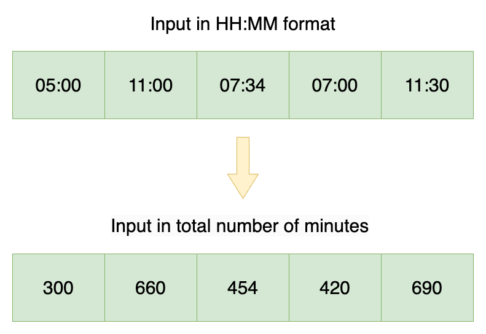

## ToC
- [September Week 3](#september-week-3)
  - [24.09.16 - 539. Minimum Time Difference](#240916---539-minimum-time-difference)
    - [나](#나)
    - [Solution](#solution)

# September Week 3
## 24.09.16 - 539. Minimum Time Difference
[문제 링크](https://leetcode.com/problems/minimum-time-difference/description/?envType=daily-question&envId=2024-09-16)

### 나
```cpp
// 1038ms, 19MB
class Solution {
public:
    int findMinDifference(vector<string>& timePoints) {
        vector<int> times;
        int answer = 1 << 30;
        for(string& timePoint : timePoints) {
            int curr = getTime(timePoint);
            int curr2 = 1440 + curr; // 24 hours later
            for(int time : times) {
                answer = min({answer, abs(curr - time), abs(time - curr)});
                answer = min({answer, abs(curr2 - time), abs(time - curr2)});
            }
            times.push_back(curr);
            times.push_back(curr2);
        }
        return answer;
    }
private:
    int getTime(string& timePoint) {
        return stoi(timePoint.substr(0,2)) * 60 + stoi(timePoint.substr(3));
    }
};
```

비효율적임

### Solution

<h3> Overview </h3>

We are given an array of times, where each time is given in `"HH:MM"` string format. We must return the minimum difference in minutes between any pair of times in the array.

<h3> Approach 1: Sort </h3>

<h3> Intuition </h3>

Since the times are given in `"HH:MM"` string format instead of the number of minutes, we can start by parsing the string format of each time and converting it into the total number of minutes passed since `"00:00"`.



If this converted array is sorted in ascending order, then the minimum difference must be the difference in an adjacent pair of times. This is because adjacent elements in a sorted array have smaller differences than nonadjacent elements. Thus, we can sort our array and calculate the difference between each adjacent pair of elements, keeping track of the smallest difference.

An edge case we have to consider is if the smallest difference is between the last and first element, in which case the time loops back to `"00:00"`. For example, if the last and first time is `"22:00"` and `"02:00"`, then the time difference is 4 hours or 240 minutes.

Thus, checking the difference between each adjacent pair in the sorted array as well as the difference between the first and last element will give us the minimum time difference.

<h3> Algorithm </h3>

1. Initialize an array `minutes` to store the given time points in units of minutes.
2. For each time `time` in the given `timePoints` array:
   - Parse the first two characters in `time` to get the hour `h`.
   - Parse the last two characters to get the minutes `m`.
   - Calculate the total number of minutes `h * 60 + m` and store the value in `minutes`.
3. Sort `minutes` in ascending order.
4. Initialize our answer variable `ans = Integer.MAX_VALUE`.
5. Iterate through each adjacent pair of elements `(i, i+1)` in `minutes` to find the minimum time difference:
   - `ans = min(ans, minutes[i+1] - minutes[i])`.
6. Return the minimum of `ans` and `24 * 60 - minutes[minutes.length - 1] + minutes[0]`, the amount of time between the last and first elements.

<h3> Implementation </h3>

```cpp
// 14ms, 17.46MB
class Solution {
public:
    int findMinDifference(vector<string>& timePoints) {
        // Convert input to minutes
        vector<int> minutes(timePoints.size());
        for (int i = 0; i < timePoints.size(); i++) {
            string time = timePoints[i];
            int h = stoi(time.substr(0, 2));
            int m = stoi(time.substr(3));
            minutes[i] = h * 60 + m;
        }

        // Sort times in ascending order
        sort(minutes.begin(), minutes.end());

        // Find minimum difference across adjacent elements
        int ans = INT_MAX;
        for (int i = 0; i < minutes.size() - 1; i++) {
            ans = min(ans, minutes[i + 1] - minutes[i]);
        }

        // Consider difference between last and first element
        return min(ans, 24 * 60 - minutes[minutes.size() - 1] + minutes[0]);
    }
};
```

<h3> Complexity Analysis </h3>

Let $N$ be the size of the given array `timePoints`.

- **Time Complexity**: $O(N \cdot \log N)$  
  Converting the input into minutes and traversing the sorted array to calculate the minimum difference both take $O(N)$ time. However, sorting the array takes $O(N \cdot \log N)$ time. Thus, the total time complexity is $O(N \cdot \log N)$.
  
- **Space Complexity**: $O(N)$  
  Our array `minutes` to store the converted input takes $O(N)$ space.

<h3> Approach 2: Bucket Sort </h3>

<h3> Intuition </h3>

In Approach 1, our time complexity was dominated by the time needed for sorting, which was $O(N \cdot \log N)$. However, we notice that the values in our array `minutes` can only fall into the range $[0, 24 \cdot 60 - 1]$. Because we know the range of values for the array we'd like to sort, we can instead use bucket sort, which is a sorting algorithm that can be done in linear time.

Bucket sort is typically completed in three steps:

1. We initialize an array `buckets` whose size is equal to the total number of possible values.
2. We process the input array so that each element `buckets[i]` contains the frequency count of the value `i` in the input array.
3. We can finally produce the sorted array by iterating through each element/bucket `buckets[i]` in `buckets` and append the value `i` `buckets[i]` times to a new array.

For our purposes, we can use a modified bucket sort for `minutes` where `minutes[i]` will contain a boolean value for whether or not the input array has value `i`. After, we can iterate through `minutes` in a similar fashion as Approach 1, where we keep track of the difference between adjacent elements, as well as the difference between the last and first elements.

<h3> Algorithm </h3>

1. Initialize array `minutes` with a size of $24 \cdot 60$.
2. For each `time` in `timePoints`:
   - Parse `time` and convert to the total number of minutes `min`.
   - If `minutes[min] == true`, then that means `time` appears more than once in our array, which means the minimum time difference is just $0$, so return $0$.
   - Otherwise, set `minutes[min] == true`.
3. Initialize variable `prevIndex = Integer.MAX_VALUE` to keep track of the previous time to calculate the time difference for adjacent pairs.
4. Initialize variables `firstIndex = Integer.MAX_VALUE` and `lastIndex = Integer.MAX_VALUE` to keep track of the first and last elements in our array.
5. Initialize answer variable `ans = Integer.MAX_VALUE` to maintain the minimum time difference between adjacent pairs.
6. Iterate through values `i` between $[0, 24 \cdot 60 - 1]$:
   - If `minutes[i]` is true, then the time `i` is present in our array:
     - If `prevIndex` does not contain the default value `Integer.MAX_VALUE`, then we can find the difference between time `i` and the previous time `prevIndex`: `ans = min(ans, i - prevIndex)`.
     - Update `prevIndex` to `i`.
     - If `firstIndex` contains the default value, then `i` is the first element in our sorted array, so we can set `firstIndex = i`.
     - Update `lastIndex` to `i`.
7. Return the minimum between `ans` and $24 \cdot 60 - lastIndex + firstIndex$.

<h3> Implementation </h3>

```cpp
// 7ms, 17.40MB
class Solution {
public:
    int findMinDifference(vector<string>& timePoints) {
        // create buckets array for the times converted to minutes
        vector<bool> minutes(24 * 60, false);
        for (string time : timePoints) {
            int h = stoi(time.substr(0, 2));
            int m = stoi(time.substr(3));
            int min = h * 60 + m;
            if (minutes[min]) return 0;
            minutes[min] = true;
        }
        int prevIndex = INT_MAX;
        int firstIndex = INT_MAX;
        int lastIndex = INT_MAX;
        int ans = INT_MAX;

        // find differences between adjacent elements in sorted array
        for (int i = 0; i < 24 * 60; i++) {
            if (minutes[i]) {
                if (prevIndex != INT_MAX) {
                    ans = min(ans, i - prevIndex);
                }
                prevIndex = i;
                if (firstIndex == INT_MAX) {
                    firstIndex = i;
                }
                lastIndex = i;
            }
        }

        return min(ans, 24 * 60 - lastIndex + firstIndex);
    }
};
```

<h3> Complexity Analysis </h3>

Let $N$ be the size of the given array `timePoints`.

- **Time Complexity**: $O(N)$  
  In contrast to Approach 1, our sorting only takes $O(N)$ time.
  
- **Space Complexity**: $O(1)$  
  Our array `minutes` will always have a size of $24 \cdot 60$, so the space complexity is constant.

