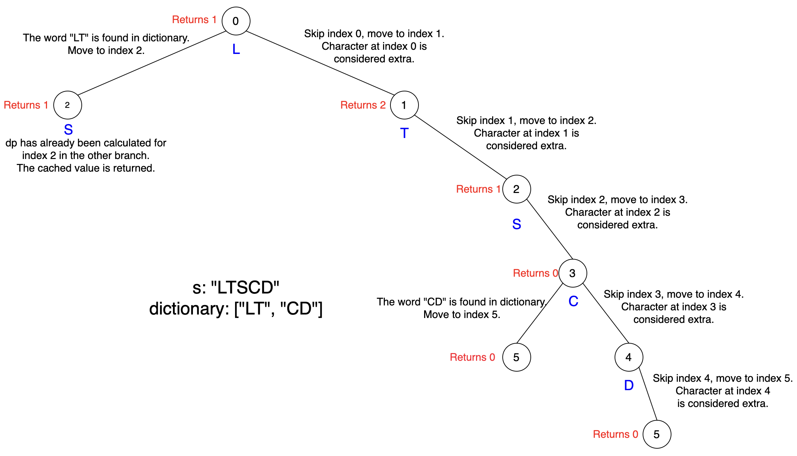

## ToC
- [September Week 4](#september-week-4)
  - [24.09.23 - 2707. Extra Characters in a String](#240923---2707-extra-characters-in-a-string)
    - [나](#나)
    - [Solution](#solution)
      - [Approach 1: Top Down Dynamic Programming with Substring Method](#approach-1-top-down-dynamic-programming-with-substring-method)
      - [Approach 2: Bottom Up Dynamic Programming with Substring Method](#approach-2-bottom-up-dynamic-programming-with-substring-method)
      - [Approach 3: Top Down Dynamic Programming with Trie](#approach-3-top-down-dynamic-programming-with-trie)
      - [Approach 4: Bottom Up Dynamic Programming with Trie](#approach-4-bottom-up-dynamic-programming-with-trie)
  - [24.09.24 - 3043. Find the Length of the Longest Common Prefix](#240924---3043-find-the-length-of-the-longest-common-prefix)
    - [나](#나-1)
    - [Solution](#solution-1)
      - [Approach 1: Using Hash Table](#approach-1-using-hash-table)
      - [Complexity Analysis](#complexity-analysis)
      - [Approach 2: Trie](#approach-2-trie)
      - [Complexity Analysis](#complexity-analysis-1)
  - [24.09.25 - 2416. Sum of Prefix Scores of Strings](#240925---2416-sum-of-prefix-scores-of-strings)
    - [나](#나-2)
  - [24.09.26 - 729. My Calendar I](#240926---729-my-calendar-i)
    - [나](#나-3)
    - [Solution](#solution-2)
      - [Approach #2: Sorted List + Binary Search](#approach-2-sorted-list--binary-search)
      - [Complexity Analysis](#complexity-analysis-2)

# September Week 4

## 24.09.23 - 2707. Extra Characters in a String
[문제 링크](https://leetcode.com/problems/extra-characters-in-a-string/description/?envType=daily-question&envId=2024-09-23)

### 나
답지 참고..
- DP.
- Trie

### Solution

<h3> Overview </h3>

The problem is about breaking a given string, `s` of length `n`, into non-overlapping substrings such that each substring is present in a given `dictionary` of words. The objective is to minimize the number of extra characters left over after the string is broken up optimally. The maximum number of characters that could possibly be left over after breaking up the string is `n`. This is the case where we find no match in the `dictionary` and all the characters must be removed. In the best-case scenario, no characters need to be removed (i.e. we can match every character to a non-overlapping substring).

#### Approach 1: Top Down Dynamic Programming with Substring Method

<h3> Intuition </h3>

We will consider breaking the given string into non-overlapping substrings that exist in the dictionary while minimizing the number of extra characters left over.

To solve this problem, we can utilize a recursive approach with memoization. We define a recursive function `dp` that takes an index `start` as a parameter. This index represents the current position in the string where we are considering adding characters to form a valid word. The function `dp` returns the minimum number of extra characters needed to form a valid concatenation of words starting from the `start` index.

The `dp` function represents the dynamic programming approach used to solve the problem. It takes a single argument, `start`, which represents the index in the string `s` that we are currently considering. We will try to find a word in `dictionary` that **starts** at this index.

The recurrence relation in the `dp` function is as follows:

- If the `start` index reaches the end of the string (`start == n`), indicating that we have considered all characters in `s`, the function returns 0, as no extra characters are needed.
- If the `start` index is not at the end of the string, the function considers two possibilities:
  1. Counting the current character at `start` as an extra character by recursively calling `dp` with the next index (`start + 1`). This corresponds to the case where the current character is not part of any valid word in the dictionary. The result is incremented by 1, as we are counting the current character as an extra.
  2. Iterating over all possible `end` indices from `start` to the end of the string. For each `end`, the function checks if the substring `s[start:end+1]` exists in `dictionary`. We can convert `dictionary` to a set before starting the DP to make these checks more efficient. If it does, the function recursively calls `dp` with the next index after the valid word's end index, `end + 1`. The result is updated to the minimum value between the current minimum and the value returned from the recursive call.

For each recursive call, we keep track of the minimum number of extra characters needed to form a valid concatenation. We update this minimum by considering both possibilities and selecting the option with the minimum number of extra characters.

To optimize the solution, we use memoization, which allows us to avoid redundant calculations. By caching the results of previously computed recursive calls, we can retrieve them directly instead of recomputing them, which significantly improves the efficiency of the algorithm.

The initial call to the recursive function is made with `start` set to 0, indicating that we start from the beginning of the string. The result of the function is the minimum number of extra characters needed to form a valid concatenation of words from the dictionary.

Here's how this algorithm will work for the string s `"LTSCD"` and dictionary `["LT", "CD"]`:



<h3> Algorithm </h3>

1. To achieve `O(1)` lookups, convert the list of strings in the dictionary to a set.
2. Define a recursive function called `dp` that takes the starting index of the substring as a parameter.
3. At each recursive call of `dp` check if the starting index `start` has reached the end of the string `s`. If so, return 0.
4. Set `ans`, the answer for the current state, to `dp(start + 1) + 1`.
5. If the starting index is not at the end of the string, explore all possible substrings starting from the current index `start`.
6. For each possible substring, check if it exists in the `dictionary`. If it does, recursively calculate the minimum number of extra characters starting from the next index `dp(end + 1)`.
7. Keep track of the minimum number of extra characters encountered so far (`ans`) and update it whenever a lower value is found.
8. To optimize the solution and avoid redundant computations, utilize memoization. Store the results of previously computed subproblems in a separate data structure.
9. Finally, call the `dp` function with the starting index set to 0.

<h3> Implementation </h3>

```cpp
class Solution {
public:
    int minExtraChar(string s, vector<string> dictionary) {
        int n = s.length();
        unordered_set<string> dictionarySet(dictionary.begin(), dictionary.end());
        unordered_map<int, int> memo;

        function<int(int)> dp = [&](int start) {
            if (start == n) {
                return 0;
            }
            if (memo.count(start)) {
                return memo[start];
            }
            // To count this character as a left over character 
            // move to index 'start + 1'
            int ans = dp(start + 1) + 1;
            for (int end = start; end < n; end++) {
                auto curr = s.substr(start, end - start + 1);
                if (dictionarySet.count(curr)) {
                    ans = min(ans, dp(end + 1));
                }
            }

            return memo[start] = ans;
        };

        return dp(0);
    }
};
```

<h3> Complexity Analysis </h3>

Let $N$ be the total characters in the string.  
Let $M$ be the average length of the strings in `dictionary`.  
Let $K$ be the length of the `dictionary`.

- **Time complexity**: $O(N^3)$  
  There can be $N + 1$ unique states of the `dp` method. In each state of `dp`, we iterate over `end`, which is $O(N)$ iterations. In each of these iterations, we create a substring, which costs $O(N)$. Hence, the overall cost of the `dp` method is $O(N^3)$.

- **Space complexity**: $O(N + M \cdot K)$  
  The HashSet used to store the strings in the `dictionary` will incur a cost of $O(M \cdot K)$. Additionally, the `dp` method will consume stack space and traverse to a depth of $N$ in the worst-case scenario, resulting in a cost of $O(N)$.

#### Approach 2: Bottom Up Dynamic Programming with Substring Method

<h3> Intuition </h3>

As shown in the first approach to solve this problem, we can utilize a dynamic programming approach. But this time bottom up. This solution converts the top-down approach used above to a bottom-up approach. We start by initializing a dynamic programming table `dp` with values corresponding to the minimum number of extra characters at each position in the string. Notice that here, `dp[start]` is equal to `dp(start)` from the previous approach.

With bottom-up, we need to start from the base case. The base case we defined above is when `start = n`. Thus, we iterate through the string backward (starting from `n - 1`), considering each position as a potential starting point for a substring. For each position, we can apply the same recurrence from the previous approach - explore all possible substrings starting from that point and calculate the minimum number of extra characters associated with each substring. We update the dynamic programming table accordingly.

By the end of the iteration, the value at the first position of the dynamic programming table represents the minimum number of extra characters left over after breaking the string optimally. This value is our desired result, which we return as the output.

<h3> Algorithm </h3>

1. To achieve `O(1)` lookups, convert the list of strings in the dictionary to a set.
2. Create a dynamic programming array `dp` of size `n + 1`.
3. Iterate over the string `s` from right to left, starting from last character (`n - 1`) down to the first character (`0`).
4. Initialize `dp[start]` by `dp[start + 1] + 1` to consider the case where the character at index `start` is an extra character.
5. For each starting index `start`, consider all possible substrings starting from `start` and ending at various indices `end` from `start` to `n - 1`.
6. If the substring from `start` to `end` is found in the `dictionary` set, update `dp[start]` by taking the minimum of its current value and `dp[end + 1]`.
7. Finally, return the value at `dp[0]`.

<h3> Implementation </h3>

```cpp
class Solution {
public:
    int minExtraChar(string s, vector<string> dictionary) {
        int n = s.length();
        unordered_set<string> dictionarySet(dictionary.begin(), dictionary.end());
        vector<int> dp(n + 1, 0);

        for (int start = n - 1; start >= 0; start--) {
            dp[start] = dp[start + 1] + 1;
            for (int end = start; end < n; end++) {
                auto curr = s.substr(start, end - start + 1);
                if (dictionarySet.count(curr)) {
                    dp[start] = min(dp[start], dp[end + 1]);
                }
            }
        }

        return dp[0];
    }
};
```

<h3> Complexity Analysis </h3>

Let $N$ be the total characters in the string.  
Let $M$ be the average length of the strings in `dictionary`.  
Let $K$ be the length of the `dictionary`.

- **Time complexity**: $O(N^3)$  
  The two nested loops used to perform the dynamic programming operation cost $O(N^2)$. The substring method inside the inner loop costs another $O(N)$. Hence, the overall time complexity is $O(N^3)$.

- **Space complexity**: $O(N + M \cdot K)$  
  The HashSet used to store the strings in the `dictionary` will incur a cost of $O(M \cdot K)$. The `dp` array will incur a cost of $O(N)`.


#### Approach 3: Top Down Dynamic Programming with Trie

<h3> Intuition </h3>

To optimize the top-down dynamic programming approach shared earlier we can try to get rid of the `substring` method. If we can get rid of the `substring` method we can reduce the time complexity to $O(N^2)$. We can use the [trie](https://en.wikipedia.org/wiki/Trie) data structure to reduce the time complexity of the algorithm. If you are not familiar with tries, we highly recommend you solve [this problem](https://leetcode.com/problems/implement-trie-prefix-tree/) first. In this article, we will assume you are already familiar with tries.

First, we create a trie data structure by building a trie from the given dictionary of words. Each `TrieNode` represents a character, and we connect the nodes to form a hierarchical structure based on the characters in the words. We mark the nodes that correspond to the end of a word.

To find the minimum number of extra characters, we use the same recursive function `dp` from the first approach, with a few modifications. It takes an index representing the starting position in the string.

Like in the first approach, we initialize the answer for a given `start` index as `dp(start + 1) + 1`. Then we try all possible `end` positions by iteration over the string starting from `end = start`. As we iterate, we traverse the Trie data structure to check if the characters in the string exist in the trie.

If we encounter a TrieNode marked as the end of a word, we update the minimum count by recursively calling `dp` on the next index without adding any extra characters. If we find that no TrieNode exists at all for a character, we can immediately break since no words will exist beyond this point.

<h3> Algorithm </h3>

1. Start by defining a `TrieNode` class with `children` and `is_word` attributes. Each node represents a character in the trie.
2. The `buildTrie` function is used to construct the trie by iterating through each word in the dictionary and adding it to the trie character by character.
3. Define a recursive helper function called `dp`.
4. At each recursive call of `dp` check if the starting index `start` has reached the end of the string `s`. If so, return 0.
5. The base case of the recursion is when the starting index reaches the end of the string, in which case it returns 0.
6. Traverse the trie starting from the root and follow the characters of the substring, checking if each character exists in the trie.
7. If a character is not found in the trie, break out of the loop.
8. If a valid substring is found in the trie (`node.is_word == true`), call `dp(end + 1)`.
9. Track the minimum number of extra characters encountered so far(`ans`) and update it whenever a lower value is found.
10. To optimize the solution, apply memoization. Store the results of previously computed subproblems in a separate data structure.
11. Finally, call `dp` with the starting index set to 0.

<h3> Implementation </h3>

```cpp
class TrieNode {
public:
    unordered_map<char, TrieNode*> children;
    bool is_word;
};

class Solution {
public:
    int minExtraChar(string s, vector<string>& dictionary) {
        int n = s.length();
        auto root = buildTrie(dictionary);
        unordered_map<int, int> memo;

        function<int(int)> dp = [&](int start) {
            if (start == n) {
                return 0;
            }
            if (memo.count(start)) {
                return memo[start];
            }
            // To count this character as a left over character 
            // move to index 'start + 1'
            int ans = dp(start + 1) + 1;
            TrieNode* node = root;
            for (int end = start; end < n; end++) {
                char c = s[end];
                if (node->children.find(c) == node->children.end()) {
                    break;
                }
                node = node->children[c];
                if (node->is_word) {
                    ans = min(ans, dp(end + 1));
                }
            }

            return memo[start] = ans;
        };

        return dp(0);
    }

    TrieNode* buildTrie(vector<string>& dictionary) {
        auto root = new TrieNode();
        for (auto& word : dictionary) {
            auto node = root;
            for (auto& c : word) {
                if (node->children.find(c) == node->children.end()) {
                    node->children[c] = new TrieNode();
                }
                node = node->children[c];
            }
            node->is_word = true;
        }
        return root;
    }
};
```

<h3> Complexity Analysis </h3>

Let $N$ be the total characters in the string.  
Let $M$ be the average length of the strings in `dictionary`.  
Let $K$ be the length of the `dictionary`.

- **Time complexity**: $O(N^2 + M \cdot K)$  
  There can be $N + 1$ unique states of the `dp` method. Each state of the `dp` method costs $O(N)$ to compute. Hence, the overall cost of the `dp` method is $O(N^2)$. Building the trie costs $O(M \cdot K)$.

- **Space complexity**: $O(N + M \cdot K)$  
  The Trie used to store the strings in the `dictionary` will incur a cost of $O(M \cdot K)$. Additionally, the `dp` method will consume stack space and traverse to a depth of $N$, resulting in a cost of $O(N)`.

#### Approach 4: Bottom Up Dynamic Programming with Trie

<h3> Intuition </h3>

We can optimize the bottom-up approach the same way we optimized the top-down approach, by using a Trie to avoid needing to create substrings.

We initialize a dynamic programming table, `dp`, where each position represents the minimum number of extra characters starting from that index. This is the same table as the one from approach 2.

For each index `start`, we initialize `dp[start] = dp[start + 1] + 1` as the base case. Then we iterate backward through the string, starting from the last index. For each index, we update the corresponding value in the `dp` table by considering all possible substrings starting from that position. We traverse the Trie data structure, checking if the characters in the string exist in the Trie. If a character doesn't exist in the Trie, we can immediately break.

If we encounter a TrieNode marked as the end of a word during traversal, we update the `dp` value at the start index by taking the minimum between the current value and the value at the end index without adding any extra characters.

<h3> Algorithm </h3>

The algorithm used in the solution can be explained in the following short points:

1. Define a `TrieNode` class with `children` and `is_word` attributes. Each node represents a character in the trie.
2. The `buildTrie` function is used to construct the trie by iterating through each word in the dictionary and adding it to the trie character by character.
3. Initialize the root of the trie, the length of the input string, and a dynamic programming array `dp` of size `n + 1`.
4. Iterate over the string `s` from right to left, starting from the last character down to the first character.
5. For each starting index `start`, calculate the minimum number of extra characters needed to break down the substring from `start` to the end of the string.
6. Initialize `dp[start]` with `dp[start + 1] + 1`.
7. Traverse the trie starting from the root and follow the characters of the substring, checking if each character exists in the trie.
8. If a character is not found in the trie, break out of the for loop.
9. If a valid substring is found in the trie (`node.is_word == true`), update `dp[start]` by taking the minimum of its current value and `dp[end + 1]`.
10. Finally, return the value at `dp[0]`.

<h3> Implementation </h3>

```cpp
class TrieNode {
public:
    unordered_map<char, TrieNode*> children;
    bool is_word;
};

class Solution {
public:
    int minExtraChar(string s, vector<string>& dictionary) {
        int n = s.length();
        auto root = buildTrie(dictionary);
        vector<int> dp(n + 1, 0);

        for (int start = n - 1; start >= 0; start--) {
            dp[start] = dp[start + 1] + 1;
            auto node = root;
            for (int end = start; end < n; end++) {
                if (node->children.find(s[end]) == node->children.end()) {
                    break;
                }
                node = node->children[s[end]];
                if (node->is_word) {
                    dp[start] = min(dp[start], dp[end + 1]);
                }
            }
        }

        return dp[0];
    }

    TrieNode* buildTrie(vector<string>& dictionary) {
        auto root = new TrieNode();
        for (auto& word : dictionary) {
            auto node = root;
            for (auto& c : word) {
                if (node->children.find(c) == node->children.end()) {
                    node->children[c] = new TrieNode();
                }
                node = node->children[c];
            }
            node->is_word = true;
        }
        return root;
    }
};
```

<h3> Complexity Analysis </h3>

Let $N$ be the total characters in the string.  
Let $M$ be the average length of the strings in `dictionary`.  
Let $K$ be the length of the `dictionary`.

- **Time complexity**: $O(N^2 + M \cdot K)$  
  The two nested for loops that are being used for the dynamic programming operation cost $O(N^2)$. Building the trie costs $O(M \cdot K)`.

- **Space complexity**: $O(N + M \cdot K)`  
  The Trie used to store the strings in `dictionary` will incur a cost of $O(M \cdot K)`. The `dp` array will incur a cost of $O(N)`.


## 24.09.24 - 3043. Find the Length of the Longest Common Prefix
[문제 링크](https://leetcode.com/problems/find-the-length-of-the-longest-common-prefix/description/?envType=daily-question&envId=2024-09-24)

### 나
파멸적인 시간.
```cpp
// 1502ms, 156.44MB
class Solution {
public:
    int longestCommonPrefix(vector<int>& arr1, vector<int>& arr2) {
        // Put all the possible prefixes of each element in arr1 into a HashSet.
        set<string> S;
        for(int n : arr1) {
            string str = to_string(n);
            for(int s{}, e = str.length();s<e;++s) {
                string tmp = str.substr(0, s + 1);
                if(S.count(tmp)) continue;
                S.insert(tmp);
            }
        }

        int answer{};
        for(int n : arr2) {
            string str = to_string(n);
            for(int s{}, e = str.length();s<e;++s) {
                string tmp = str.substr(0, s + 1);
                if(S.count(tmp)) {
                    answer = max(answer, static_cast<int>(tmp.length()));
                }
            }
        }

        return answer;
    }
};
```

### Solution
가져오기 귀찮음.

#### Approach 1: Using Hash Table
```cpp
class Solution {
public:
    int longestCommonPrefix(vector<int>& arr1, vector<int>& arr2) {
        unordered_set<int> arr1Prefixes;  // Set to store all prefixes from arr1

        // Step 1: Build all possible prefixes from arr1
        for (int val : arr1) {
            while (!arr1Prefixes.count(val) && val > 0) {
                // Insert current value as a prefix
                arr1Prefixes.insert(val);
                // Generate the next shorter prefix by removing the last digit
                val /= 10;
            }
        }

        int longestPrefix = 0;

        // Step 2: Check each number in arr2 for the longest matching prefix
        for (int val : arr2) {
            while (!arr1Prefixes.count(val) && val > 0) {
                // Reduce val by removing the last digit if not found in the
                // prefix set
                val /= 10;
            }
            if (val > 0) {
                // Length of the matched prefix using log10 to determine the
                // number of digits
                longestPrefix =
                    max(longestPrefix, static_cast<int>(log10(val) + 1));
            }
        }

        return longestPrefix;
    }
};
```
#### Complexity Analysis

Let $m$ be the length of `arr1`, $n$ be the length of `arr2`, $M$ be the maximum value in `arr1`, and $N$ be the maximum value in `arr2`.

- **Time Complexity**: 
  $$
  O(m \cdot \log_{10}(M) + n \cdot \log_{10}(N))
  $$
  For each number in `arr1`, we repeatedly divide the number by 10 to generate its prefixes. Since dividing a number by 10 reduces the number of digits logarithmically, this process takes $O(\log_{10}(M))$ for each number in `arr1`. Hence, for $m$ numbers, the total time complexity is $O(m \cdot \log_{10}(M))$. Similarly, for each number in `arr2`, we reduce it by repeatedly dividing it by 10 to check if it matches any prefix in the set. This also takes $O(\log_{10}(N))$ for each number in `arr2$. Hence, for $n$ numbers, the total time complexity is $O(n \cdot \log_{10}(N))$. The overall time complexity is $O(m \cdot \log_{10}(M) + n \cdot \log_{10}(N))$.

- **Space Complexity**: 
  $$
  O(m \cdot \log_{10}(M))
  $$
  Each number in `arr1` contributes $O(\log_{10}(M))$ space to the set, as it generates prefixes proportional to the number of digits (logarithmic in the value of the number with base 10). With $m$ numbers in `arr1`, the total space complexity for the set is $O(m \cdot \log_{10}(M))$. The algorithm uses constant space for variables like `longestPrefix` and loop variables, so this doesn’t contribute significantly to the space complexity. Thus, the total space complexity is $O(m \cdot \log_{10}(M))$.

#### Approach 2: Trie
```cpp
class TrieNode {
public:
    // Each node has up to 10 possible children (digits 0-9)
    TrieNode* children[10];
    TrieNode() {
        for (int i = 0; i < 10; ++i) {
            children[i] = nullptr;
        }
    }
};

class Trie {
public:
    TrieNode* root;

    Trie() { root = new TrieNode(); }

    // Insert a number into the Trie by treating it as a string of digits
    void insert(int num) {
        TrieNode* node = root;
        string numStr = to_string(num);
        for (char digit : numStr) {
            int idx = digit - '0';
            if (!node->children[idx]) {
                node->children[idx] = new TrieNode();
            }
            node = node->children[idx];
        }
    }

    // Find the longest common prefix for a number in arr2 with the Trie
    int findLongestPrefix(int num) {
        TrieNode* node = root;
        string numStr = to_string(num);
        int len = 0;

        for (char digit : numStr) {
            int idx = digit - '0';
            if (node->children[idx]) {
                // Increase length if the current digit matches
                len++;
                node = node->children[idx];
            } else {
                // Stop if no match for the current digit
                break;
            }
        }
        return len;
    }
};

class Solution {
public:
    int longestCommonPrefix(vector<int>& arr1, vector<int>& arr2) {
        Trie trie;

        // Step 1: Insert all numbers from arr1 into the Trie
        for (int num : arr1) {
            trie.insert(num);
        }

        int longestPrefix = 0;

        // Step 2: Find the longest prefix match for each number in arr2
        for (int num : arr2) {
            int len = trie.findLongestPrefix(num);
            longestPrefix = max(longestPrefix, len);
        }

        return longestPrefix;
    }
};
```

#### Complexity Analysis

Let $m$ be the length of `arr1`, $n$ be the length of `arr2`.

- **Time Complexity**: 
  $$
  O(m \cdot d + n \cdot d) = O(m + n)
  $$
  For each number in `arr1`, we insert it into the Trie by processing each digit. Since each number has up to $d$ digits, inserting a single number takes $O(d)$ time. Therefore, inserting all $m$ numbers from `arr1` into the Trie takes $O(m \cdot d)$ time. For each number in `arr2`, we check how long its prefix matches with any prefix in the Trie. This involves traversing up to $d$ digits of the number, which takes $O(d)$ time per number. For all $n$ numbers in `arr2$, the time complexity for this step is $O(n \cdot d)$. Overall, the total time complexity is $O(m \cdot d + n \cdot d) = O(m + n)$.

- **Space Complexity**: 
  $$
  O(m \cdot d) = O(m)
  $$
  Each node in the Trie represents a digit (0-9), and each number from `arr1` can contribute up to $d$ nodes. Thus, the total space used by the Trie for storing all prefixes is $O(m \cdot d)$. The algorithm uses constant space for variables like `longestPrefix` and loop variables, which is negligible compared to the space used by the Trie. Thus, the total space complexity is $O(m \cdot d) = O(m)$.


## 24.09.25 - 2416. Sum of Prefix Scores of Strings
[문제 링크](https://leetcode.com/problems/sum-of-prefix-scores-of-strings/description/?envType=daily-question&envId=2024-09-25)

### 나
Trie

```cpp
// 1082ms, 703.54MB
struct Trie {
    int cnt{}; 
    unordered_map<char, Trie*> um;
    Trie() = default;
};

class Solution {
public:
    vector<int> sumPrefixScores(vector<string>& words) {
        Trie * root = new Trie{};

        for(string& word : words) {
            Trie * now = root;
            for(char c : word) {
                if(now->um.count(c) == 0) { // 새로 만들기
                    Trie * newNode = new Trie{}; 
                    now->um.emplace(c, newNode);
                }
                now = now->um[c]; // 이동
                now->cnt++;
            }
        }

        vector<int> answer;
        for(string& word : words) {
            int sum{};
            Trie * now = root;
            for(char c : word) {
                now = now->um[c];
                sum += now->cnt;
            }
            answer.push_back(sum);
        }
        
        delete root;
        return answer;
    }
};
```

`vector`말고 그냥 배열

```cpp
// 541ms, 704.04MB
struct Trie {
    int cnt{}; 
    Trie* next[26]{};
    Trie() = default;
};

class Solution {
public:
    vector<int> sumPrefixScores(vector<string>& words) {
        Trie* root = new Trie{};

        for(string& word : words) {
            Trie* now = root;
            for(char c : word) {
                if(!now->next[c - 'a']) {
                    Trie * newNode = new Trie{}; 
                    now->next[c-'a'] = newNode;
                }
                now = now->next[c - 'a']; // 이동
                now->cnt++;
            }
        }

        vector<int> answer;
        for(string& word : words) {
            int sum{};
            Trie * now = root;
            for(char c : word) {
                now = now->next[c - 'a']; // 이동
                sum += now->cnt;
            }
            answer.push_back(sum);
        }
        
        delete root;
        return answer;
    }
};
```

## 24.09.26 - 729. My Calendar I
[문제 링크](https://leetcode.com/problems/my-calendar-i/editorial/?envType=daily-question&envId=2024-09-26)

### 나
Solution 참고 - Brute Force

```cpp
// 88ms, 41.58MB
// Brute Force
class MyCalendar {
private:
    vector<pair<int, int>> calender;
public:
    MyCalendar() {
        
    }
    
    bool book(int start, int end) {
        for(auto [s, e] : calender) {
            if(start < e && s < end) {
                return false;
            }
        }
        calender.emplace_back(start, end);
        return true;
    }
};

/**
 * Your MyCalendar object will be instantiated and called as such:
 * MyCalendar* obj = new MyCalendar();
 * bool param_1 = obj->book(start,end);
 */
```

### Solution
#### Approach #2: Sorted List + Binary Search

```cpp
class MyCalendar {
private:
    set<pair<int, int>> calendar;

public:
    bool book(int start, int end) {
        const pair<int, int> event{start, end};
        const auto nextEvent = calendar.lower_bound(event);
        if (nextEvent != calendar.end() && nextEvent->first < end) {
            return false;
        }

        if (nextEvent != calendar.begin()) {
            const auto prevEvent = prev(nextEvent);
            if (prevEvent->second > start) {
                return false;
            }
        }

        calendar.insert(event);
        return true;
    }
};
```

#### Complexity Analysis
Like Approach 1, let $N$ be the number of events booked.

- **Time Complexity**: 
  $$
  O(N \cdot \log N)
  $$
  For each new event, we search to ensure that the event is legal in $O(\log N)$ time, then insert it in $O(\log N)$ time. Thus, the overall time complexity is $O(N \cdot \log N)$.

- **Space Complexity**: 
  $$
  O(N)
  $$
  This is the space complexity due to the size of the data structures used, which scales linearly with the number of events, $N$.

